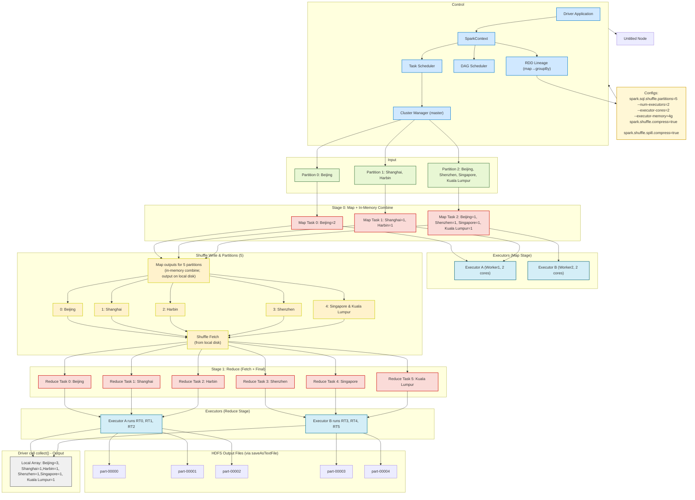

# PySpark Notes   

📌 **Core Concepts:** RDD, DataFrame, Lazy Evaluation, Fault Tolerance /fɔːlt/ /ˈtɒlərəns/, Execution Mechanisms /ˈmekənɪzəmz/

---

## 🧭 1. Getting Started with PySpark

### 1.1 Initialize SparkSession
```python
from pyspark.sql import SparkSession
spark = SparkSession.builder \
    .appName("PySpark Basic Tutorial") \
    .getOrCreate()
```

### 1.2 Create a Simple DataFrame
```python
data = [(1, 10), (2, 20), (3, 30)]
df = spark.createDataFrame(data, ["id", "value"])
df.show()
```
```
+---+-----+
| id|value|
+---+-----+
|  1|   10|
|  2|   20|
|  3|   30|
+---+-----+
```

---

## 📊 2. Basic DataFrame Operations

### 2.1 Aggregations
```python
# Total Sum
df.agg({"value": "sum"}).show()

# Maximum value with collect()
max_val = df.agg({"value": "max"}).collect()[0]["max(value)"]
print(max_val)
```

### 2.2 groupBy + sum
```python
df.groupBy("id").sum("value").show()
```
```
+---+----------+
| id|sum(value)|
+---+----------+
|  1|        10|
|  2|        20|
|  3|        30|
+---+----------+
```

### 2.3 filter, select, withColumn
```python
from pyspark.sql.functions import col

# Filter rows
filtered = df.filter(col("value") > 20)
filtered.show()

# Add a new column
df.withColumn("value_doubled", col("value") * 2).show()
```

---

## 📂 3. Read and Aggregate from File

```python
from pyspark.sql import SparkSession
from pyspark.sql.functions import col, lit

def main():
    spark = SparkSession.builder.appName("CityCountWithDataFrame").getOrCreate()
    input_path = "hdfs://path/to/cities.txt"
    df = spark.read.text(input_path).withColumnRenamed("value", "city")
    df = df.withColumn("count", lit(1))
    city_counts = df.groupBy("city").sum("count").withColumnRenamed("sum(count)", "total")
    city_counts.orderBy("city").show(truncate=False)
    spark.stop()

if __name__ == "__main__":
    main()
```
**Output Example:**
```
+-------------+-----+
|city         |total|
+-------------+-----+
|Kuala Lumpur |2    |
|Shanghai     |2    |
|Singapore    |3    |
+-------------+-----+
```

---

## 🧠 4. PySpark UDF (User Defined Function)

### 4.1 Purpose of UDF
- Apply custom Python logic to DataFrame columns.
- Similar to `apply()` in Pandas.

### 4.2 UDF Implementation – Step by Step

🧠 **udf(func_name, XType()), check, withColumn("col\_name", ur\_udf)**

```python
from pyspark.sql.functions import udf
from pyspark.sql.types import IntegerType
from pyspark.sql import SparkSession

# Step 1: Initialize SparkSession
spark = SparkSession.builder.appName("UDF Example").getOrCreate()

# Step 2: Create sample DataFrame
data = [("hello",), ("world",), ("example",), ("common",)]
df = spark.createDataFrame(data, ["before_checking"])

# Step 3: Define Python function
common_words = ["hello", "common"]
def check(col):
    return 1 if col in common_words else 0

# Step 4: Register as UDF
check_udf = udf(check, IntegerType())

# Step 5: Apply UDF
df = df.withColumn("after_checking", check_udf(df["before_checking"]))

# Step 6: Show result
df.show()
```
**Expected Output:**
```
+----------------+---------------+
|before_checking|after_checking |
+----------------+---------------+
|hello           |1              |
|world           |0              |
|example         |0              |
|common          |1              |
+----------------+---------------+
```

---

## 🔍 5. SQL Integration

```python
df.createOrReplaceTempView("my_table")
spark.sql("SELECT Category, SUM(Value1) as total_value1 FROM my_table GROUP BY Category").show()

# Check query plan
df.groupBy("Category").sum().explain()
```

---

## 🎯 6. PySpark Interview Essentials

| Question | Summary |
|---------|---------|
| Spark Core | Driver, Executor, Cluster Manager, RDD, DataFrame |
| RDD vs DataFrame | RDD: low-level, unstructured. DataFrame: optimized, with schema. |
| Transformation vs Action | Lazy vs Triggers computation (e.g., `count`, `show`) |
| Broadcast Join | Broadcast small table to avoid shuffle |
| Lineage | Enables fault tolerance by recomputing lost partitions |
| Catalyst Optimizer | Optimizes execution plan in Spark SQL |
| Window Function | Requires `Window` spec from `pyspark.sql.window` |
| UDF | Register with `udf()` from `pyspark.sql.functions` |

---

Happy Spark-ing! ⚡

---



