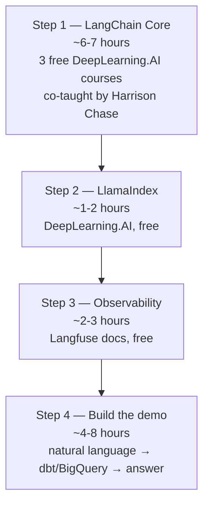
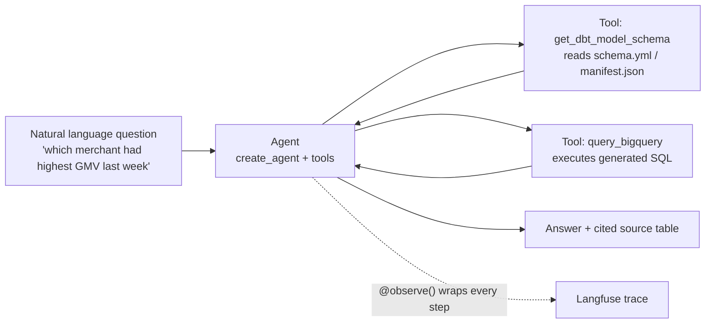

# AI Agent Learning Plan — Targeting: Analytics Engineering Manager (AI & Agentic Analytics) @ foodpanda

> Goal: be able to demo a working "natural language → dbt/BigQuery → answer" agent, and speak fluently about the production stack (LlamaIndex, observability, semantic layer) the JD names explicitly.
>
> **Time-constrained version** — starting from zero, prioritizing DeepLearning.AI's free short courses (co-taught by Harrison Chase, LangChain's founder) over the 19-hour Udemy course. Total core path: ~6-9 hours instead of ~24.

---

## 📚 Table of Contents

- [Chap 1. Decoding the JD](#chap-1-decoding-the-jd)
- [Chap 2. Why LangChain Concepts First, Even Though the JD Says LlamaIndex/ADK](#chap-2-why-langchain-concepts-first-even-though-the-jd-says-llamaindexadk)
- [Chap 3. The Four-Step Path](#chap-3-the-four-step-path)
- [Chap 4. Step 1 — LangChain Core (DeepLearning.AI, free, ~6-7h)](#chap-4-step-1--langchain-core-deeplearningai-free-6-7h)
- [Chap 5. Step 2 — LlamaIndex (DeepLearning.AI, free)](#chap-5-step-2--llamaindex-deeplearningai-free)
- [Chap 6. Step 3 — Observability (Langfuse docs)](#chap-6-step-3--observability-langfuse-docs)
- [Chap 7. Step 4 — The Demo Itself](#chap-7-step-4--the-demo-itself)
- [Chap 8. Full Resource Table](#chap-8-full-resource-table)
- [Chap 9. Interview Talking Points](#chap-9-interview-talking-points)

---

## Chap 1. Decoding the JD

📌 **This is a player-coach analytics engineering role with an AI layer bolted on — not a pure AI engineering role.**

| JD line | What it actually means | Weight |
|---|---|---|
| "5+ years analytics engineering... dbt, BigQuery" | This is the floor. Without this you don't pass screening. | Core |
| "3+ years leadership... mentoring" | Player-coach — you'll still write code, but also run code reviews | Core |
| "Build internal copilots, workflow agents, intelligent data QA bots" | This is the part a demo can prove | Differentiator |
| "Own the semantic layer... dbt and BigQuery" | Metrics/entities/metadata layer both humans AND agents query | Core + AI bridge |
| "Evaluation and monitoring... Langfuse or Phoenix" | They want you to know LLM observability exists and roughly how it works — not necessarily deep hands-on | Differentiator |
| "Stack: dbt, BigQuery, LlamaIndex, ADK, n8n" | **LlamaIndex explicitly named — not LangChain.** ADK = Google's Agent Development Kit. | Differentiator |

```
关键判断：
        ↓
JD里完全没提LangChain，但LangChain的核心概念
（agent loop / tool calling / RAG）是框架无关的
        ↓
策略：用最快的方式打通这些底层概念
（不是死磕一个框架的语法），再花小成本学
LlamaIndex的API语法差异
```

---

## Chap 2. Why LangChain Concepts First, Even Though the JD Says LlamaIndex/ADK

```
LangChain               LlamaIndex              ADK (Google)
   ↓                        ↓                        ↓
chain组合为中心          索引/检索为中心            Google生态原生
免费教学资料最权威        更适合"文档密集型"RAG      文档相对少
（创始人亲自讲）          和你的JD贴合度实际更高     国内资料少
        ↓                        ↓                        ↓
    学这个打基础         API语法差异，1-2天能补    可选，非必须
  （吴恩达三门短课）      （Jerry Liu短课，免费）   （除非面试明确问）
```

**底层概念是通用的，这些在三个框架里都长一个样：**
- Agent loop（think → act → observe → repeat）
- Tool calling / function calling
- RAG 的四个building block：Loader → Splitter → Embedding → VectorStore
- 状态管理与多步推理（LangGraph 覆盖最深的部分）

---

## Chap 3. The Four-Step Path



| Step | What | Time | Cost |
|---|---|---|---|
| 1 | LangChain core + agent + LangGraph | ~6-7 hours | **Free** |
| 2 | LlamaIndex API differences | ~1-2 hours | Free |
| 3 | Observability (Langfuse) | ~2-3 hours (docs) | Free |
| 4 | Build dbt+BigQuery agent demo | ~4-8 hours | Free (your own code) |

**Total: ~13-20 hours, all free except your own time.** Compared to the original ~24-hour plan built around the paid Udemy course, this cuts roughly 40-50% off the time while keeping the same conceptual coverage — because the same person who built LangChain is teaching it.

---

## Chap 4. Step 1 — LangChain Core (DeepLearning.AI, free, ~6-7h)

📌 **Three short courses, all free, all co-taught by Harrison Chase — co-founder and CEO of LangChain. Starting from zero, this is the fastest path to real depth.**

### Course 1 — LangChain for LLM Application Development (1 hour)

**Link:** https://www.deeplearning.ai/courses/langchain
**Instructors:** Harrison Chase (LangChain) + Andrew Ng

| Topic | What it covers |
|---|---|
| Models, Prompts, Parsers | Calling LLMs, structuring prompts, parsing responses |
| Memory | Storing conversation history, managing limited context |
| Chains | Sequences of operations — the foundational LCEL idea |
| Question Answering over Documents | Applying LLMs to your own data |
| Agents | First introduction to LLMs as reasoning agents |

**🎯 Concept Primer — why start here even at only 1 hour**
```
This is the fastest possible "can I follow what's happening
in a LangChain codebase" course. It won't make you an expert,
but every later course assumes you already know what a
PromptTemplate, a Chain, and basic Memory are — this gives
you that vocabulary in 60 minutes, taught by the framework's
own creator.
```

### Course 2 — LangChain: Functions, Tools and Agents (~4 hours)

**Link:** https://www.deeplearning.ai/short-courses/functions-tools-agents-langchain/
**Instructors:** Harrison Chase (LangChain) + Andrew Ng

| Topic | What it covers |
|---|---|
| Function calling | How native tool calling actually works under the hood |
| Tagging and extraction | Structured output from unstructured text |
| Tool binding | Attaching tools to a model so it can decide when to call them |
| Conversational agent | Capstone — a customer support agent that escalates to tools or humans |
| Deployment best practices | Async support, tracing with LangSmith, error resilience |

**🎯 Concept Primer — this is your direct match for the demo's tool calling**
```
Your dbt+BigQuery demo (Step 4) needs an agent that decides
WHEN to check the dbt schema versus WHEN to query BigQuery —
that decision-making is exactly what this course teaches.
The capstone project (a support agent escalating between
tools and humans) is structurally identical to "agent checks
schema, then queries BigQuery, then answers."
```

### Course 3 — AI Agents in LangGraph (~1-2 hours) ★ highest priority

**Link:** https://learn.deeplearning.ai/courses/ai-agents-in-langgraph
**Instructors:** Harrison Chase (LangChain) + Rotem Weiss (Tavily)

| Topic | What it covers |
|---|---|
| Build an agent from scratch | Pure Python + LLM, no framework |
| Rebuild with LangGraph | Same agent, now using LangGraph components — see exactly what the framework saves you |
| Agentic search | Using Tavily to give the agent live web access |
| Memory | Tracking state across multi-step reasoning |
| Human-in-the-loop | Pausing at key junctures for human approval |
| Persistence | Saving agent state so execution can resume later |
| Capstone | A full essay-writing agent combining everything above |

**🎯 Concept Primer — why this is the single most important course in your plan**
```
This is the one course covering LangGraph's state management
and multi-step orchestration — the exact gap identified earlier
in this plan. Building the same agent twice — once raw,
once with LangGraph — is the fastest way to understand WHY
a graph-based orchestration layer exists at all, rather than
just memorizing its API.
        ↓
If time only allows ONE of the three courses, take this one.
```

---

## Chap 5. Step 2 — LlamaIndex (DeepLearning.AI, free)

**Course:** Building Agentic RAG with LlamaIndex
**Link:** https://www.deeplearning.ai/courses/building-agentic-rag-with-llamaindex/
**Instructor:** Jerry Liu, co-founder & CEO of LlamaIndex
**Length:** ~1-2 hours, free

### What it covers

| Lecture | Content |
|---|---|
| Router | Simplest agentic RAG — given a query, pick Q&A or summarization engine |
| Tool Calling | LLM picks a function AND infers arguments to pass |
| Research Agent | Multi-step reasoning over tools, not single-shot |
| Multi-document Agent | Extends to handling multiple documents intelligently |

**🎯 Concept Primer — LangChain vs LlamaIndex, the one-sentence answer**
```
LangChain  = chain-composition-centric
             ("pipe together prompt → llm → parser → tool")

LlamaIndex = index-centric
             ("build an index over your data, query it intelligently")
        ↓
For a JD that explicitly wants you querying dbt models
and BigQuery tables — LlamaIndex's index-first mental model
arguably maps MORE naturally to "index the semantic layer,
then let an agent query it" than LangChain's chain-first model.
        ↓
This is worth saying in an interview: you understand WHY
the JD might prefer LlamaIndex for this specific use case,
not just that you've heard of it.
```

Alternative platform (same course, different UI):
https://www.coursera.org/projects/building-agentic-rag-with-llamaindex

---

## Chap 6. Step 3 — Observability (Langfuse docs)

📌 **Docs only, no full course needed — this is recognition-level knowledge for the JD, not a hands-on skill to demonstrate.**

| Resource | Link | What to read |
|---|---|---|
| Docs home | https://langfuse.com/docs | Skim structure |
| Observability overview | https://langfuse.com/docs/observability/overview | Core concepts: trace, span, generation, session |
| Get started guide | https://langfuse.com/docs/observability/get-started | `@observe()` decorator + LangChain callback handler |
| GitHub repo | https://github.com/langfuse/langfuse | Just to say you looked at the source |

**🎯 Concept Primer — Langfuse's data model, the five objects**
```
Trace        → one end-to-end request (one user interaction)
  └─ Span        → a unit of work with duration (retrieval, tool call)
  └─ Generation   → a span specifically for one LLM call
                     (model name, prompt, completion, tokens, cost)
  └─ Event        → point-in-time marker, no duration

Session      → groups multiple traces (one multi-turn conversation)
Score        → quality signal attached to a trace (numeric/bool/category)
        ↓
Memorize this five-object model — it's the entire mental
model behind "LLM observability" and applies whether you
use Langfuse, Phoenix, or anything else in this category.
```

---

## Chap 7. Step 4 — The Demo Itself

**No course teaches this combination — it's your own stitching job.**

### Reference doc
LangChain BigQuery integration:
https://python.langchain.com/docs/integrations/tools/google_bigquery/
*(if link has moved, search: "LangChain BigQuery tool integration")*

### Architecture



### Skeleton code

```python
from langchain.tools import tool
from langchain.agents import create_agent
from google.cloud import bigquery

@tool
def query_bigquery(sql: str) -> str:
    """Execute a SQL query against BigQuery and return results."""
    client = bigquery.Client()
    return str(client.query(sql).to_dataframe())

@tool
def get_dbt_model_schema(model_name: str) -> str:
    """Read the schema definition for a dbt model."""
    # parse schema.yml or manifest.json
    ...

agent = create_agent(
    model=llm,
    tools=[query_bigquery, get_dbt_model_schema]
)

# "which merchant had highest GMV last week"
# → agent checks schema to understand fields
# → generates SQL
# → queries BigQuery
# → returns answer
```

**🎯 Why this demo is the right one for this specific JD**
```
JD says, verbatim:
"Build internal copilots, workflow agents,
 and intelligent data QA bots"
        ↓
This demo IS one of those three things —
a data QA bot that bridges natural language ↔ your
actual dbt + BigQuery stack, which is also explicitly
named in the JD's tech stack list.
        ↓
Wrap query_bigquery and get_dbt_model_schema with
Langfuse's @observe() decorator. Even a single trace
screenshot in your portfolio shows you understand BOTH
halves of the JD: building the agent AND monitoring it.
```

---

## Chap 8. Full Resource Table

| Step | Resource | Link | Time | Cost |
|---|---|---|---|---|
| 1a | LangChain for LLM App Dev | https://www.deeplearning.ai/courses/langchain | 1h | **Free** |
| 1b | Functions, Tools and Agents | https://www.deeplearning.ai/short-courses/functions-tools-agents-langchain/ | ~4h | **Free** |
| 1c | AI Agents in LangGraph ★ | https://learn.deeplearning.ai/courses/ai-agents-in-langgraph | ~1-2h | **Free** |
| 2 | LlamaIndex — DeepLearning.AI | https://www.deeplearning.ai/courses/building-agentic-rag-with-llamaindex/ | 1-2h | Free |
| 2b | LlamaIndex — Coursera mirror | https://www.coursera.org/projects/building-agentic-rag-with-llamaindex | — | Free |
| 3a | Langfuse docs home | https://langfuse.com/docs | — | Free |
| 3b | Langfuse observability overview | https://langfuse.com/docs/observability/overview | 30 min | Free |
| 3c | Langfuse get started guide | https://langfuse.com/docs/observability/get-started | 1-2h | Free |
| 3d | Langfuse GitHub | https://github.com/langfuse/langfuse | — | Free |
| 4 | LangChain BigQuery integration | https://python.langchain.com/docs/integrations/tools/google_bigquery/ | — | Free |

```
若时间极度有限，只能砍其中一门：
        ↓
优先级排序（从必须保留到可砍）：
1c AI Agents in LangGraph    ← 不能砍，补的是最大缺口
1b Functions, Tools, Agents  ← 不能砍，直接对应demo的tool calling
2  LlamaIndex                ← 不能砍，JD明确点名
1a LangChain for LLM App Dev ← 可以砍，内容和1b有重叠
```

---

## Chap 9. Interview Talking Points

Use these as ready-made answers once you've completed the path above.

| Likely question | Your answer |
|---|---|
| "Why LangChain if our stack is LlamaIndex?" | "Agent architecture concepts — tool calling, RAG, multi-step reasoning — are framework-agnostic. I learned the foundation through DeepLearning.AI's short courses, co-taught by LangChain's own founder, then mapped that onto LlamaIndex's index-centric API, which I'd argue fits your use case even better since you're querying a structured semantic layer." |
| "How do you monitor an LLM application in production?" | "I'd instrument it with Langfuse — wrap each agent step with `@observe()`, track traces per user session, and watch cost/latency/quality scores on a dashboard. The five-object model — trace, span, generation, session, score — covers everything from a single LLM call to a multi-turn conversation." |
| "Walk me through a project you'd build for this role." | Walk through the dbt+BigQuery demo: natural language in, agent checks the dbt schema, generates SQL, queries BigQuery, returns a cited answer — directly mirroring "internal copilots, workflow agents, intelligent data QA bots" from the JD. |
| "How would you evaluate whether an agent's answer is correct?" | Reference Langfuse's Score object — LLM-as-judge, heuristic functions, or human annotation, attached to a trace and tracked over time. |
| "Why LangGraph instead of just a simple agent loop?" | "I built the same agent twice in the LangGraph short course — once with raw Python, once with LangGraph components — to see exactly what the framework provides: state persistence across steps, the ability to pause for human approval at key junctures, and resuming execution after a failure. For a production data QA bot, that resilience matters more than it does for a one-off script." |
