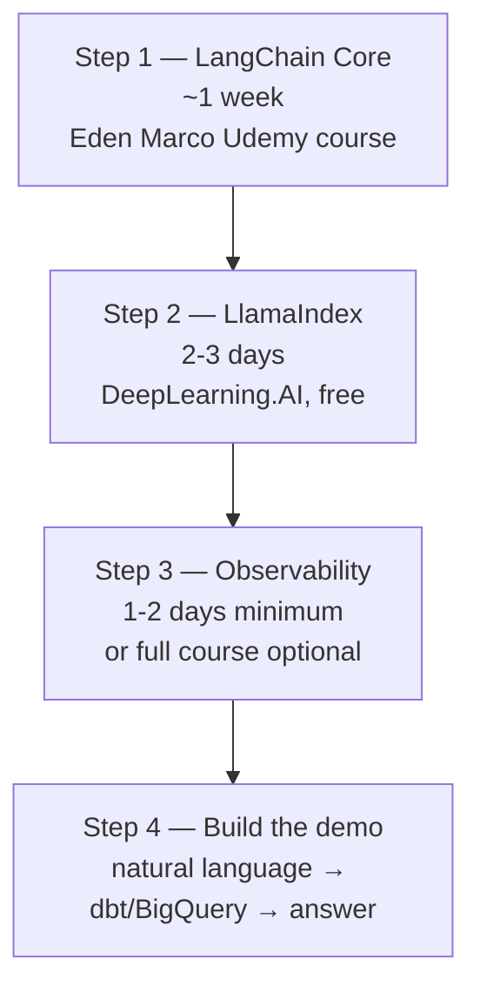
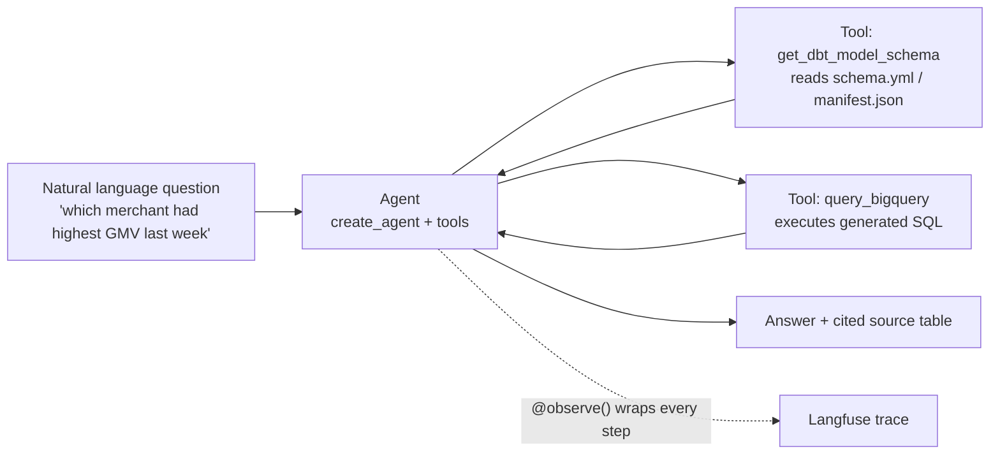

# AI Agent Learning Plan — Targeting: Analytics Engineering Manager (AI & Agentic Analytics) @ foodpanda

> Goal: be able to demo a working "natural language → dbt/BigQuery → answer" agent, and speak fluently about the production stack (LlamaIndex, observability, semantic layer) the JD names explicitly.

---

## 📚 Table of Contents

- [Chap 1. Decoding the JD](#chap-1-decoding-the-jd)
- [Chap 2. Why LangChain First, Even Though the JD Says LlamaIndex/ADK](#chap-2-why-langchain-first-even-though-the-jd-says-llamaindexadk)
- [Chap 3. The Four-Step Path](#chap-3-the-four-step-path)
- [Chap 4. Step 1 — LangChain Core (Eden Marco)](#chap-4-step-1--langchain-core-eden-marco)
- [Chap 5. Step 2 — LlamaIndex (DeepLearning.AI, free)](#chap-5-step-2--llamaindex-deeplearningai-free)
- [Chap 6. Step 3 — Observability (Production Track + Langfuse)](#chap-6-step-3--observability-production-track--langfuse)
- [Chap 7. Step 4 — The Demo Itself](#chap-7-step-4--the-demo-itself)
- [Chap 8. Full Resource Table](#chap-8-full-resource-table)
- [Chap 9. Interview Talking Points](#chap-9-interview-talking-points)

---

## Chap 1. Decoding the JD

📌 **This is a player-coach analytics engineering role with an AI layer bolted on — not a pure AI engineering role.**

| JD line | What it actually means | Weight |
|---|---|---|
| "5+ years analytics engineering... dbt, BigQuery" | This is the floor. Without this you don't pass screening. | Core |
| "3+ years leadership... mentoring" | Player-coach — you'll still write code, but also run code reviews | Core |
| "Build internal copilots, workflow agents, intelligent data QA bots" | This is the part a demo can prove | Differentiator |
| "Own the semantic layer... dbt and BigQuery" | Metrics/entities/metadata layer both humans AND agents query | Core + AI bridge |
| "Evaluation and monitoring... Langfuse or Phoenix" | They want you to know LLM observability exists and roughly how it works — not necessarily deep hands-on | Differentiator |
| "Stack: dbt, BigQuery, LlamaIndex, ADK, n8n" | **LlamaIndex explicitly named — not LangChain.** ADK = Google's Agent Development Kit. | Differentiator |

```
关键判断：
        ↓
JD里完全没提LangChain，但LangChain是市面上
教学资料最完整、概念最体系化的框架
        ↓
策略：用LangChain打底层概念（agent/RAG/tool calling
这些概念是框架无关的），再花小成本学LlamaIndex的API
语法差异，这样比直接啃LlamaIndex零散文档效率高
```

---

## Chap 2. Why LangChain First, Even Though the JD Says LlamaIndex/ADK

```
LangChain               LlamaIndex              ADK (Google)
   ↓                        ↓                        ↓
chain组合为中心          索引/检索为中心            Google生态原生
教学资料最完整            更适合"文档密集型"RAG      文档相对少
概念体系最系统            和你的JD贴合度实际更高     国内资料少
        ↓                        ↓                        ↓
    学这个打基础         API语法差异，1-2天能补    可选，非必须
   （Eden Marco课）      （Jerry Liu短课，免费）   （除非面试明确问）
```

**底层概念是通用的，这些在三个框架里都长一个样：**
- Agent loop（think → act → observe → repeat）
- Tool calling / function calling
- RAG 的四个building block：Loader → Splitter → Embedding → VectorStore
- 状态管理与多步推理

---

## Chap 3. The Four-Step Path



| Step | What | Time | Cost |
|---|---|---|---|
| 1 | LangChain core concepts | ~1 week | Paid (already have coupon) |
| 2 | LlamaIndex API differences | 2-3 days | Free |
| 3 | Observability (Langfuse/Phoenix) | 1-2 days (docs) or 18.5h (full course) | Free docs / Paid course |
| 4 | Build dbt+BigQuery agent demo | Stitch together | Free (your own code) |

---

## Chap 4. Step 1 — LangChain Core (Eden Marco)

**Course:** LangChain — Agentic AI Engineering with LangChain & LangGraph
**Link:** https://www.udemy.com/course/langchain/?couponCode=MT260629G3
**Instructor:** Eden Marco · 182,669 students · 4.6★

### What to prioritize (not the full 19 hours — targeted)

| Section | Why it matters for this JD |
|---|---|
| Section 2 — The GIST of LangChain | LCEL syntax — the `\|` pipe operator you'll use everywhere |
| Section 3 — The GIST of AI Agents | Agent vs Chain distinction, the 4-stage ReAct evolution timeline |
| Section 4-6 — Agents Under The Hood | **Most valuable for interview depth** — building the agent loop by hand means you can explain *why* tool calling works, not just *that* it works |
| Section 7 — The GIST of RAG | Naive RAG vs LCEL RAG — the architecture critique here directly informs how you should design a QA bot |
| Section 8 — Documentation Assistant | The `content_and_artifact` pattern — exactly what a "data QA bot" needs for citing which dbt model/table it queried |

**🎯 Concept Primer — why Section 8's pattern matters for your demo**
```
A data QA bot answering "which merchant had highest GMV last week"
needs to show its work — which table, which SQL, which dbt model.
        ↓
content_and_artifact pattern:
  content  → answer text sent back to the LLM
  artifact → raw query results / source table metadata,
             shown directly to the user, bypassing the LLM
        ↓
This is the exact mechanism for building trust in an
internal analytics copilot — the JD's "trusted, scalable
data language" language maps directly to this pattern.
```

---

## Chap 5. Step 2 — LlamaIndex (DeepLearning.AI, free)

**Course:** Building Agentic RAG with LlamaIndex
**Link:** https://www.deeplearning.ai/courses/building-agentic-rag-with-llamaindex/
**Instructor:** Jerry Liu, co-founder & CEO of LlamaIndex
**Length:** ~1-2 hours, free

### What it covers

| Lecture | Content |
|---|---|
| Router | Simplest agentic RAG — given a query, pick Q&A or summarization engine |
| Tool Calling | LLM picks a function AND infers arguments to pass |
| Research Agent | Multi-step reasoning over tools, not single-shot |
| Multi-document Agent | Extends to handling multiple documents intelligently |

**🎯 Concept Primer — LangChain vs LlamaIndex, the one-sentence answer**
```
LangChain  = chain-composition-centric
             ("pipe together prompt → llm → parser → tool")

LlamaIndex = index-centric
             ("build an index over your data, query it intelligently")
        ↓
For a JD that explicitly wants you querying dbt models
and BigQuery tables — LlamaIndex's index-first mental model
arguably maps MORE naturally to "index the semantic layer,
then let an agent query it" than LangChain's chain-first model.
        ↓
This is worth saying in an interview: you understand WHY
the JD might prefer LlamaIndex for this specific use case,
not just that you've heard of it.
```

Alternative platform (same course, different UI):
https://www.coursera.org/projects/building-agentic-rag-with-llamaindex

---

## Chap 6. Step 3 — Observability (Production Track + Langfuse)

### Option A — Fast path: Langfuse docs only (1-2 days)

| Resource | Link | What to read |
|---|---|---|
| Docs home | https://langfuse.com/docs | Skim structure |
| Observability overview | https://langfuse.com/docs/observability/overview | Core concepts: trace, span, generation, session |
| Get started guide | https://langfuse.com/docs/observability/get-started | `@observe()` decorator + LangChain callback handler |
| GitHub repo | https://github.com/langfuse/langfuse | Just to say you looked at the source |

**🎯 Concept Primer — Langfuse's data model, the five objects**
```
Trace        → one end-to-end request (one user interaction)
  └─ Span        → a unit of work with duration (retrieval, tool call)
  └─ Generation   → a span specifically for one LLM call
                     (model name, prompt, completion, tokens, cost)
  └─ Event        → point-in-time marker, no duration

Session      → groups multiple traces (one multi-turn conversation)
Score        → quality signal attached to a trace (numeric/bool/category)
        ↓
Memorize this five-object model — it's the entire mental
model behind "LLM observability" and applies whether you
use Langfuse, Phoenix, or anything else in this category.
```

### Option B — Deep path: full course (18.5h, optional but strong signal)

**Course:** AI Engineer Production Track: Deploy LLMs & Agents at Scale
**Link:** search "AI Engineer Production Track Ed Donner Udemy" (same Udemy account family as the Agentic Track)
**Instructors:** Ed Donner / Ligency · 4.7★ · 3,240 ratings · 124 lectures

```
This course explicitly covers:
"Deploy AI to AWS, GCP, Azure, Vercel with MLOps,
 Bedrock, SageMaker, RAG, Agents, MCP:
 scalable, secure and observable"
        ↓
The word "observable" here is doing real work — this is
a FULL COURSE on the production layer, not just docs.
        ↓
Take this if: you want to go deeper than "I read the docs"
and actually have hands-on deployment + monitoring reps
to talk about. Higher signal for a Manager-level role that
needs to set best practices for a team, not just ship demos.
```

---

## Chap 7. Step 4 — The Demo Itself

**No course teaches this combination — it's your own stitching job.**

### Reference doc
LangChain BigQuery integration:
https://python.langchain.com/docs/integrations/tools/google_bigquery/
*(if link has moved, search: "LangChain BigQuery tool integration")*

### Architecture



### Skeleton code

```python
from langchain.tools import tool
from langchain.agents import create_agent
from google.cloud import bigquery

@tool
def query_bigquery(sql: str) -> str:
    """Execute a SQL query against BigQuery and return results."""
    client = bigquery.Client()
    return str(client.query(sql).to_dataframe())

@tool
def get_dbt_model_schema(model_name: str) -> str:
    """Read the schema definition for a dbt model."""
    # parse schema.yml or manifest.json
    ...

agent = create_agent(
    model=llm,
    tools=[query_bigquery, get_dbt_model_schema]
)

# "which merchant had highest GMV last week"
# → agent checks schema to understand fields
# → generates SQL
# → queries BigQuery
# → returns answer
```

**🎯 Why this demo is the right one for this specific JD**
```
JD says, verbatim:
"Build internal copilots, workflow agents,
 and intelligent data QA bots"
        ↓
This demo IS one of those three things —
a data QA bot that bridges natural language ↔ your
actual dbt + BigQuery stack, which is also explicitly
named in the JD's tech stack list.
        ↓
Wrap query_bigquery and get_dbt_model_schema with
Langfuse's @observe() decorator. Even a single trace
screenshot in your portfolio shows you understand BOTH
halves of the JD: building the agent AND monitoring it.
```

---

## Chap 8. Full Resource Table

| Step | Resource | Link | Time | Cost |
|---|---|---|---|---|
| 1 | LangChain — Eden Marco | https://www.udemy.com/course/langchain/?couponCode=MT260629G3 | ~1 week | Paid |
| 2 | LlamaIndex — DeepLearning.AI | https://www.deeplearning.ai/courses/building-agentic-rag-with-llamaindex/ | 2-3 days | Free |
| 2b | LlamaIndex — Coursera mirror | https://www.coursera.org/projects/building-agentic-rag-with-llamaindex | — | Free |
| 3a | Langfuse docs home | https://langfuse.com/docs | — | Free |
| 3b | Langfuse observability overview | https://langfuse.com/docs/observability/overview | 30 min | Free |
| 3c | Langfuse get started guide | https://langfuse.com/docs/observability/get-started | 1-2 days | Free |
| 3d | Langfuse GitHub | https://github.com/langfuse/langfuse | — | Free |
| 3e (optional) | AI Engineer Production Track | search Udemy: "AI Engineer Production Track Ed Donner" | 18.5h | Paid |
| 4 | LangChain BigQuery integration | https://python.langchain.com/docs/integrations/tools/google_bigquery/ | — | Free |

---

## Chap 9. Interview Talking Points

Use these as ready-made answers once you've completed the path above.

| Likely question | Your answer |
|---|---|
| "Why LangChain if our stack is LlamaIndex?" | "Agent architecture concepts — tool calling, RAG, multi-step reasoning — are framework-agnostic. I built the foundation with LangChain because the teaching material is the most systematic available, then mapped that onto LlamaIndex's index-centric API, which I'd argue fits your use case even better since you're querying a structured semantic layer." |
| "How do you monitor an LLM application in production?" | "I'd instrument it with Langfuse — wrap each agent step with `@observe()`, track traces per user session, and watch cost/latency/quality scores on a dashboard. The five-object model — trace, span, generation, session, score — covers everything from a single LLM call to a multi-turn conversation." |
| "Walk me through a project you'd build for this role." | Walk through the dbt+BigQuery demo: natural language in, agent checks the dbt schema, generates SQL, queries BigQuery, returns a cited answer — directly mirroring "internal copilots, workflow agents, intelligent data QA bots" from the JD. |
| "How would you evaluate whether an agent's answer is correct?" | Reference Langfuse's Score object — LLM-as-judge, heuristic functions, or human annotation, attached to a trace and tracked over time. |
