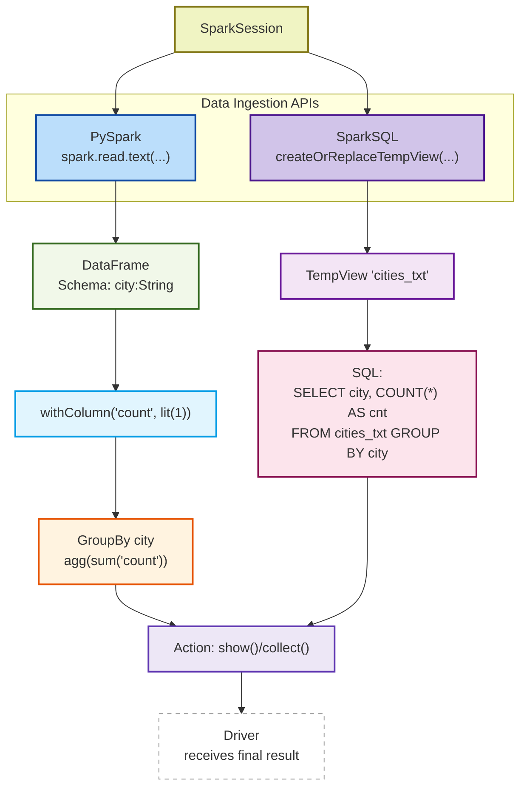
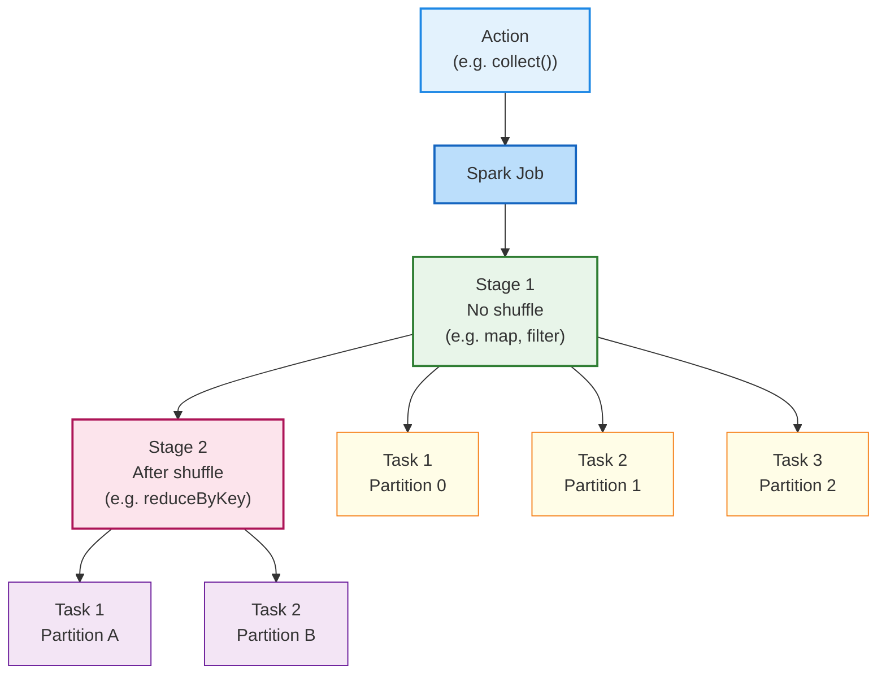
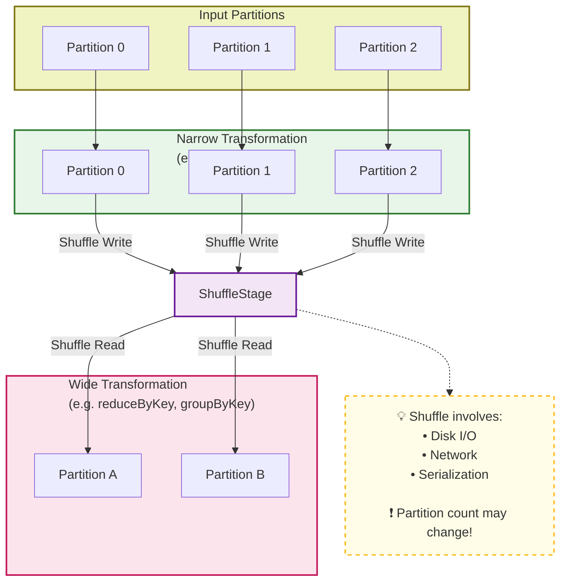
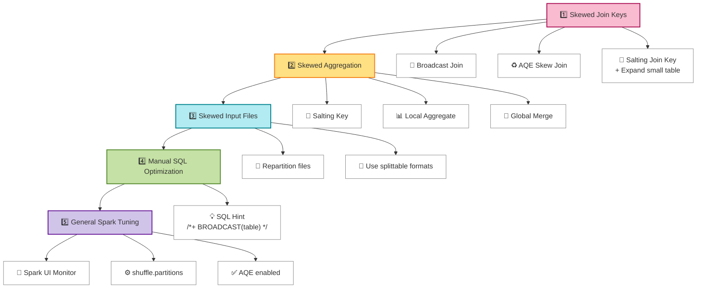

Apache Spark (Distributed computing engine)

## 🟩 1. Apache Spark Core Concepts
📌 **RDD, DataFrame, Lazy |  fault tolerance mechanisms** /fɔːlt/ /ˈtɒlərəns/ /ˈmekənɪzəmz/

---
## 🟨 2. Execution Model

📌 **Job → Stage → Task**

## 🟧 3. Shuffle & Partitioning

📌 **Shuffle = Costly, Wide vs Narrow**

## 4. Data Skew（skewness)

🔥 Data Skew in Spark - *Unbalanced data across partitions*

