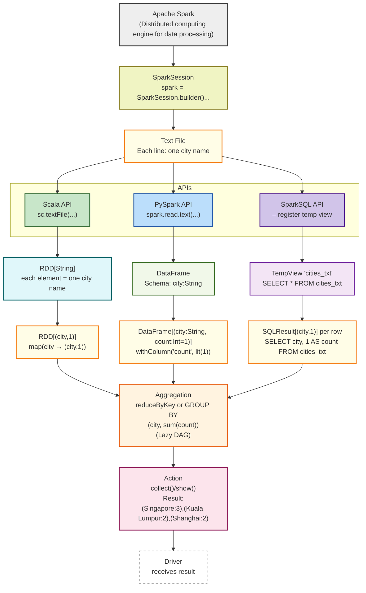
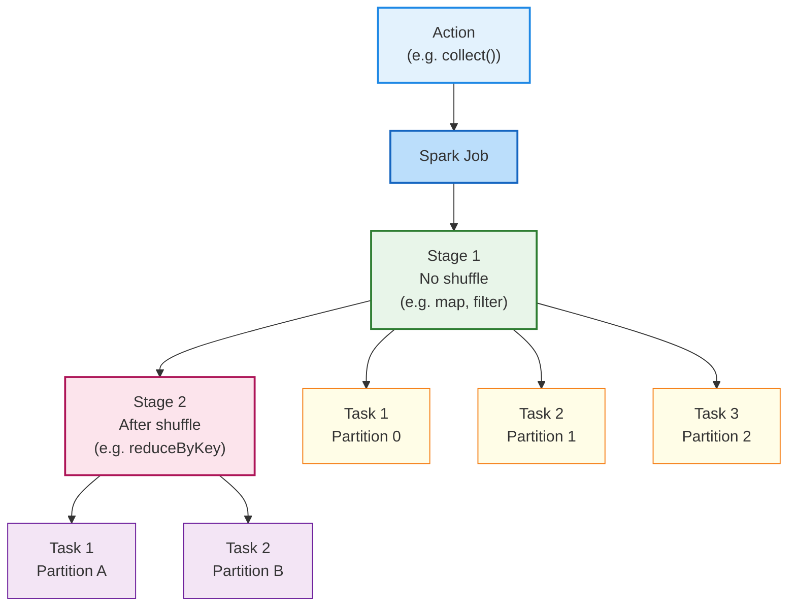
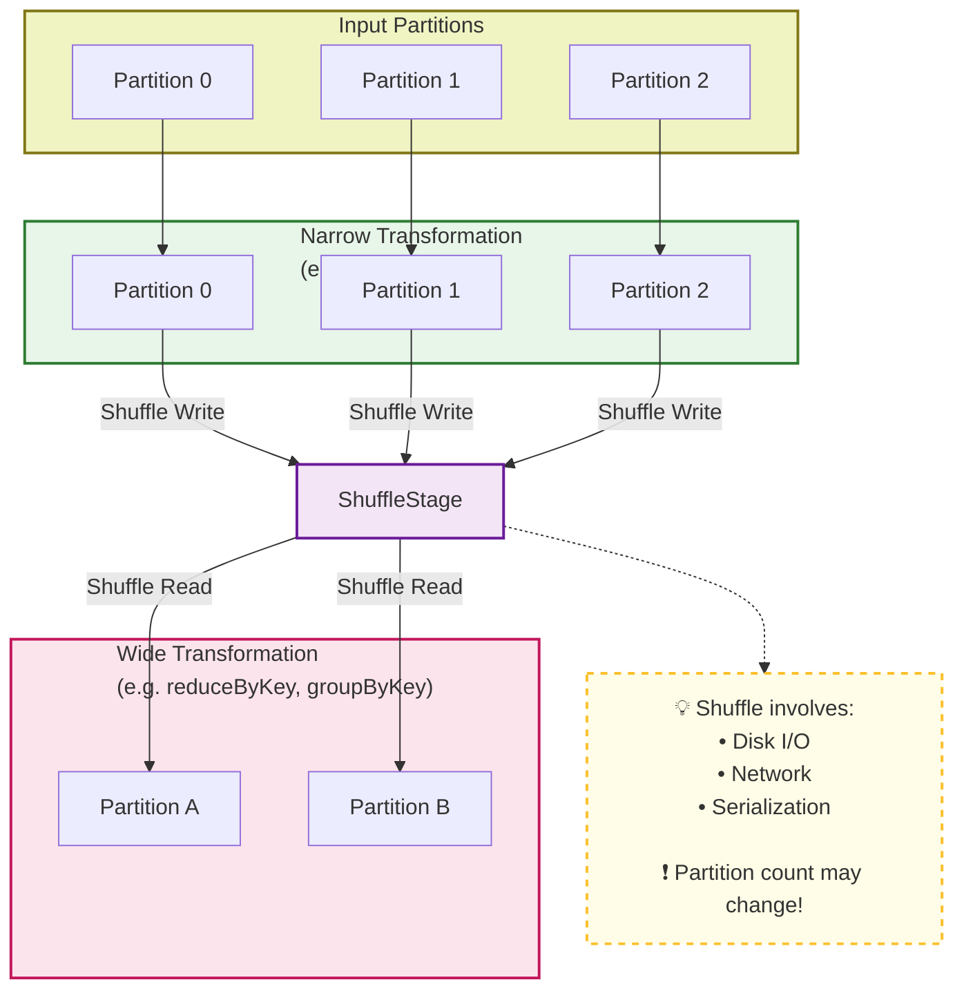

## 🟩 1. Core Concepts

📌 **RDD, DataFrame, Lazy |  fault** /fɔːlt/ **tolerance** /ˈtɒlərəns/ **mechanisms** /ˈmekənɪzəmz/

---
## 🟨 2. Execution Model

📌 **Job → Stage → Task**

## 🟧 3. Shuffle & Partitioning

📌 **Shuffle = Costly, Wide vs Narrow**

