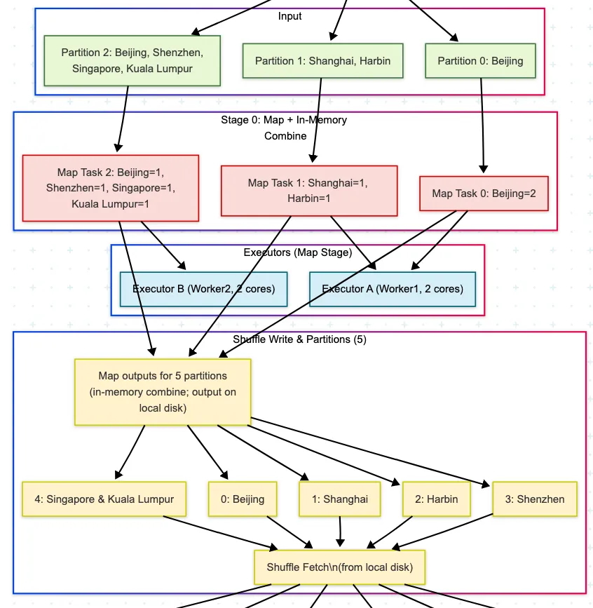
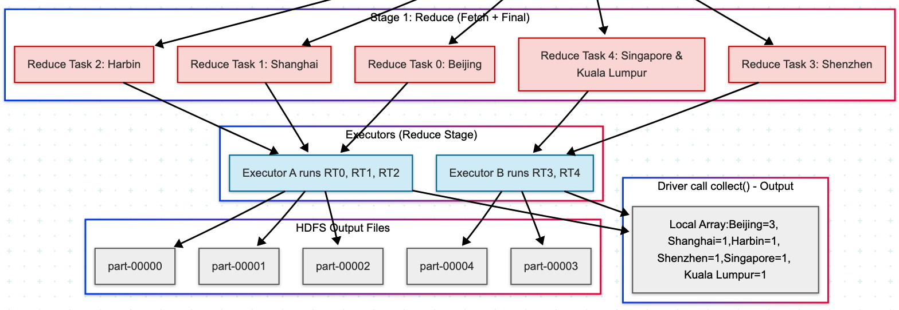

```mermaid
flowchart TD
    %% Action & Job
    A["Action<br>(e.g. collect())"]
    A --> Job["Spark Job"]

    %% Stages
    Job --> Stage0["Stage 0<br>Shuffle Map Stage"]
    Stage0 --> Stage1["Stage 1<br>Reduce Stage"]

    %% ===== Map0: Sort-based Shuffle 子图 =====
    subgraph SB0["Map Task 0 — Sort Shuffle (per-map: single data file + index)"]
        direction TB
        T1["Shuffle Map Task<br>Partition 0"]
        T1 --> SF1["Shuffle File (Map0.data + Map0.index)"]
    end

    %% ===== Map1: Sort-based Shuffle 子图 =====
    subgraph SB1["Map Task 1 — Sort Shuffle (per-map: single data file + index)"]
        direction TB
        T2["Shuffle Map Task<br>Partition 1"]
        T2 --> SF2["Shuffle File (Map1.data + Map1.index)"]
    end

    %% ===== Map2: Sort-based Shuffle 子图 =====
    subgraph SB2["Map Task 2 — Sort Shuffle (per-map: single data file + index)"]
        direction TB
        T3["Shuffle Map Task<br>Partition 2"]
        T3 --> SF3["Shuffle File (Map2.data + Map2.index)"]
    end

    %% Stage0 指向各 Map 任务（在子图内）
    Stage0 --> T1
    Stage0 --> T2
    Stage0 --> T3

    %% AQE 节点 (黄色虚线框，Stage1 reduce task 调整)
    subgraph AQE["AQE Re-Planning<br>(Coalesce / Skew Split / Join Strategy)"]
        direction TB
        AQE_T["Adjust Reduce Tasks"]
    end
    SF1 -.-> AQE
    SF2 -.-> AQE
    SF3 -.-> AQE
    AQE -.-> Stage1

    %% Stage1 Reduce Tasks (调整后)
    Stage1 --> T4["Reduce Task<br>Partition A"]
    Stage1 --> T5["Reduce Task<br>Partition B"]

    %% 在 Reduce Task 右侧加注释（非流程节点）
    subgraph G1[ ]
      direction LR
      T4 -. note .- NoteT4["Note: reads its slice<br/>from all map shuffle files → aggregate"]
    end
    subgraph G2[ ]
      direction LR
      T5 -. note .- NoteT5["Note: reads its slice<br/>from all map shuffle files → aggregate"]
    end

    %% Stage颜色
    style Stage0 fill:#e8f5e9,stroke:#2e7d32,stroke-width:2px
    style Stage1 fill:#e8f5e9,stroke:#2e7d32,stroke-width:2px

    %% Task颜色
    style T1 fill:#fffde7,stroke:#f57f17
    style T2 fill:#fffde7,stroke:#f57f17
    style T3 fill:#fffde7,stroke:#f57f17
    style T4 fill:#f3e5f5,stroke:#6a1b9a
    style T5 fill:#f3e5f5,stroke:#6a1b9a
    style AQE_T fill:#fff59d,stroke:#fbc02d,stroke-dasharray:5 5,stroke-width:2px

    %% Shuffle 文件颜色
    style SF1 fill:#e0e0e0,stroke:#9e9e9e
    style SF2 fill:#e0e0e0,stroke:#9e9e9e
    style SF3 fill:#e0e0e0,stroke:#9e9e9e

    %% Note颜色
    style NoteT4 fill:#fafafa,stroke:#bdbdbd,stroke-dasharray: 2 2
    style NoteT5 fill:#fafafa,stroke:#bdbdbd,stroke-dasharray: 2 2

    %% Action & Job 颜色
    style A fill:#e3f2fd,stroke:#1e88e5,stroke-width:2px
    style Job fill:#bbdefb,stroke:#1565c0,stroke-width:2px
```

## 📚 Table of Contents

- [Chap 1. Apache Spark Core Concepts](#-1-apache-spark-core-concepts)
- [Chap 2. Execution Model](#-2-execution-model)
- [Chap 3. Shuffle & Partitioning](#-3-shuffle--partitioning)
- [Chap 4. Data Skew（Skewness）](#4-data-skewskewness)
- [Chap 5. General Spark Tuning (Skew Indirectly Helpful)](#5-general-spark-tuning-skew-indirectly-helpful)
- [Chap 6. ❓ Spark QA](#6--spark-qa)

Apache Spark (Distributed computing engine)

## 🟩 1. Apache Spark Core Concepts
📌 **RDD, DataFrame, Lazy |  fault tolerance mechanisms** /fɔːlt/ /ˈtɒlərəns/ /ˈmekənɪzəmz/

| No. | ❓Question | ✅ Answer | 📘 Notes |
| --- | --- | --- | --- |
| 1 | **What is Apache Spark?** | A distributed computing engine for large-scale data processing. | Supports in-memory computation and APIs in Scala, Python, Java, SQL. |
| 2 | **What is an RDD?** | An immutable, partitionable, distributed collection of objects. | immutable to enhance the stability of parallel computation and simplify fault tolerance mechanisms;    supports transformations like `map`, `filter`, `reduceByKey`. |
| 3 | **What is a DataFrame?** | A distributed table with named columns and typed rows. | Built on RDDs; optimized by Catalyst engine; like a distributed Pandas/DataTable. |
| 4 | **What is a transformation?** | A lazy operation that returns a new RDD or DataFrame. **<mark>Narrow transformations + Wide transformations</mark>** | Examples: `map()`, `filter()`, `groupBy()`. |
| 5 | **What is an action?** | An operation that triggers actual computation and returns results. | Examples: `collect()`, `count()`, `show()`. |
| 6 | **What is lazy evaluation?** | Spark builds a **<mark>logical DAG of transformations</mark>**, which is only executed when **an action is called**. | Enables optimization and fault tolerance. |

Spark builds a **<mark>logical DAG of transformations</mark>**, which is only executed when **an action is called**.

<div align="center">
  
</div>

<details>
<summary><strong>SparkSession</strong></summary>


</details>

---
## 🟨 2. Execution Model

### 2.1 📌 **<mark>Job → Stage → Task</mark>**

| No. | Question | Summary |
| --- | --- | --- |
| 7 | What is a Spark job? | Triggered by action ("collect, take(n), saveAsTextFile(path), show..DF"), Spark creates a job - **<mark>consists of stages</mark>**, |
| 8 | What is a stage in Spark? | a set of parallel **tasks** that execute the same computation on different **partitions of the data**. <br> **<mark>A set of tasks</mark>** between shuffles. |
| 9 | What is a task? | **<mark>Unit of execution</mark>** on a partition. |

Stage division： Spark splits the DAG into stages at shuffle operations (like reduceByKey, groupBy, join).

<details>
<summary><strong>Execution Model</strong></summary>

<div align="center">
  
</div>

<div align="center">
  
</div>

</details>



| No. | Question | Summary |
| --- | --- | --- |
| Stage0 | contains narrow transformations (e.g. `map`, `filter`) **and writes shuffle output if followed by a wide transformation** | 👉 Divided into multiple **Tasks**, each processing **one input partition** (e.g. Partition 0, 1, 2), executing all narrow transformations **in parallel**. Shuffle files are written if needed for Stage1. |
| Stage1 | begins **after Stage 0 completes**, involves **wide transformations** (e.g. `reduceByKey`)                                | 👉 Divided into **Tasks** operating on **shuffled partitions** (e.g. Partition A, B). Tasks run **in parallel**, and once Stage 1 completes, the **final result** is returned to the **Driver**.            |

> Wide Dependency : A parent partition may be used by multiple child partitions.

### 2.2 Spark Component

| No. | Component       | What It Does |
| --- |-----------------|-------------|
| 1 | Client | Acts as the client on the user’s behalf, responsible for submitting applications.
| 2 | **Driver**      | Runs your main application code (`main()`), creates the `SparkContext` <br> Responsible for the scheduling of jobs, i.e., the distribution of tasks. Think of it as the “orchestrator” of your Spark job. |
| 3 | **Worker**      | A machine/node in the cluster that runs executors. It follows the driver’s instructions and reports back its status. |
| 4 | **Executor**    | Runs the actual tasks on a worker node. Each executor has a pool of threads to process multiple tasks in parallel. |
| 5 | **Cluster Manager** | Controls the cluster (like the “master controller”). In Standalone mode, it launches workers, monitors them, and helps schedule jobs. |

<div align="center">
  
</div>

| Step | Spark App Process | Description |
|------|-----------------|-------------|
| 1    | Client submission | The client submits the Spark application to the cluster. |
| 2    | Driver launch    | The Master selects a Worker to start the Driver. |
| 3    | Resource request & RDD graph creation | The Driver requests resources from the Master or resource manager, and converts the application into an RDD graph. |
| 4    | DAG creation & stage planning | DAGScheduler converts the RDD graph into a DAG of stages and submits it to TaskScheduler. |
| 5    | Task scheduling  | TaskScheduler sends tasks to Executors for execution. |
| 6    | Task execution & coordination | Driver serializes tasks along with required files/jars and sends them to Workers. Executors execute tasks on assigned data partitions. Other components coordinate to ensure smooth application execution. |


## 🟧 3. Shuffle & Partitioning

📌 **Shuffle = Costly, Wide vs Narrow**

| # | Question | Summary |
| --- | --- | --- |
| 10 | What is a shuffle in Spark? | Data redistribution across partitions.  |
| 11 | Why is shuffle expensive? | Disk I/O + network + serialization. |
| 12 | What is the difference between narrow and wide transformations? | Narrow = no shuffle, Wide = shuffle needed. |

```mermaid
flowchart TD
    subgraph InputPartitions["Input Partitions"]
        A0["Partition 0"]
        A1["Partition 1"]
        A2["Partition 2"]
    end

    subgraph NarrowTransformation["Narrow Transformation<br>(e.g. map, filter)"]
        B0["Partition 0"]
        B1["Partition 1"]
        B2["Partition 2"]
    end

    subgraph WideTransformation["Wide Transformation<br>(e.g. reduceByKey, groupByKey)"]
        C0["Partition A"]
        C1["Partition B"]
    end

    A0 --> B0
    A1 --> B1
    A2 --> B2

    B0 -->|Shuffle Write| ShuffleStage
    B1 -->|Shuffle Write| ShuffleStage
    B2 -->|Shuffle Write| ShuffleStage

    ShuffleStage -->|Shuffle Read| C0
    ShuffleStage -->|Shuffle Read| C1

    Note1["💡 Shuffle involves:<br>• Disk I/O<br>• Network<br>• Serialization<br><br>❗ Partition count may change!"]
    ShuffleStage -.-> Note1

    %% Styling
    style InputPartitions fill:#f0f4c3,stroke:#827717,stroke-width:2px
    style NarrowTransformation fill:#e8f5e9,stroke:#2e7d32,stroke-width:2px
    style WideTransformation fill:#fce4ec,stroke:#c2185b,stroke-width:2px
    style ShuffleStage fill:#f3e5f5,stroke:#6a1b9a,stroke-width:2px
    style Note1 fill:#fffde7,stroke:#fbc02d,stroke-width:2px,stroke-dasharray: 5 5
```

<details>
<summary><strong>Narrow vs Wise Dependency</strong></summary>

<div align="center">
  
</div>

| No. | ❓Question   | ✅ Answer| 📘 Notes                                                                                                    
| --- | --- | --- | --- |
| 1   | What is a Narrow Dependency in Spark?  | A **narrow dependency** means that **each partition** of the parent RDD is used by **at most one partition** of the child RDD.                            | No shuffle is required. Examples include `map`, `filter`, and `union`. These operations allow pipelined execution and are typically faster and more efficient.           |
| 2   | What is a Wide Dependency in Spark?    | A **wide dependency** means that **multiple partitions** of the parent RDD may be used by **multiple partitions** of the child RDD.                       | This necessitates a shuffle across the cluster, typically seen in operations like `groupBy`, `reduceByKey`, or `join`. It incurs higher overhead and network transfer.   |
| 3   | Why are Wide Dependencies expensive?   | Because they involve **shuffles**, during which data must be **redistributed** across nodes, leading to **disk I/O**, **network transfer**, and **skew**. | Wide dependencies are often the primary bottleneck. Optimisation may require techniques such as salting, repartitioning, or adaptive execution.                         |
| 4   | Can Spark optimise Wide Dependencies?  | Yes, Spark can use **Adaptive Query Execution (AQE)** to detect skew and adjust partitioning dynamically to reduce overhead.                             | Enable configs like `spark.sql.adaptive.enabled` and `spark.sql.adaptive.skewJoin.enabled`. AQE may merge small partitions or split skewed ones to improve performance. |

</details>



🔁 Task Count Comparison

| Stage   | Task Type | Count | Description 
| --- | --- | --- | --- |
| Stage 0 | **Shuffle Map Tasks** | **3** | One task per input partition (P0–P2). Each task executes all narrow transformations (map/flatMap/…) in a pipeline, then buckets records by key and writes **2 shuffle outputs** (for partitions A and B). |
| Stage 1 | **Reduce Tasks**      | **2** | One task per output partition (A, B). **Each reduce task fetches its partition’s blocks from all 3 shuffle map tasks** (one block per map task), then merges/aggregates to produce the final result.      |


## 4. Data Skew（skewness)

🔥 Data Skew in Spark - *Unbalanced data across partitions*

| Category  | Optimization Methods | Notes / Best Practices                       
| --- | --- | --- | 
| 1️⃣ Skewed Input Files         | Repartitioning, **<mark>Merging small files</mark>**, Using columnar file formats (Parquet/ORC), Increasing `spark.sql.files.maxPartitionBytes` <br> `spark.sql.files.openCostInBytes` | Avoid too many small files that lead to excessive tasks or file handle pressure; control partition sizes appropriately                               |
| 2️⃣ Skewed Join Keys           | Broadcast Join, **<mark>Salting, Adaptive Query Execution (AQE)</mark>**, Map-side join               | For highly skewed join keys, AQE can split large partitions at runtime or broadcast small tables to reduce shuffle                                   |
| 3️⃣ Skewed Aggregation         | **<mark>Salting + Two-stage aggregation, AQE coalesce partitions</mark>**                             | For uneven key distributions in aggregations, pre-salt to scatter keys, then aggregate and remove salt; AQE can automatically split large partitions |
| 4️⃣ General Tuning & SQL Hints | SQL hints (e.g., `/*+ BROADCAST */`), Repartitioning, AQE (coalesce & skew join), Cache/Checkpoint    | Overall performance tuning: use hints to guide joins/partitions, cache hotspot data appropriately, adjust parallelism                                |


| # | Question | Summary |
| --- | --- | --- |
| 13 | What is data skew? | Unbalanced data across partitions. |
| 14 | What causes it? | Skewed key distribution. |
| 15 | Why is it bad? | Causes long-running tasks, resource underuse. |
| 16 | How to detect it? | Spark UI (task duration, skewed keys). |
| 17 | What ops are sensitive? | Joins, groupByKey, reduceByKey. |
| 18 | What is salting? | Adding randomness to distribute hot keys. |
| 19 | How does salting+grouping work? | Salt keys → aggregate → merge. |
| 20 | What is a broadcast join? | Send small table to all workers. |
| 21 | When to use broadcast? | Small tables (<10MB), skewed joins. |
| 22 | What Spark configs help? | `spark.sql.shuffle.partitions`, `autoBroadcastJoinThreshold`. |
| 23 | What is AQE? | Adaptive runtime optimizations (incl. skew fix). |
| 24 | Other methods to handle skew? | Filter hot keys, use approx algorithms, repartition. |

| AQE  —  Functions    | What It Does - (Adaptive Query Execution)   |    Benefit      |
| ---------------------------------------------- | ----------------------------------------------------------------------------------------------------------- | ------------------------------------------------- |
| **1. Dynamically coalesce shuffle partitions** | Merges many small shuffle partitions into fewer larger ones at runtime                                      | Reduces empty tasks, lowers scheduling overhead   |
| **2. Handle skewed joins (skew split)**        | Detects skewed partitions (hot keys) and splits them into multiple tasks   <br> It will add a <mark>final aggregation step</mark> to merge the intermediate results. <br> Think of skew handling like <mark>cutting the elephant into pieces — that’s what AQE does</mark>. But it’s not turning the elephant into smaller animals. So the huge key is still huge, just processed in slices.               | Avoids long-tail stragglers, improves parallelism |
| **3. Switch join strategies at runtime**       | Can change SortMergeJoin → BroadcastHashJoin (or others) if actual stats differ from estimates              | Better performance, avoids unnecessary shuffles   |
| **4. Improve overall robustness**              | Uses *runtime statistics* (row count, size, distribution) instead of relying only on compile-time estimates | More stable performance even with bad statistics  |

### 🟢 1. Skewed Input Files


```bash
spark.conf.set("spark.sql.files.maxPartitionBytes", 256*1024*1024)  # 128–512MB common setting
spark.conf.set("spark.sql.files.openCostInBytes",   8*1024*1024)    # 8–16MB adjustable for small file sizes, 1M+8M = 9M
# 1000 1M small files
# 1000 / 256 = 4 tasks VS 1000 / (256/9) = 36 tasks can reduce file handles
spark.conf.set("spark.sql.orc.enableVectorizedReader","true")
spark.conf.set("spark.sql.orc.filterPushdown","true")
# AQE (valid for shuffles)
spark.conf.set("spark.sql.adaptive.enabled","true")
spark.conf.set("spark.sql.adaptive.coalescePartitions.enabled","true")
spark.conf.set("spark.sql.adaptive.skewJoin.enabled","true")
```

<details>
<summary>💬 **Solution:**</summary>

> SET spark.sql.shuffle.partitions = 20;     
> SET hive.exec.dynamic.partition.mode = nonstrict;

```mermaid
graph TD
    A[Detect too many small files]:::start --> B[Set spark.sql parameters]:::config
    B --> C[Use INSERT OVERWRITE]:::action
    C --> D{Need to shuffle output?}:::decision
    D -- Yes --> E[Use DISTRIBUTE BY rand（） or column]:::shuffle
    D -- No --> F[Direct INSERT OVERWRITE]:::overwrite
    E --> G[Files merged successfully]:::success
    F --> G

    classDef start fill:#e6f7ff,stroke:#1890ff,stroke-width:2px;
    classDef config fill:#f9f0ff,stroke:#9254de,stroke-width:2px;
    classDef action fill:#fffbe6,stroke:#faad14,stroke-width:2px;
    classDef decision fill:#fff0f6,stroke:#eb2f96,stroke-width:2px;
    classDef shuffle fill:#f6ffed,stroke:#52c41a,stroke-width:2px;
    classDef overwrite fill:#e6fffb,stroke:#13c2c2,stroke-width:2px;
    classDef success fill:#f0f5ff,stroke:#2f54eb,stroke-width:2px;
```



</details>

### 🟣 2. Skewed Join Keys


| Feature                  | AQE (Adaptive Query Execution)          | Salting                                          |
| ------------------------ | --------------------------------------- | ------------------------------------------------ |
| **Optimization timing**  | After shuffle (runtime) <br> **With AQE enabled**, spark.sql.shuffle.partitions is used only as an **<mark>initial value / upper bound</mark>** for the shuffle partitions. AQE will dynamically merge or split them at runtime.                | Before shuffle (logical rewrite)                 |
| **Implementation**       | Automatic (enable config)               | Manual (modify SQL/ETL)                          |
| **Skew type handled**    | Join/aggregation skew **after** shuffle <br> 1. AQE does not rewrite data to disk — it only modifies the scheduling metadata. <br> 2. The shuffle files remain exactly the ones written by the map stage. <br> 3. As a result, AQE’s overhead is minimal (it’s just analysis and re-planning), and there’s no need for a disk rewrite. | Join skew or data source skew **before** shuffle |
| **Intrusiveness**        | No SQL changes required                 | SQL changes required                             |
| **Best fit scenario**    | Skew is mild and/or not fixed           | Skewed key is known and severe                   |


How Spark chooses (Spark 3.3)
- Broadcast first: if one side fits autoBroadcastJoinThreshold → BHJ. (You can disable by setting to -1 or force via /*+ BROADCAST(t) */.) 
- Otherwise default = SMJ for equi-joins (because spark.sql.join.preferSortMergeJoin=true by default). 
- SHJ: considered when SMJ is not preferred (set spark.sql.join.preferSortMergeJoin=false, or hint /*+ SHUFFLE_HASH(t) */). Spark uses a per-partition hash map on the build side.

### 🟡 3. Skewed Aggregation Keys

```mermaid
flowchart TD
    A["Raw DataFrame<br>Logs with city names"]
    A --> B["Aggregation: GROUP BY city"]
    B --> C["Skewed Key Detected<br>e.g., 'Singapore' appears 1M times"]
    
    C --> D["✅ Solution:<br>• Add salt (e.g., city_1, city_2)<br>• First stage: group by salted keys<br>• Second stage: merge original keys"]

    style A fill:#f0f4c3,stroke:#827717,stroke-width:2px
    style B fill:#bbdefb,stroke:#0d47a1,stroke-width:2px
    style C fill:#f8bbd0,stroke:#c2185b,stroke-width:2px
    style D fill:#e0f7fa,stroke:#006064,stroke-width:2px
```



### 🔧 4. General Spark Tuning & SQL Optimization


## ⚙️ 5. General Spark Tuning (Skew Indirectly Helpful)

These don't solve skew but improve performance or stability overall.

```mermaid
flowchart TD
    A["🔥 Spark Optimization Techniques"]

    A --> G1["⚙️ Memory Tuning<br>- executor.memory<br>- memoryOverhead"]
    A --> G2["⚙️ Parallelism<br>- shuffle partitions"]
    A --> G3["⚙️ GC Config<br>- memory fraction<br>- G1GC"]
    A --> G4["⚙️ Dynamic Allocation<br>- auto executor scaling"]
    A --> G5["⚙️ Caching<br>- persist()/cache()"]

    style A fill:#f3e5f5,stroke:#6a1b9a,stroke-width:2px
    style G1 fill:#e0f7fa,stroke:#0288d1,stroke-width:2px
    style G2 fill:#e0f7fa,stroke:#0288d1,stroke-width:2px
    style G3 fill:#e0f7fa,stroke:#0288d1,stroke-width:2px
    style G4 fill:#e0f7fa,stroke:#0288d1,stroke-width:2px
    style G5 fill:#e0f7fa,stroke:#0288d1,stroke-width:2px
```
   


1. **Memory Configuration**
    - Adjust executor/driver memory
    - Configure memory overhead
2. **Parallelism Settings**
    - Tune `spark.sql.shuffle.partitions`
    - Adjust `spark.default.parallelism`
3. **GC Optimization**
    - Tune memory fraction
4. **Dynamic Resource Allocation**
    - Enable auto-scaling of executors
5. **Caching & Persistence**
    - Reuse intermediate results
  
## 6. ❓ Spark QA

---

<details>
<summary><strong>Q1: After Spark reads data, what determines the number of partitions, and what is the role of `spark.sql.shuffle.partitions`? Is setting it to 200 meaningful?</strong></summary>

- The initial partition count is determined by the data source (e.g., HDFS block size, file format, and parallelism).
- `spark.sql.shuffle.partitions` sets the number of partitions **after a shuffle** (e.g., joins, aggregations, groupBy), not during file read.
- Setting it to 200 can be helpful for **large datasets**, increasing parallelism; however, it might introduce overhead for small datasets.

```sql
-- Set partition count for shuffle
SET spark.sql.shuffle.partitions = 200;
```

#### 🔍 Detailed Explanation:

##### 1.1 Input Partitioning:
- Spark reads data based on HDFS block size or other input format configurations. This determines the **initial parallelism**.

##### 1.2 Read & Partition:
- After reading, data is split into partitions.
- More partitions = more parallel tasks = higher throughput (if cluster resources allow).

##### 1.3 Map Phase:
- Tasks transform data within their partition.
- No shuffle or inter-node communication occurs in this phase.

##### 1.4 Reduce Phase:
- Shuffle re-partitions data based on key, such as `groupBy`, `join`, etc.
- Number of reduce tasks is controlled by `spark.sql.shuffle.partitions`.

##### 1.5 Partitions ↔️ Tasks:
- One partition = One task.
- Parallelism depends on partition count **and** available cluster resources (e.g., executor cores).

</details>

<details>
<summary><strong>Q2: What's the difference between MapReduce and Spark in terms of shuffle and memory?</strong></summary>

- **Spark**: Supports in-memory computation and DAG execution.
- **MapReduce**: Always writes intermediate data to disk.

| Aspect              | Spark MR Equivalent                          | MapReduce (MR)                               |
|---------------------|----------------------------------------------|-----------------------------------------------|
| **Execution Model** | **<mark>DAG of stages</mark>**; in-memory, **<mark>pipelined execution</mark>** | Two fixed stages: Map → Reduce; disk-based    |
| **Shuffle**         | Sort-based Shuffle with optimizations (AQE, push-based, bypass merge) | Always disk + full sort, heavy I/O            |
| **Intermediate Data** | Cached in memory (spill to disk only if needed) | Written to disk every stage                 |
| **Fault Tolerance** | RDD lineage recomputes only lost partitions  | Restart tasks using on-disk data

#### 🔹 (1) In-Memory Advantage:

- Spark can cache data in memory across stages, significantly reducing I/O overhead.
- MapReduce flushes to HDFS between each stage.

#### 🔹 (2) DAG Execution:

- Spark builds a Directed Acyclic Graph (DAG) of stages and tasks.
- Reduces unnecessary data writes by chaining operations intelligently.

<div align="center">
  
</div>

#### 🔹 (3) Spark Architecture:

- **Driver & SparkContext**: Starts app, builds DAG via RDD/DataFrame ops.
- **DAG Scheduler**: Splits stages, submits tasks.
- **Execution Engine**: Executes tasks on workers.

<div align="center">
  
</div>

</details>

<details>
<summary><strong> Q3: Why is "Shuffle Read" the bottleneck in skewed aggregations?</strong></summary>

- Spark **reduce tasks** fetch partition files written by map tasks — this is the **Shuffle Read** stage.
- Under skew, some partitions are significantly larger → more data to read → **slower tasks**.
- Aggregation (CPU-bound) is usually lightweight vs I/O-heavy Shuffle Read.

#### 📊 Spark UI Indicators:

- **Shuffle Read Time**: High = skewed data fetch.
- **Task CPU Time**: Usually low even in skew cases.

</details>

<details>
<summary><strong>Q4: How do I troubleshoot Spark performance problems?</strong></summary>

| **Step** | **Description**  | **Key Focus** |
| --- | --- | --- |
| **1. Web UI** | Identify slow jobs and stages.  | Optimize resource allocation and adjust configurations. |
| **2. SQL Code & DAG Inspection** | Analyze long SQL queries and the corresponding DAG to pinpoint problematic parts  | Simplify query logic and optimize expensive operations. |
| **3. Examine Execution Plans** | Use EXPLAIN to view the logical, optimized logical, and physical plans. Focus on problematic nodes like **HashAggregate, SortAggregate, SortMergeJoin**, etc. | Identify problematic nodes and adjust join strategies or grouping techniques. |
| **4.** Web UI - **Stage Summary Metrics** | Analyze task metrics in the Spark Web UI (execution time, data processed) to detect data skew, slow tasks, or resource bottlenecks. | Identify data skew and resource bottlenecks by examining task-level metrics. |
| **5. Data Context Investigation** | Examine the underlying datasets (e.g., using GROUP BY and COUNT queries) to detect skewed keys or large columns that may cause performance issues. | Collaborate with teams to adjust the data model or partitioning strategy if necessary. |

💡 Also monitor:
- **Shuffle Read Time**: If it dominates, the issue is I/O, not CPU.
- **Task Duration Distribution**: Long tails often mean skew.
- **Spill Metrics**: Frequent spills imply memory pressure.

</details>

<details>
<summary><strong>Q5: What is Spark Catalyst Optimizer?</strong></summary>

**A:** Catalyst is the **query optimiser** in SparkSQL.

<div align="center">
  
</div>

- Applies rule-based optimizations:
  - Predicate Pushdown
  - Constant Folding
  - Join Reordering
  - Column Pruning
- Generates efficient execution plans for better performance.

</details>


<details>
<summary><strong>Q6: How to use salting to resolve join skew in Spark?</strong></summary>

```sql
-- Spark SQL / Hive SQL
WITH saltedLarge AS (
  SELECT 
    CONCAT(CAST(FLOOR(RAND() * 10) AS STRING), '_', joinKey) AS saltedKey,
    someValue
  FROM largeTable
),

saltedSmall AS (
  WITH saltValues AS (
    SELECT '0' AS salt
    UNION ALL SELECT '1'
    UNION ALL SELECT '2'
    UNION ALL SELECT '3'
    UNION ALL SELECT '4'
    UNION ALL SELECT '5'
    UNION ALL SELECT '6'
    UNION ALL SELECT '7'
    UNION ALL SELECT '8'
    UNION ALL SELECT '9'
  )
  SELECT 
    CONCAT(sv.salt, '_', t.joinKey) AS saltedKey,
    otherValue
  FROM smallTable t
  CROSS JOIN saltValues sv
)  -- 

SELECT 
  split(s.saltedKey, '_')[1] AS originalKey,
  sum(s.someValue) AS aggregatedValue
FROM saltedLarge s
JOIN saltedSmall ss
  ON s.saltedKey = ss.saltedKey
GROUP BY split(s.saltedKey, '_')[1];
```

</details>
