Apache Spark (Distributed computing engine)

## 🟩 1. Apache Spark Core Concepts
📌 **RDD, DataFrame, Lazy |  fault tolerance mechanisms** /fɔːlt/ /ˈtɒlərəns/ /ˈmekənɪzəmz/

| No. | ❓Question | ✅ Answer | 📘 Notes |
| --- | --- | --- | --- |
| 1 | **What is Apache Spark?** | A distributed computing engine for large-scale data processing. | Supports in-memory computation and APIs in Scala, Python, Java, SQL. |
| 2 | **What is an RDD?** | An immutable, partitionable, distributed collection of objects. | immutable to enhance the stability of parallel computation and simplify fault tolerance mechanisms;    supports transformations like `map`, `filter`, `reduceByKey`. |
| 3 | **What is a DataFrame?** | A distributed table with named columns and typed rows. | Built on RDDs; optimized by Catalyst engine; like a distributed Pandas/DataTable. |
| 4 | **What is a transformation?** | A lazy operation that returns a new RDD or DataFrame. | Examples: `map()`, `filter()`, `groupBy()`. |
| 5 | **What is an action?** | An operation that triggers actual computation and returns results. | Examples: `collect()`, `count()`, `show()`. |
| 6 | **What is lazy evaluation?** | Spark builds a logical DAG of transformations, which is only executed when an action is called. | Enables optimization and fault tolerance. |

---
## 🟨 2. Execution Model

📌 **Job → Stage → Task**

| No. | Question | Summary |
| --- | --- | --- |
| 7 | What is a Spark job? | Triggered by action, consists of stages. |
| 8 | What is a stage in Spark? | A set of tasks between shuffles. |
| 9 | What is a task? | Unit of execution on a partition. |
| Stage1 | contains narrow transformations (e.g. `map`, `filter`) that don't require shuffling data. | 👉 It is divided into multiple **Tasks**, each processing one partition (e.g. Partition 0, 1, 2). These tasks run **in parallel**. |
| Stage2 | begins **after** Stage 1 is completed, it involves **shuffle** operations like `reduceByKey` | 👉 It too is broken into **Tasks**, now operating on **shuffled partitions** (e.g. Partition A, B). Again, tasks in this stage run in parallel.， Once Stage 2 completes, the final result is returned to the **Driver** |

   
## 🟧 3. Shuffle & Partitioning

📌 **Shuffle = Costly, Wide vs Narrow**

| # | Question | Summary |
| --- | --- | --- |
| 10 | What is a shuffle in Spark? | Data redistribution across partitions. |
| 11 | Why is shuffle expensive? | Disk I/O + network + serialization. |
| 12 | What is the difference between narrow and wide transformations? | Narrow = no shuffle, Wide = shuffle needed. |

```mermaid
flowchart TD
    subgraph InputPartitions["Input Partitions"]
        A0["Partition 0"]
        A1["Partition 1"]
        A2["Partition 2"]
    end

    subgraph NarrowTransformation["Narrow Transformation<br>(e.g. map, filter)"]
        B0["Partition 0"]
        B1["Partition 1"]
        B2["Partition 2"]
    end

    subgraph WideTransformation["Wide Transformation<br>(e.g. reduceByKey, groupByKey)"]
        C0["Partition A"]
        C1["Partition B"]
    end

    A0 --> B0
    A1 --> B1
    A2 --> B2

    B0 -->|Shuffle Write| ShuffleStage
    B1 -->|Shuffle Write| ShuffleStage
    B2 -->|Shuffle Write| ShuffleStage

    ShuffleStage -->|Shuffle Read| C0
    ShuffleStage -->|Shuffle Read| C1

    Note1["💡 Shuffle involves:<br>• Disk I/O<br>• Network<br>• Serialization<br><br>❗ Partition count may change!"]
    ShuffleStage -.-> Note1

    %% Styling
    style InputPartitions fill:#f0f4c3,stroke:#827717,stroke-width:2px
    style NarrowTransformation fill:#e8f5e9,stroke:#2e7d32,stroke-width:2px
    style WideTransformation fill:#fce4ec,stroke:#c2185b,stroke-width:2px
    style ShuffleStage fill:#f3e5f5,stroke:#6a1b9a,stroke-width:2px
    style Note1 fill:#fffde7,stroke:#fbc02d,stroke-width:2px,stroke-dasharray: 5 5
```

🔁 Task Count Comparison

| Stage    | Task Type         | Count | Description                                                             |
|----------|-------------------|--------|-------------------------------------------------------------------------|
| Stage 1  | Map Tasks          | 3      | Each processes one original input partition.                           |
| Stage 1  | Shuffle Map Tasks  | 3      | Same as above; each writes shuffle files for downstream consumption.   |
| **Stage 2**  | Reduce Tasks       | 2      | **Each fetches its partitioned data from all 3 shuffle files, merges and aggregates.** |

## 4. Data Skew（skewness)

🔥 Data Skew in Spark - *Unbalanced data across partitions*

| Category                      | Optimization Methods                                           |
|------------------------------|----------------------------------------------------------------|
| 1️⃣ Skewed Input Files        | Repartitioning, Merging small files, Using more suitable file formats |
| 2️⃣ Skewed Join Keys          | Broadcast Join, Salting, Adaptive Query Execution (AQE)       |
| 3️⃣ Skewed Aggregation        | Salting + Two-stage aggregation                               |
| 4️⃣ General Tuning & SQL Hints| SQL hints, Repartitioning, Adaptive Query Execution (AQE)     |

| # | Question | Summary |
| --- | --- | --- |
| 13 | What is data skew? | Unbalanced data across partitions. |
| 14 | What causes it? | Skewed key distribution. |
| 15 | Why is it bad? | Causes long-running tasks, resource underuse. |
| 16 | How to detect it? | Spark UI (task duration, skewed keys). |
| 17 | What ops are sensitive? | Joins, groupByKey, reduceByKey. |
| 18 | What is salting? | Adding randomness to distribute hot keys. |
| 19 | How does salting+grouping work? | Salt keys → aggregate → merge. |
| 20 | What is a broadcast join? | Send small table to all workers. |
| 21 | When to use broadcast? | Small tables (<10MB), skewed joins. |
| 22 | What Spark configs help? | `spark.sql.shuffle.partitions`, `autoBroadcastJoinThreshold`. |
| 23 | What is AQE? | Adaptive runtime optimizations (incl. skew fix). |
| 24 | Other methods to handle skew? | Filter hot keys, use approx algorithms, repartition. |

### 🟢 1. Skewed Input Files

### 🟣 2. Skewed Join Keys

### 🟡 3. Skewed Aggregation Keys

```mermaid
flowchart TD
    A["Raw DataFrame<br>Logs with city names"]
    A --> B["Aggregation: GROUP BY city"]
    B --> C["Skewed Key Detected<br>e.g., 'Singapore' appears 1M times"]
    
    C --> D["✅ Solution:<br>• Add salt (e.g., city_1, city_2)<br>• First stage: group by salted keys<br>• Second stage: merge original keys"]

    style A fill:#f0f4c3,stroke:#827717,stroke-width:2px
    style B fill:#bbdefb,stroke:#0d47a1,stroke-width:2px
    style C fill:#f8bbd0,stroke:#c2185b,stroke-width:2px
    style D fill:#e0f7fa,stroke:#006064,stroke-width:2px
```

### 🔧 4. General Spark Tuning & SQL Optimization

## ⚙️ 5. General Spark Tuning (Skew Indirectly Helpful)

These don't solve skew but improve performance or stability overall.

```mermaid
flowchart TD
    A["🔥 Spark Optimization Techniques"]

    A --> G1["⚙️ Memory Tuning<br>- executor.memory<br>- memoryOverhead"]
    A --> G2["⚙️ Parallelism<br>- shuffle partitions"]
    A --> G3["⚙️ GC Config<br>- memory fraction<br>- G1GC"]
    A --> G4["⚙️ Dynamic Allocation<br>- auto executor scaling"]
    A --> G5["⚙️ Caching<br>- persist()/cache()"]

    style A fill:#f3e5f5,stroke:#6a1b9a,stroke-width:2px
    style G1 fill:#e0f7fa,stroke:#0288d1,stroke-width:2px
    style G2 fill:#e0f7fa,stroke:#0288d1,stroke-width:2px
    style G3 fill:#e0f7fa,stroke:#0288d1,stroke-width:2px
    style G4 fill:#e0f7fa,stroke:#0288d1,stroke-width:2px
    style G5 fill:#e0f7fa,stroke:#0288d1,stroke-width:2px
```
   

1. **Memory Configuration**
    - Adjust executor/driver memory
    - Configure memory overhead
2. **Parallelism Settings**
    - Tune `spark.sql.shuffle.partitions`
    - Adjust `spark.default.parallelism`
3. **GC Optimization**
    - Tune memory fraction
4. **Dynamic Resource Allocation**
    - Enable auto-scaling of executors
5. **Caching & Persistence**
    - Reuse intermediate results
