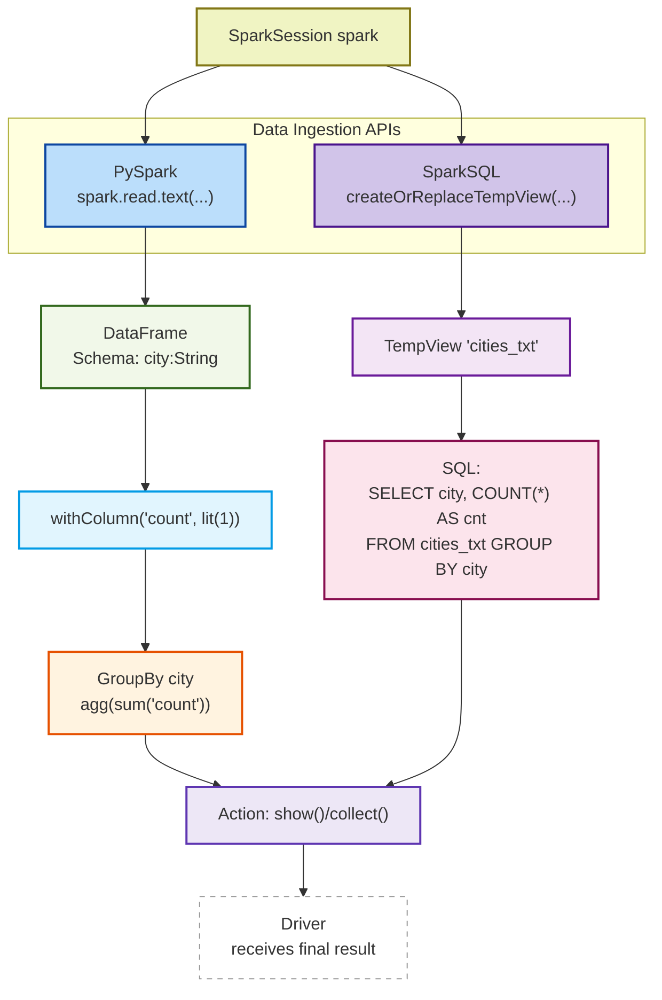

```mermaid
flowchart TD
    subgraph InputPartitions["Input Partitions"]
        A0["Partition 0"]
        A1["Partition 1"]
        A2["Partition 2"]
    end

    subgraph NarrowTransformation["Narrow Transformation<br>(e.g. map, filter)"]
        B0["Partition 0"]
        B1["Partition 1"]
        B2["Partition 2"]
    end

    subgraph WideTransformation["Wide Transformation<br>(e.g. reduceByKey, groupByKey)"]
        C0["Partition A"]
        C1["Partition B"]
    end

    A0 --> B0
    A1 --> B1
    A2 --> B2

    B0 -->|Shuffle Write| ShuffleStage
    B1 -->|Shuffle Write| ShuffleStage
    B2 -->|Shuffle Write| ShuffleStage

    ShuffleStage -->|Shuffle Read| C0
    ShuffleStage -->|Shuffle Read| C1

    Note1["💡 Shuffle involves:<br>• Disk I/O<br>• Network<br>• Serialization<br><br>❗ Partition count may change!"]
    ShuffleStage -.-> Note1

    %% Styling
    style InputPartitions fill:#f0f4c3,stroke:#827717,stroke-width:2px
    style NarrowTransformation fill:#e8f5e9,stroke:#2e7d32,stroke-width:2px
    style WideTransformation fill:#fce4ec,stroke:#c2185b,stroke-width:2px
    style ShuffleStage fill:#f3e5f5,stroke:#6a1b9a,stroke-width:2px
    style Note1 fill:#fffde7,stroke:#fbc02d,stroke-width:2px,stroke-dasharray: 5 5
```

Apache Spark (Distributed computing engine)

## 🟩 1. Apache Spark Core Concepts
📌 **RDD, DataFrame, Lazy |  fault** /fɔːlt/ **tolerance** /ˈtɒlərəns/ **mechanisms** /ˈmekənɪzəmz/

---
## 🟨 2. Execution Model

📌 **Job → Stage → Task**

## 🟧 3. Shuffle & Partitioning

📌 **Shuffle = Costly, Wide vs Narrow**

