Apache Spark (Distributed computing engine)

## 🟩 1. Apache Spark Core Concepts
📌 **RDD, DataFrame, Lazy |  fault tolerance mechanisms** /fɔːlt/ /ˈtɒlərəns/ /ˈmekənɪzəmz/

---
## 🟨 2. Execution Model

📌 **Job → Stage → Task**

## 🟧 3. Shuffle & Partitioning

📌 **Shuffle = Costly, Wide vs Narrow**

```mermaid
flowchart TD
    subgraph InputPartitions["Input Partitions"]
        A0["Partition 0"]
        A1["Partition 1"]
        A2["Partition 2"]
    end

    subgraph NarrowTransformation["Narrow Transformation<br>(e.g. map, filter)"]
        B0["Partition 0"]
        B1["Partition 1"]
        B2["Partition 2"]
    end

    subgraph WideTransformation["Wide Transformation<br>(e.g. reduceByKey, groupByKey)"]
        C0["Partition A"]
        C1["Partition B"]
    end

    A0 --> B0
    A1 --> B1
    A2 --> B2

    B0 -->|Shuffle Write| ShuffleStage
    B1 -->|Shuffle Write| ShuffleStage
    B2 -->|Shuffle Write| ShuffleStage

    ShuffleStage -->|Shuffle Read| C0
    ShuffleStage -->|Shuffle Read| C1

    Note1["💡 Shuffle involves:<br>• Disk I/O<br>• Network<br>• Serialization<br><br>❗ Partition count may change!"]
    ShuffleStage -.-> Note1

    %% Styling
    style InputPartitions fill:#f0f4c3,stroke:#827717,stroke-width:2px
    style NarrowTransformation fill:#e8f5e9,stroke:#2e7d32,stroke-width:2px
    style WideTransformation fill:#fce4ec,stroke:#c2185b,stroke-width:2px
    style ShuffleStage fill:#f3e5f5,stroke:#6a1b9a,stroke-width:2px
    style Note1 fill:#fffde7,stroke:#fbc02d,stroke-width:2px,stroke-dasharray: 5 5
```

## 4. Data Skew（skewness)

🔥 Data Skew in Spark - *Unbalanced data across partitions*

```mermaid
flowchart TB
    Case1["1️⃣ Skewed Join Keys"] --> C1a["📡 Broadcast Join<br>Use for small table (&lt;10 MB)"] & C1b["♻️ AQE Skew Join<br>Enable adaptive shuffle join"]
    Case2["2️⃣ Skewed Aggregation"] --> C2a["🧂 Salting<br>Append random suffix"] & C2b["📊 Local Aggregate<br>Group by salted key"] & C2c["📉 Global Merge<br>Final group by key"]
    Case3["3️⃣ Skewed Input Files"] --> C3a["🔁 Repartition files"] & C3b["📁 Avoid GZIP (non‑splittable)"]
    Case4["4️⃣ Manual SQL Optimization"] --> C4a["💡 SQL Hint<br>/*+ BROADCAST(table) */"]
    Case5["5️⃣ General Spark Tuning"] --> C5a["🧭 Monitor Spark UI"] & C5b["⚙️ spark.sql.shuffle.partitions"] & C5c["✅ spark.sql.adaptive.enabled=true"]
    C5c --> n1["Untitled Node"]

     C1a:::leaf
     C1b:::leaf
     C2a:::leaf
     C2b:::leaf
     C2c:::leaf
     C3a:::leaf
     C3b:::leaf
     C4a:::leaf
     C5a:::leaf
     C5b:::leaf
     C5c:::leaf
    classDef leaf fill:#ffffff,stroke:#888,stroke-width:1.5px
    style Case1 fill:#f8bbd0,stroke:#ad1457,stroke-width:2px
    style Case2 fill:#ffe082,stroke:#f57f17,stroke-width:2px
    style Case3 fill:#b2ebf2,stroke:#00838f,stroke-width:2px
    style Case4 fill:#c5e1a5,stroke:#558b2f,stroke-width:2px
    style Case5 fill:#d1c4e9,stroke:#6a1b9a,stroke-width:2px
```

