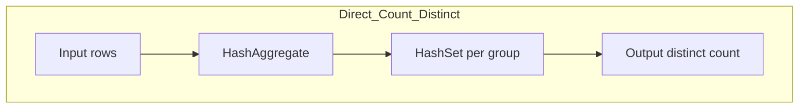
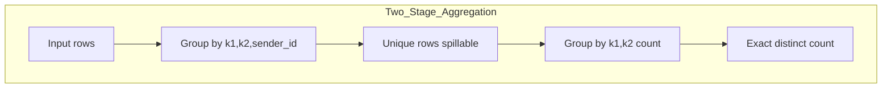
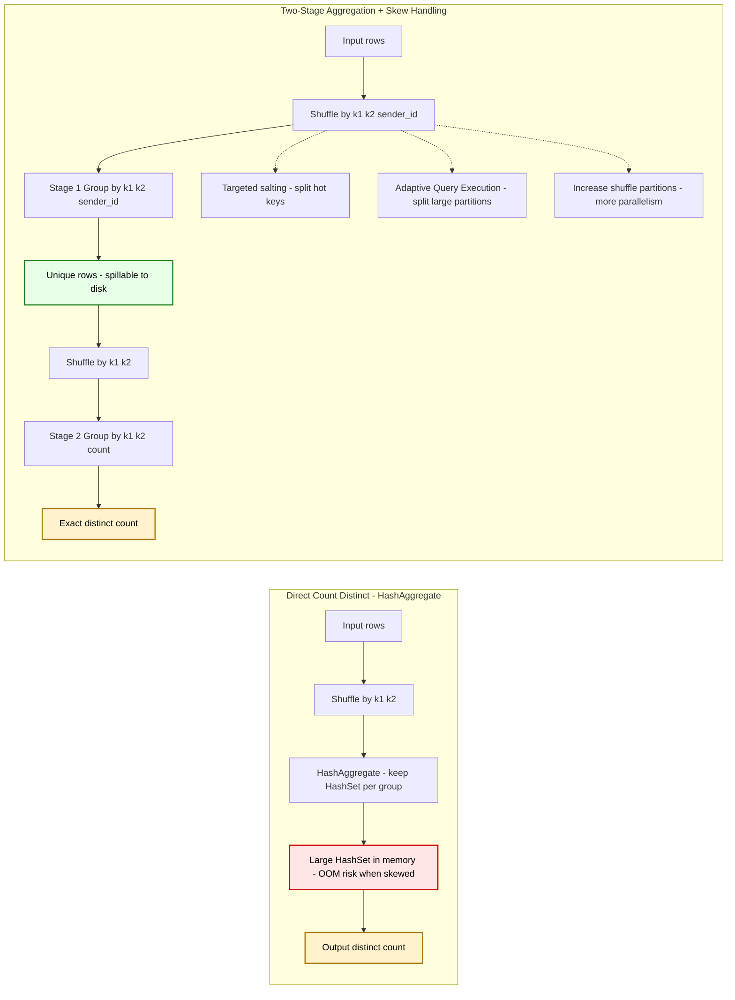
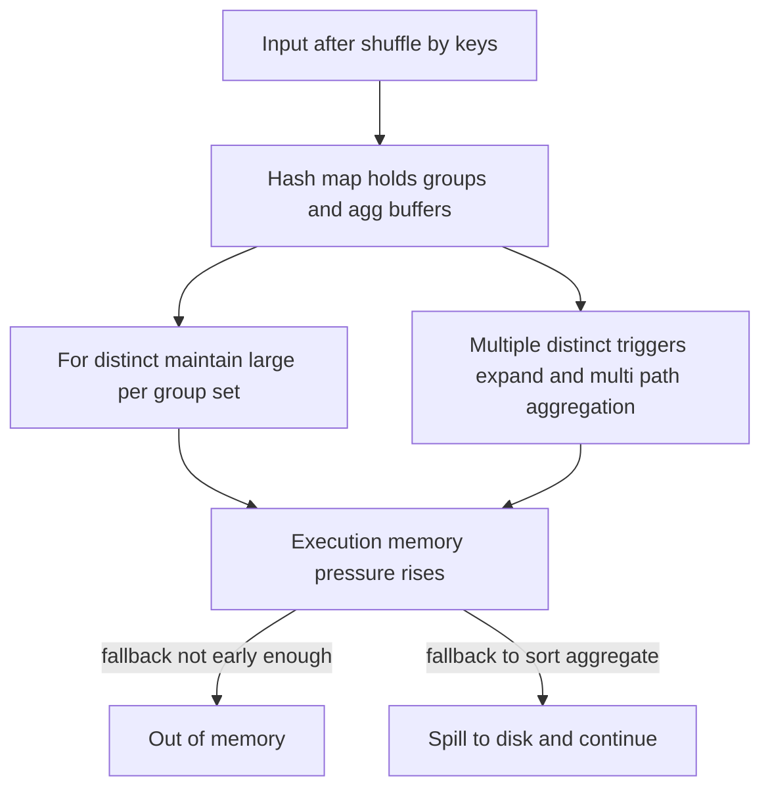
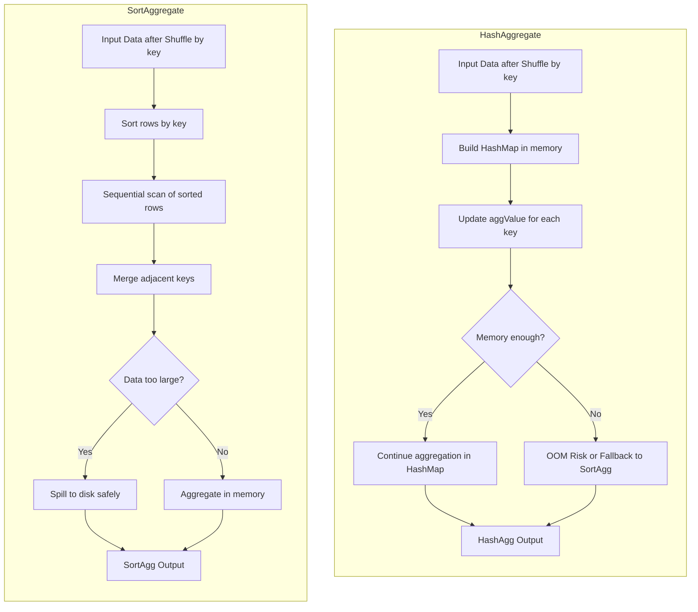

# 🚀 SLA Improvement Report

**✅ SLA Improved from ~95% → 99%+**  
By applying structured optimizations at both the workflow and Spark job levels, overall SLA stability and job timeliness have been significantly improved.

---

## ✨ SLA Framework-Level Optimization

| No. | Optimization Area          | Description                                                                                                          |
|-----|-----------------------------|----------------------------------------------------------------------------------------------------------------------|
| 1️⃣ | 🔗 Workflow Dependency       | Removed non-critical and redundant dependencies to streamline DAG execution.                                          |
| 2️⃣ | ⏱️ Trigger-Based Scheduling  | Replaced fixed-time triggers with dependency-based scheduling.<br>Tasks now auto-execute upon upstream success.       |
| 3️⃣ | 🚨 Monitoring & Alerting     | Added alerting for job failures and delays, enabling early detection and faster troubleshooting.                      |
| 4️⃣ | 🧩 Spark Job Optimization    | Prioritized optimization of long-running (1h+) critical path jobs and de-emphasized low-impact ones.                  |

---

## 🧩 Spark Job Optimisation


✅ Summary Comparison

| Solution | Close HashAgg | DISTINCT Implementation | Memory Risk                 | Performance                          | Complexity |
|----------|---------------|--------------------------|-----------------------------|--------------------------------------|------------|
| **Option 1** | ✅ Yes (force disable) | Single-stage + Salting       | Low (SortAgg can spill)      | Medium (SortAgg slightly slower)     | Low        |
| **Option 2** | ❌ No (keep enabled)   | Two-Stage                   | Low (no large HashSet)       | High (HashAgg is faster for small partitions) | Medium     |


### 1. 📌 Background

A cross-border remittance platform required a Spark-based analytical job to generate annual WeChat remittance insights. In 2024, the system processed approximately **12 million transactions**, totaling **50 billion RMB** in inbound payments.

**Dimensions**: sender country, remittance institution, currency  
**Metrics**: txn count, unique users, inbound amount (RMB/USD), average txn amount (RMB/USD)

---

### 2. ⚙️ Initial SQL (Pre-Optimisation)

```sql
SELECT
  t.institution,
  t.sender_country,
  t.currency,
  COUNT(t.transaction_id) AS tx_count,
  COUNT(DISTINCT t.sender_id) AS sender_count,
  SUM(t.amount * fx.fx_to_cnh) AS total_cnh,
  SUM(t.amount * fx.fx_to_usd) AS total_usd
FROM transactions t
JOIN exchange_rates fx
  ON t.currency = fx.currency AND t.fdate = fx.fdate
WHERE t.fdate BETWEEN '20240101' AND '20241231'
GROUP BY t.institution, t.sender_country, t.currency;
```



```sql
-- Stage 1: row-level dedup
WITH dedup AS (
  SELECT k1, k2, sender_id
  FROM t
  GROUP BY k1, k2, sender_id
)
-- Stage 2: counting
SELECT k1, k2, COUNT(*) AS sender_cnt
FROM dedup
GROUP BY k1, k2;
```





✅ **Two-Stage Aggregation + Skew Optimization = Stable + Fast**

**Recommended combined approach**:  

- **<mark>Two-Stage Aggregation</mark>**: Solves **memory risk** (avoids **HashSet explosion**).  
- **<mark>Skew Handling</mark>**: Solves **performance tail latency** (ensures data is evenly distributed).  

**Common techniques**:  

- **<mark>Targeted salting</mark>**: For identified hot keys (e.g., `US+Wise+USD`), split them into **N buckets** using `hash(sender_id) % N`.  
- **<mark>AQE (Adaptive Query Execution)</mark>**: Let Spark **dynamically split large partitions**.  
- **<mark>Increase shuffle partitions</mark>**: Prevent **oversized partitions**.

---

After switching to two-stage aggregation, you can safely keep **HashAgg enabled**, since it will **no longer run into OOM** due to a large DISTINCT HashSet.

Skew still needs to be addressed, but it will cause the <mark>**job to run slower, not crash**</mark>.

### 3. ❗ Symptoms Observed

1. Runtime fluctuated **30–75 minutes**
2. Some reducers stalled for over 30 minutes
3. **Sometimes, Executor OOM** errors
4. Frequent GC pauses (heap pressure)
5. Spark UI showed **severe task skew**

### 4. 🔍 Root Cause Analysis

* **Skewed Keys**: `US+Wise+USD` (\~4M txns), `KR+Panda+KRW` (\~3M txns) created 5GB+ shuffle partitions
* **Executor Config**: Only 6G memory per executor, too small for skewed reducers
* **Default shuffle partitions (200)**: Caused heavy reducers

| Problem          | Technical Root Cause                                |
| ---------------- | --------------------------------------------------- |
| OOM              | HashAggregate retained large intermediate states    |
| GC Pressure      | Excessive heap usage from large in-memory hash maps |
| Data Skew        | Uneven key distribution in `GROUP BY`               |
| Shuffle Overload | Too few partitions (200) → large reducer tasks      |



### 5. ⚙️ Optimization Goals

* Eliminate OOM and memory pressure
* Resolve skew to improve parallelism
* Reduce shuffle size and improve aggregation stability
* Ensure SLA ≥ 99%


### 6. ✅ Step-by-Step SparkSQL Optimisation

| Scenario (avg shuffled row size) | 4M-row hot key → reducer size | 3M-row hot key → reducer size |
|----------------------------------|-------------------------------|--------------------------------|
| Lean payload ~300 B              | ~1.2 GB                       | ~0.9 GB                        |
| Typical wide ~600 B              | ~2.4 GB                       | ~1.8 GB   

#### Step 1: Tune Spark Configuration

```bash
--num-executors 100 \
--executor-cores 4 \
--executor-memory 6G \
--driver-memory 4G
```

```sql
SET spark.sql.shuffle.partitions = 2000;
```

* Increased shuffle parallelism for finer skew detection
* Enabled dynamic allocation for elasticity

```sql
SET spark.dynamicAllocation.enabled=true;
SET spark.dynamicAllocation.maxExecutors=120;
SET spark.dynamicAllocation.minExecutors=5;
```

#### Step 2: Enable AQE and Skew Handling

```sql
SET spark.sql.adaptive.enabled = true;
SET spark.sql.adaptive.coalescePartitions.enabled = true;
SET spark.sql.adaptive.skewJoin.enabled = true;
SET spark.sql.adaptive.skewedPartitionThresholdInBytes = 64MB;
SET spark.sql.adaptive.skewedPartitionFactor = 5;
SET spark.sql.autoBroadcastJoinThreshold = 10MB;
```

* AQE merges small partitions & splits skewed ones
* Broadcast joins applied automatically for small tables

---

#### Step 3: Switch to SortAggregate (Avoid OOM)

```sql
SET spark.sql.execution.useObjectHashAggregateExec = false;
SET spark.sql.execution.useHashAggregateExec = false;
```

| Feature      | HashAggregate   | SortAggregate          |
| ------------ | --------------- | ---------------------- |
| Memory Usage | High (hash map) | Lower (disk spillable) |
| OOM Risk     | High            | Much lower             |
| Small Data   | Faster          | Slightly slower        |
| Skewed Data  | Poor            | Stable                 |



#### Step 4: Targeted Salting for Hot Keys

```sql
-- =========================================================
-- Spark SQL (Optimized) — Targeted Salting + Exact Distinct
-- =========================================================

-- 说明：
-- 1) 热点 key： (US, Wise) 与 (KR, PandaRemit) 分 8 个桶：0~7
-- 2) 非热点：统一放入桶 8（避免与热点桶重叠）
-- 3) 精确 distinct：盐值只依赖 sender_id，确保 SUM(桶内 COUNT DISTINCT) = 全局精确 distinct
-- 4) FX 汇率表先按 (currency, fdate) 去重为 1 条记录，避免重复连接

-- ---------- A. 汇率去重（建议窗口内筛选） ----------
WITH fx_dedup AS (
  SELECT currency, fdate, fx_to_cnh, fx_to_usd
  FROM (
    SELECT
      currency,
      fdate,
      fx_to_cnh,
      fx_to_usd,
      ROW_NUMBER() OVER (PARTITION BY currency, fdate ORDER BY fdate DESC) AS rn
    FROM exchange_rates
    WHERE fdate BETWEEN '20240101' AND '20241231'
  ) d
  WHERE rn = 1
),

-- ---------- B. 加盐（仅对热点；非热点 = 桶 8） ----------
salted_txn AS (
  SELECT
    t.institution,
    t.fsender_country,
    t.fpartner_org,
    t.fcurrency,
    t.sender_id,
    t.transaction_id,
    t.amount,
    t.fdate,
    CASE
      WHEN (t.fsender_country = 'US' AND t.fpartner_org = 'Wise')
        OR (t.fsender_country = 'KR' AND t.fpartner_org = 'PandaRemit')
      THEN (HASH(t.sender_id) & 2147483647) % 8      -- 热点分 8 桶：0~7
      ELSE 8                                         -- 非热点固定桶：8
    END AS salt_bucket
  FROM remittance_txn t
  WHERE t.fdate BETWEEN '20240101' AND '20241231'
),

-- ---------- C. Stage 1：按“维度+盐桶”聚合（桶内精确去重） ----------
agg_stage1 AS (
  SELECT
    s.institution,
    s.fsender_country,
    s.fpartner_org,
    s.fcurrency,
    s.salt_bucket,
    COUNT(s.transaction_id)             AS tx_cnt_bucket,     -- 精确
    COUNT(DISTINCT s.sender_id)                  AS sender_cnt_bucket,  -- 精确（同一 sender 只在一个桶）
    SUM(s.amount * fx.fx_to_cnh)                 AS total_cnh_bucket,
    SUM(s.amount * fx.fx_to_usd)                 AS total_usd_bucket
  FROM salted_txn s
  /*+ BROADCAST(fx) */                           -- 若 fx 很小可广播（可选）
  JOIN fx_dedup fx
    ON s.fcurrency = fx.currency
   AND s.fdate     = fx.fdate
  GROUP BY
    s.institution, s.fsender_country, s.fpartner_org, s.fcurrency, s.salt_bucket
)

-- ---------- D. Stage 2：汇总盐桶（回到原始维度，结果精确） ----------
SELECT
  institution,
  fsender_country,
  fpartner_org,
  fcurrency,
  SUM(tx_cnt_bucket)           AS tx_count,        -- 精确 distinct（各桶互斥）
  SUM(sender_cnt_bucket)       AS sender_count,    -- 精确 distinct（各桶互斥）
  SUM(total_cnh_bucket)        AS total_cnh,
  SUM(total_usd_bucket)        AS total_usd,
  ROUND(SUM(total_cnh_bucket) / NULLIF(SUM(tx_cnt_bucket), 0), 2) AS avg_txn_amt_cnh,
  ROUND(SUM(total_usd_bucket) / NULLIF(SUM(tx_cnt_bucket), 0), 2) AS avg_txn_amt_usd
FROM agg_stage1
GROUP BY
  institution, fsender_country, fpartner_org, fcurrency;
```

---

### 7. 🎯 Before vs After

| Metric     | Before   | After           |
| ---------- | -------- | --------------- |
| Runtime    | 75 min   | **13 min** ✅    |
| OOM Errors | Frequent | **Resolved** ✅  |
| GC Count   | >500     | **<100** ✅      |
| Task Skew  | Severe   | **Mitigated** ✅ |
| SLA        | \~95%    | **99%+** ✅      |

---

### 8. 🧠 Key Takeaways

* Use Spark UI to identify skewed keys (`US+Wise+USD`)
* Switch from **HashAgg → SortAgg** for stability
* Apply **targeted salting** for hot keys (with care for distinct metrics)
* Tune shuffle partitions & executor config
* Enable **AQE + Broadcast Join** for runtime optimization
* Result: **6X faster job**, SLA stability improved to 99%+

---

### 9. 🔄 AQE in Skew Optimization

* AQE merges small shuffle partitions
* Splits skewed partitions dynamically
* Switches join strategies (Broadcast vs SortMerge)
* Rewrites plan at runtime using Stage 1 stats

**Summary**: AQE reduces long-tail tasks and improves workload balance, but for extreme hot keys, manual salting remains the most effective approach.

---


## 其他知识： 通用 Salting for JOIN（不知道热键，小表可广播）

- 思路：把小表整体复制 N 份（N 一般取 4/8/16），给每行附 salt=0..N-1；大表所有行按 hash(join_key)%N 赋同样范围的 salt；然后按 (join_key, salt) 连接。
- 好处：不需要提前找热键，所有 key 的负载都被均匀切成 N 份。
- 代价：小表放大 N 倍，但小表可广播时影响很小。

```sql
SELECT
  f.merchant_id,
  f.transaction_id,
  f.amount,
  d.level,
  d.country
FROM fact_txn f
JOIN dim_merchant d
  ON f.merchant_id = d.merchant_id
WHERE f.biz_date BETWEEN '20240101' AND '20241231';
```

```sql
SELECT
  f_salted.merchant_id,
  f_salted.transaction_id,
  f_salted.amount,
  d_salted.level,
  d_salted.country
FROM
  -- 大表：为所有行计算确定性盐（N=8 可改 4/16/32）
  (
    SELECT
      f.*,
      (hash(f.merchant_id) & 2147483647) % 8 AS salt   -- 0..7，确定性
    FROM fact_txn f
    WHERE f.biz_date BETWEEN '20240101' AND '20241231'
  ) AS f_salted

JOIN
  -- 小表：整体复制 8 份，附上 salt=0..7（可广播）
  (
    SELECT d.*, CAST(r.id AS INT) AS salt
    FROM dim_merchant d
    CROSS JOIN (SELECT CAST(id AS INT) AS id FROM range(8)) r
  ) AS d_salted
  /*+ BROADCAST(d_salted) */                         -- 小表可广播时建议加
ON  f_salted.merchant_id = d_salted.merchant_id
AND f_salted.salt        = d_salted.salt;
```

#### 知道 hot key

```sql
SELECT
  f_salted.merchant_id,
  f_salted.transaction_id,
  f_salted.amount,
  d_salted.level,
  d_salted.country
FROM
  -- 大表：热点随机分 1..8，非热点固定 0（避免与热点重叠）
  (
    SELECT
      f.*,
      CASE WHEN f.merchant_id = 123
           THEN CAST(FLOOR(RAND() * 8) AS INT) + 1   -- 1..8
           ELSE 0
      END AS salt
    FROM fact_txn f
  ) AS f_salted
JOIN
  -- 小表：热点复制 1..8；非热点只保留 0
  (
    SELECT d.*, 0 AS salt
    FROM dim_merchant d
    WHERE d.merchant_id <> 123

    UNION ALL

    SELECT d.*, s.salt
    FROM dim_merchant d
    JOIN (
      SELECT 1 AS salt UNION ALL SELECT 2 UNION ALL SELECT 3 UNION ALL SELECT 4
      UNION ALL SELECT 5 UNION ALL SELECT 6 UNION ALL SELECT 7 UNION ALL SELECT 8
    ) s
      ON d.merchant_id = 123
  ) AS d_salted
ON  f_salted.merchant_id = d_salted.merchant_id
AND f_salted.salt        = d_salted.salt;
```
