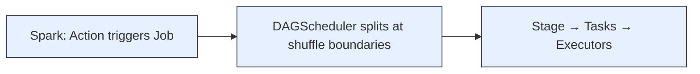
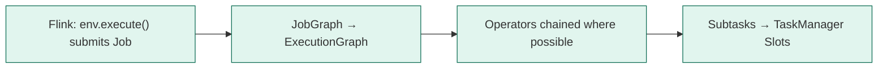
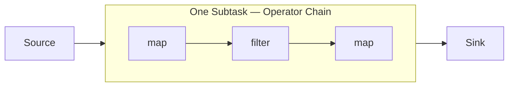
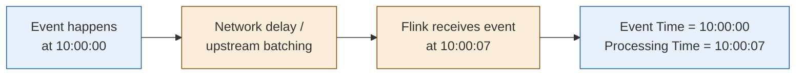
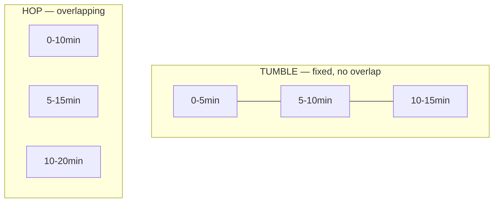
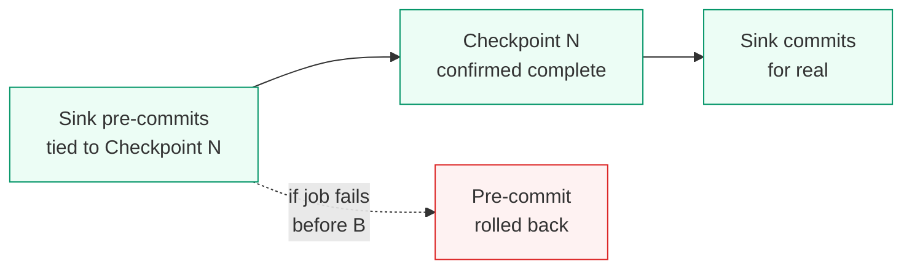
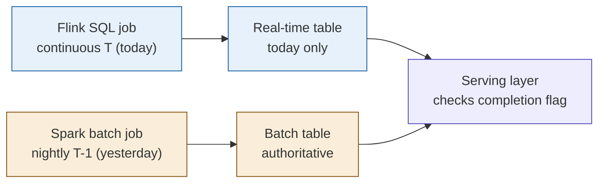

# Flink Quick Reference — Mapped from Spark

You already know Spark deeply. This note maps every Spark concept you know to its Flink equivalent, then focuses on Flink SQL — since that's what your team uses for development.

> **Core mental shift:** Spark = batch-first, streaming bolted on via micro-batch. Flink = streaming-first, batch is just a bounded stream. Once this clicks, 80% of Flink's design decisions make sense immediately.

---

## 📚 Table of Contents

- [Chap 1. Concept Mapping Table (Spark → Flink)](#chap-1-concept-mapping-table-spark--flink)
- [Chap 2. Execution Model](#chap-2-execution-model)
- [Chap 3. Flink SQL — Core Syntax](#chap-3-flink-sql--core-syntax)
- [Chap 4. Time & Watermark (the concept Spark doesn't really have)](#chap-4-time--watermark-the-concept-spark-doesnt-really-have)
- [Chap 5. Windows in Flink SQL](#chap-5-windows-in-flink-sql)
- [Chap 6. State & Fault Tolerance](#chap-6-state--fault-tolerance)
- [Chap 7. Connectors (your daily driver)](#chap-7-connectors-your-daily-driver)
- [Chap 8. Skew & Backpressure (your Spark skew knowledge, ported)](#chap-8-skew--backpressure-your-spark-skew-knowledge-ported)
- [Chap 9. Two Pipelines, One Truth — T-1 + T Reconciliation](#chap-9-two-pipelines-one-truth--t-1--t-reconciliation)
- [Chap 10. Quick Answers](#chap-10-quick-answers)

---

## Chap 1. Concept Mapping Table (Spark → Flink)

📌 **The fastest way to learn Flink is to stop thinking of it as new — it's Spark's vocabulary with different nouns.**

| Spark Concept | Flink Equivalent | Key Difference |
|---|---|---|
| `SparkSession` | `TableEnvironment` (SQL) / `StreamExecutionEnvironment` (DataStream) | Same role: entry point that builds your plan |
| RDD | `DataStream` | Flink's DataStream is *unbounded by default*; RDD is always bounded |
| DataFrame | `Table` | Both are schema'd, Catalyst-optimized vs Flink's own optimizer |
| Driver | JobManager | JobManager also handles Checkpoint coordination — Driver doesn't |
| Executor | TaskManager | TaskManager has **Slots**, not "executor cores" — similar idea, different name |
| Task | Subtask | One subtask = one parallel instance of an operator |
| Transformation (lazy) | Same concept | Both build a logical plan, nothing runs until triggered |
| Action (`collect`, `count`) | `execute()` / SQL `INSERT INTO` | Flink jobs usually never "return" — they run forever until cancelled |
| Catalyst Optimizer | Flink's Query Optimizer (also Calcite-based) | Both: Logical Plan → Optimized Plan → Physical Plan |
| Shuffle | Same concept, called "redistribution" | Same cost: network + serialization. Flink's network stack is lower-latency |
| `spark.sql.shuffle.partitions` | `table.exec.resource.default-parallelism` | Same idea: controls parallelism after a `keyBy`/shuffle |
| `groupBy` / `reduceByKey` | `keyBy` + window/aggregate | **Key difference**: Flink's `keyBy` on an unbounded stream needs a window or you get infinite accumulation |
| `broadcast()` hint | Broadcast State / Broadcast Join hint | Same idea: send small data to every task instead of shuffling |
| AQE (adaptive runtime replanning) | No direct equivalent | Flink doesn't replan at runtime the way Spark AQE does — covered in Chap 8 |
| `df.write.save()` (batch sink) | Connector Sink (continuous) | Spark writes once; Flink sink keeps writing as new data arrives |
| Checkpoint (used loosely in Spark Streaming) | **Checkpoint** (formal, core mechanism) | Flink's Checkpoint is the backbone of fault tolerance, not optional |
| (no real equivalent) | **Watermark** | This is Flink's biggest new concept — see Chap 4 |
| (no real equivalent) | **State Backend** (RocksDB) | Spark doesn't maintain long-lived per-key state across batches the way Flink does |

---

## Chap 2. Execution Model

📌 **Job → Stage → Task** (Spark) maps to **Job → ExecutionGraph → Subtask** (Flink) — but the trigger is different.





### Key difference: Operator Chaining

Spark always materializes between narrow transformation boundaries within a stage. Flink goes further — it **chains** multiple operators into a single task when possible (e.g. `map → filter → map`), avoiding even in-process serialization between them. This is why Flink can hit sub-millisecond per-record latency where Spark's micro-batch has inherent batch-interval latency.



| # | Question | Answer |
|---|---|---|
| 1 | What triggers execution in Flink? | `env.execute()` for DataStream, or any SQL `INSERT INTO` / `StatementSet.execute()` for Table/SQL API. Unlike Spark's `collect()`, this usually runs **forever**. |
| 2 | What is a Flink Job? | The whole pipeline submitted via `execute()` — equivalent to a Spark Job, but typically long-running, not one-shot. |
| 3 | What is an ExecutionGraph? | Flink's runtime version of the JobGraph — physical tasks mapped onto TaskManager slots. Roughly equivalent to Spark's Stage DAG. |
| 4 | What is operator chaining? | Flink fuses adjacent operators (e.g. map→filter) into one task to avoid serialization overhead — Spark has no equivalent inside a stage. |
| 5 | What is a Slot? | A TaskManager's unit of resource allocation — one slot can run one subtask (or a chain of them). Roughly maps to "one core's worth of executor capacity" in Spark, but slots are fixed at TaskManager startup, not dynamic. |

---

## Chap 3. Flink SQL — Core Syntax

📌 Since your team develops in Flink SQL, this is the section to actually memorize.

### 3.1 Creating a table (this replaces `spark.read`)

```sql
-- Spark equivalent: df = spark.read.format("kafka").option(...).load()

CREATE TABLE orders (
    order_id    STRING,
    user_id     STRING,
    amount      DECIMAL(10,2),
    order_time  TIMESTAMP(3),
    WATERMARK FOR order_time AS order_time - INTERVAL '5' SECOND  -- ⬅ this line has no Spark equivalent
) WITH (
    'connector' = 'kafka',
    'topic' = 'orders',
    'properties.bootstrap.servers' = 'localhost:9092',
    'format' = 'json',
    'scan.startup.mode' = 'latest-offset'
);
```

**Key difference from Spark:** the `WATERMARK FOR` clause is mandatory thinking for any streaming aggregation — it's how Flink knows when it's safe to close a window. There's nothing like this in Spark SQL because Spark doesn't process true per-event streams.

### 3.2 A streaming aggregation (the bread-and-butter query)

```sql
-- Spark equivalent: df.groupBy("user_id").agg(sum("amount"))
-- BUT in Spark this runs once on a static dataset.
-- In Flink, this query runs continuously and re-emits results as new orders arrive.

SELECT
    user_id,
    TUMBLE_START(order_time, INTERVAL '5' MINUTE) AS window_start,
    SUM(amount)   AS total_amount,
    COUNT(*)      AS order_count
FROM orders
GROUP BY
    user_id,
    TUMBLE(order_time, INTERVAL '5' MINUTE);
```

```
为什么不能直接 GROUP BY user_id 不加窗口？
        ↓
Spark 的 GROUP BY 是对一个静态数据集算完就完事
Flink 的流是无限的，如果不加窗口
GROUP BY 会变成"从作业启动到现在为止"的累计结果
永远不会输出"阶段性"的统计，状态也会无限增长
        ↓
所以 Flink SQL 做聚合，几乎总是要配合窗口
（除非你真的要的是全局累计值，那是另一种用法）
```

### 3.3 Writing the result out (this replaces `df.write.save()`)

```sql
INSERT INTO user_5min_summary
SELECT
    user_id,
    TUMBLE_START(order_time, INTERVAL '5' MINUTE) AS window_start,
    SUM(amount) AS total_amount
FROM orders
GROUP BY user_id, TUMBLE(order_time, INTERVAL '5' MINUTE);
```

| Spark | Flink SQL |
|---|---|
| `df.write.mode("append").save(path)` | `INSERT INTO sink_table SELECT ...` |
| Runs once, writes a snapshot | Runs continuously, writes a stream of updates |
| You re-run the script for new data | The job stays running, processes new data as it arrives |

### 3.4 Joining a stream to a slowly-changing dimension table (the thing Spark makes you think hard about, Flink has a clean syntax for)

```sql
-- "Temporal join" — joins each order to the user's profile
-- AS OF the order's event time, not the current state of the dimension table

SELECT
    o.order_id,
    o.amount,
    u.user_tier
FROM orders AS o
JOIN user_profile FOR SYSTEM_TIME AS OF o.order_time AS u
ON o.user_id = u.user_id;
```

```
这是 Flink SQL 一个 Spark 完全没有对应物的语法
        ↓
场景：订单流 JOIN 用户等级维度表
但用户等级会变化（比如今天是普通会员，明天升级VIP）
        ↓
普通 JOIN 的问题：
拿到的是"现在"的用户等级，不是"下单那一刻"的等级
如果用户后来升级了，历史订单的JOIN结果也会跟着变
这通常是错的——历史订单应该反映下单时的状态

FOR SYSTEM_TIME AS OF 解决的就是这个问题：
按订单的 event time，去查当时维度表的快照值
这叫"时态表 JOIN"（Temporal Table Join）
Spark 没有原生语法支持这个，要自己写很多逻辑模拟
```

### 3.5 Deduplication (common in production pipelines)

```sql
-- Spark equivalent: dropDuplicates() on a static DataFrame
-- Flink: this works correctly even with continuous late-arriving duplicates

SELECT order_id, user_id, amount, order_time
FROM (
    SELECT *,
        ROW_NUMBER() OVER (
            PARTITION BY order_id
            ORDER BY order_time DESC
        ) AS rn
    FROM orders
)
WHERE rn = 1;
```

---

## Chap 4. Time & Watermark (the concept Spark doesn't really have)

📌 This is the single biggest new mental model you need. Spend real time here.



| # | Question | Answer |
|---|---|---|
| 25 | What is Event Time? | The timestamp embedded in the data — when it actually happened. This is almost always what you want for correctness. |
| 26 | What is Processing Time? | The wall-clock time Flink happens to process the record. Fast, simple, but wrong if you need correctness across out-of-order data. |
| 27 | What is a Watermark? | A signal that says "I believe no event with timestamp earlier than X will arrive." It's how Flink knows a window is safe to close. |
| 28 | Why does Spark not need this concept? | Spark Structured Streaming has a simplified version (`withWatermark()`), but because it operates on micro-batches, the semantics are coarser. True event-at-a-time engines like Flink need watermarks to be a first-class, per-record concept. |
| 29 | What happens to data that arrives after the watermark has passed? | By default it's dropped. You can configure `allowed lateness` to still update results for a grace period, or route it to a side output to avoid silent data loss. |

### Watermark strategy in SQL

```sql
WATERMARK FOR order_time AS order_time - INTERVAL '5' SECOND
```

```
含义拆解：
        ↓
"order_time" 是事件时间字段
"- INTERVAL '5' SECOND" 是容忍的最大乱序程度
        ↓
意思是：我允许事件最多迟到5秒
如果10:00:00的事件，最迟在10:00:05之前赶到，仍然算数
超过这个时间还没到，这个窗口就关闭计算了
        ↓
这个数字怎么定：
不要拍脑袋，看你生产环境实际的乱序分布
看 p99 的迟到时间是多少，覆盖大部分情况就行
```

---

## Chap 5. Windows in Flink SQL

📌 Spark's window functions (`window()` in Structured Streaming) map almost 1:1 — the syntax differs, the concept is identical.

| Spark Structured Streaming | Flink SQL | Behavior |
|---|---|---|
| `window(col, "5 minutes")` | `TUMBLE(col, INTERVAL '5' MINUTE)` | Fixed, non-overlapping windows |
| `window(col, "10 minutes", "5 minutes")` | `HOP(col, INTERVAL '5' MINUTE, INTERVAL '10' MINUTE)` | Overlapping windows (Flink calls it HOP, not "sliding") |
| `session_window(col, "30 minutes")` | `SESSION(col, INTERVAL '30' MINUTE)` | Gap-based session windows |
| `withWatermark()` | `WATERMARK FOR ... AS ...` | Both control how late data is handled |

```sql
-- Tumbling — 5-minute fixed buckets
SELECT user_id, TUMBLE_START(order_time, INTERVAL '5' MINUTE), SUM(amount)
FROM orders
GROUP BY user_id, TUMBLE(order_time, INTERVAL '5' MINUTE);

-- Hopping — 10-minute window, every 5 minutes (overlapping)
SELECT user_id, HOP_START(order_time, INTERVAL '5' MINUTE, INTERVAL '10' MINUTE), SUM(amount)
FROM orders
GROUP BY user_id, HOP(order_time, INTERVAL '5' MINUTE, INTERVAL '10' MINUTE);

-- Session — new window after 30 min of inactivity per user
SELECT user_id, SESSION_START(order_time, INTERVAL '30' MINUTE), SUM(amount)
FROM orders
GROUP BY user_id, SESSION(order_time, INTERVAL '30' MINUTE);
```



---

## Chap 6. State & Fault Tolerance

📌 This is where Flink and Spark diverge the most architecturally. Spark's "state" concept in Structured Streaming is a thin layer on top of micro-batches. Flink's state is the core of the engine.

| Spark | Flink | Difference |
|---|---|---|
| `mapGroupsWithState` / `flatMapGroupsWithState` | Built-in per-key state in `keyBy` operators | In Flink, **any** keyed operator can hold state — it's not a special API, it's the default model |
| Checkpoint location (`checkpointLocation` option) | `state.checkpoints.dir` | Same idea: durable storage for recovery |
| (no real backend choice) | **State Backend**: `HashMapStateBackend` vs `EmbeddedRocksDBStateBackend` | Spark doesn't make you choose — it doesn't maintain state at this scale by default |
| Checkpoint interval | `execution.checkpointing.interval` | Conceptually identical |
| (Spark has no Savepoint equivalent) | **Savepoint** | Manually-triggered, version-stable snapshot for planned upgrades — Spark has nothing like this |

```sql
-- Setting these via Flink SQL config (or flink-conf.yaml)
SET 'execution.checkpointing.interval' = '60s';
SET 'state.backend' = 'rocksdb';
SET 'state.backend.incremental' = 'true';
SET 'execution.checkpointing.mode' = 'EXACTLY_ONCE';
```

### Exactly-once: how it actually works



```
对照 Spark 理解：
        ↓
Spark Structured Streaming 用 checkpointLocation
来记录"处理到哪个offset了"，failover时从那继续读
这本质是"at-least-once"或"exactly-once on idempotent sink"
取决于sink类型
        ↓
Flink 的两阶段提交更彻底：
不只是记录读到哪，而是连"写出去"这个动作本身
都纳入了事务管理——预提交 + Checkpoint确认 + 正式提交
这是为什么Flink能做到真正端到端exactly-once
不依赖sink本身是幂等的
```

---

## Chap 7. Connectors (your daily driver)

📌 This is what you'll actually write every day in Flink SQL development.

```sql
-- Kafka source/sink
CREATE TABLE kafka_orders (
    order_id STRING,
    amount   DECIMAL(10,2),
    order_time TIMESTAMP(3),
    WATERMARK FOR order_time AS order_time - INTERVAL '5' SECOND
) WITH (
    'connector' = 'kafka',
    'topic' = 'orders',
    'properties.bootstrap.servers' = 'broker:9092',
    'properties.group.id' = 'order-consumer',
    'format' = 'json',
    'scan.startup.mode' = 'group-offsets'
);

-- JDBC sink (e.g. MySQL, Postgres)
CREATE TABLE mysql_summary (
    user_id STRING,
    total_amount DECIMAL(10,2),
    PRIMARY KEY (user_id) NOT ENFORCED
) WITH (
    'connector' = 'jdbc',
    'url' = 'jdbc:mysql://host:3306/db',
    'table-name' = 'user_summary',
    'sink.buffer-flush.max-rows' = '1000',
    'sink.buffer-flush.interval' = '5s'
);

-- Iceberg sink (since you already know Iceberg from your Hive migration)
CREATE TABLE iceberg_orders (
    order_id STRING,
    amount   DECIMAL(10,2),
    order_time TIMESTAMP(3)
) WITH (
    'connector' = 'iceberg',
    'catalog-name' = 'hive_catalog',
    'catalog-type' = 'hive',
    'warehouse' = 's3://my-bucket/warehouse'
);
```

```
对照你的 Iceberg 经验来理解这块：
        ↓
你在小米做的 Hive→Iceberg 迁移
本质是批处理写入 Iceberg 表
        ↓
Flink 写 Iceberg 是同一张表，但是连续写入
每次 Checkpoint 提交一批新的 snapshot
对下游 Athena/Spark 读这张表来说完全无感知
能同时支持流写入和批查询，这是 Iceberg 的核心卖点之一
```

| # | Question | Answer |
|---|---|---|
| 30 | How do you control sink write frequency to a database? | `sink.buffer-flush.max-rows` and `sink.buffer-flush.interval` — batches writes instead of one row at a time, same idea as JDBC batch inserts in any system. |
| 31 | Why declare PRIMARY KEY on a sink table? | Tells Flink this is an upsert sink — updates overwrite by key instead of always inserting new rows. Critical for correctness with retracting aggregations. |
| 32 | What's `scan.startup.mode` for Kafka? | Controls where the source starts reading: `earliest-offset`, `latest-offset`, or `group-offsets` (resume from last committed consumer group offset) — directly affects whether you reprocess history on restart. |

---

## Chap 8. Skew & Backpressure (your Spark skew knowledge, ported)

📌 You already know this pattern cold from your Tencent 75min→13min optimization. Here's the same playbook in Flink terms.

| Spark Concept | Flink Equivalent | Notes |
|---|---|---|
| Data skew on `groupByKey`/`reduceByKey` | Skew on `keyBy` | Same root cause: one key gets disproportionate volume |
| Two-stage aggregation (local + global) | Local aggregation + `keyBy` merge | Identical pattern — pre-aggregate with a salted key, merge in a second stage |
| Salting (`hash(id) % N`) | Same technique | Append random/hash suffix to hot key, split across N parallel subtasks |
| AQE (runtime skew split) | **No direct equivalent** | This is a real gap — Flink doesn't replan partitions at runtime the way Spark AQE does |
| Backpressure (implicit, shows as long Shuffle Read) | Backpressure (explicit, Flink Web UI has a dedicated monitor) | Flink's backpressure is *more visible* — dedicated UI panel shows exactly which operator is the bottleneck |
| Increase `spark.sql.shuffle.partitions` | Increase `parallelism` on the keyed operator | Same lever, applied per-operator in Flink instead of globally |

### Salting in Flink SQL

```sql
-- Same logic as your Spark two-stage aggregation, written in Flink SQL

-- Stage 1: pre-aggregate with salted key
WITH salted AS (
    SELECT
        CONCAT(CAST(CAST(RAND() * 10 AS INT) AS STRING), '_', merchant_id) AS salted_key,
        merchant_id,
        amount
    FROM transactions
),
partial_agg AS (
    SELECT salted_key, merchant_id, SUM(amount) AS partial_sum
    FROM salted
    GROUP BY salted_key, merchant_id
)
-- Stage 2: merge partial results
SELECT merchant_id, SUM(partial_sum) AS total_amount
FROM partial_agg
GROUP BY merchant_id;
```

```
这和你简历里写的 Spark 两阶段聚合，逻辑完全一样
        ↓
Stage 1: 加随机前缀，把热点key打散成多个key
本地先聚合一次，减少shuffle数据量
Stage 2: 去掉前缀，按原始key合并最终结果
        ↓
唯一区别：
Spark批处理，这个query跑一次就结束
Flink流处理，这个query持续运行
每来一批新数据，都按这个两阶段逻辑增量计算
```

### Why Flink doesn't have AQE-style runtime replanning

```
Spark AQE能做运行时重新规划
是因为Spark是批处理——所有数据已经在那
执行到一半，可以看到实际的分区大小统计
据此动态合并或拆分分区
        ↓
Flink是流处理——数据没有"已经在那"这个状态
数据源源不断地来，永远不知道"全部数据"长什么样
所以无法像Spark那样基于完整统计信息做运行时重新规划
        ↓
应对热点key的办法只能是:
1. 提前预判热点key，主动salting（最常用）
2. 增大该算子的parallelism，分散压力
3. 用 rebalance/rescale 算子手动重分布负载
```

---

## Chap 9. Two Pipelines, One Truth — T-1 + T Reconciliation

📌 This is the production pattern you'll hit constantly: Flink for real-time T, Spark for authoritative T-1. Both engines, one team, one set of numbers that must agree.



| Issue | Why it happens | Fix |
|---|---|---|
| Numbers don't match | Filter/join logic written separately in Flink SQL and Spark SQL, subtly diverge | Share the core business logic as a single SQL definition both engines can execute — both support ANSI-like SQL |
| Late data | Flink closes window before the event arrives; Spark T-1 reads the complete dataset including it | Use `allowed lateness` + side output in Flink instead of silently dropping |
| Double-counting at midnight | Both today's leftover stream and the fresh batch job briefly overlap | Explicit cutover: serving layer never reads real-time data for a date once T-1 marks it complete |
| Watermark too aggressive | Closes windows before slow events arrive → systematic undercount | Tune watermark delay based on measured p99 lateness in production, not a guess |

```sql
-- The allowed lateness equivalent in Flink SQL is handled via the
-- WATERMARK delay itself, since SQL doesn't expose allowedLateness()
-- the way the DataStream API does. To capture late records explicitly,
-- you typically drop to DataStream API for that specific operator:

DataStream<Order> result = orderStream
    .keyBy(Order::getUserId)
    .window(TumblingEventTimeWindows.of(Time.minutes(5)))
    .allowedLateness(Time.minutes(10))
    .sideOutputLateData(lateOutputTag)
    .sum("amount");
```

```
为什么这里要"降级"到 DataStream API 而不是纯SQL？
        ↓
Flink SQL 的窗口语法本身没有暴露 allowedLateness 这个配置项
（社区一直在讨论加进去，但目前没有）
        ↓
如果你的团队主要用 SQL 开发
对迟到数据的容忍主要靠调整 WATERMARK 里的延迟值来实现
真正需要"迟到数据单独处理"这种精细控制时
才需要写一小段 DataStream API 代码插入到 pipeline 里
这是 SQL 开发为主团队最容易踩的边界
```

---

## Chap 10. Quick Answers

| Question | Answer (say this first) |
|---|---|
| What is Flink? | True streaming engine, event-at-a-time, treats batch as a bounded stream — opposite of Spark's batch-first, micro-batch streaming |
| Flink vs Spark Structured Streaming? | Flink = true streaming, sub-second latency. Spark = micro-batch, seconds-level latency. Choose Flink when latency matters |
| What is a Watermark? | Signal saying "no earlier events expected" — how Flink knows when to close a window safely |
| How does Flink achieve exactly-once? | Checkpoint (Chandy-Lamport snapshots) + two-phase commit on the sink |
| What's the Flink equivalent of Spark's groupBy? | `keyBy` + window — without a window, keyBy on an unbounded stream accumulates state forever |
| How do you handle skew in Flink? | Same as Spark: salting + two-stage aggregation. No AQE-style runtime replanning exists in Flink |
| Checkpoint vs Savepoint? | Checkpoint = automatic, for failure recovery. Savepoint = manual, for planned upgrades/migrations — Spark has no equivalent |
| Why does T-1 and T disagree? | Usually late-arriving data the streaming job already closed its window on, or diverged business logic between the two pipelines |
| State backend choice? | HashMapStateBackend (memory, fast, small state) vs RocksDB (disk, handles huge state, slightly slower) |
| What's a temporal join? | `FOR SYSTEM_TIME AS OF` — joins a stream to a dimension table's value *as of event time*, not current time. No Spark equivalent |

---

## Suggested learning path (given you already know Spark)

```
Week 1 — Don't write code yet
读 Chap 1-2，把每个 Spark 概念在脑子里换成 Flink 名字
重点确认：JobManager/TaskManager 和 Driver/Executor 的对应关系

Week 1-2 — Flink SQL 上手
直接跳到 Chap 3，照着语法写 5-10 个真实场景的 query
（取你们现有 Spark SQL 任务，逐个改写成 Flink SQL）
改写过程中遇到的语法问题，就是你最该记的笔记

Week 2 — Watermark 是唯一的硬骨头
花一整块时间在 Chap 4
找一个你熟悉的业务场景，自己想一遍：
"如果用Flink实时算这个指标，迟到数据怎么处理"
这道题想透了，Flink最难的部分就过了

Week 3 — Connector + 生产问题
Chap 7 的 connector 配置直接背下来当字典查
Chap 8-9 是你已经会的（skew + 两阶段聚合）
只需要换个语法，不需要重新学概念
```
