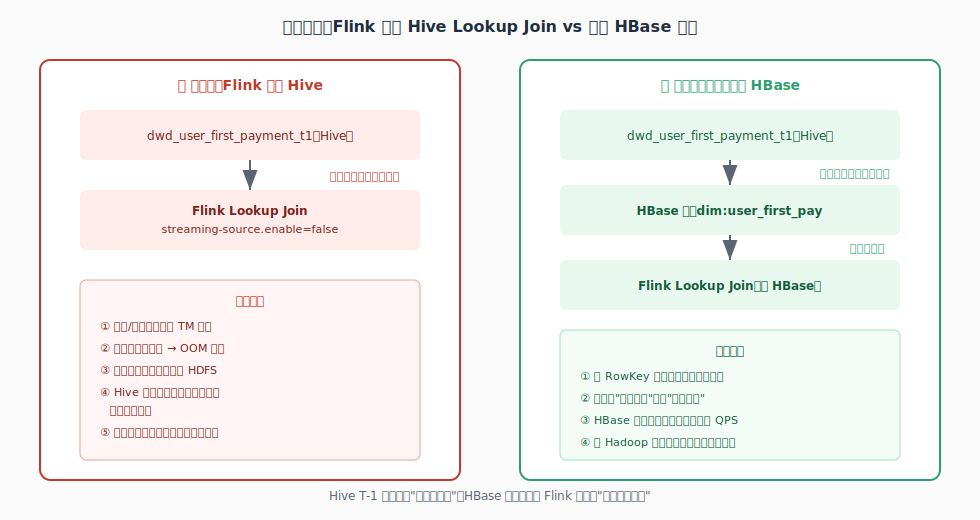

# 留学缴费首次支付检测 —— 完整方案最终版（含作业拆分决策 + 容错重启）

> 初学者向完整教程：从最源头的 MySQL 数据讲起，一路讲到最终触发发券、5 个作业怎么分工、以及作业挂了怎么保证不丢数据。每一步都配图 + 示例数据 + 面试考点。

---

## 命名规范总览（先记住这套规则，全文贯穿使用）

| 前缀 | 类型 | 说明 | 举例 |
|---|---|---|---|
| `dm_` | Hive 数据集市层表 | 针对具体业务主题聚合加工后的结果表，本文的**权威数据源** | `dm_user_first_payment_d` |
| `hbt_dm_` | HBase 物理表 | `hbt_` 表示"这是一张 HBase 表"，后面完整保留源头 Hive 表名，方便追溯血缘 | `hbt_dm_user_first_payment_d` |
| `ft_` | Flink SQL 里注册的表 | Source / Sink / 维表映射，只是 connector 配置，不存数据 | `ft_src_payment_events`、`ft_dim_hbase_first_pay`、`ft_sink_coupon_trigger` |
| `_d` | 表名后缀 | 日全量快照，每天覆盖式更新 | 对应 `_i` 增量表、`_his` 拉链表 |

---

## Step 0：数据源全景 —— 数据从哪来，怎么流转


### 数据的起点：MySQL 缴费表

**`study_abroad_payment` 表**

| order_id | user_id | pay_time | pay_amount | pay_type |
|---|---|---|---|---|
| order_88213 | u_7001 | 2026-07-03 09:00:00 | 5000.00 | 订金 |
| order_88214 | u_7001 | 2026-07-03 15:30:00 | 45000.00 | 尾款 |
| order_91002 | u_8002 | 2026-07-03 10:00:00 | 30000.00 | 全款 |

### 📌 知识点科普：数据怎么从 MySQL 变成 Kafka 消息

这一步叫 **CDC（Change Data Capture，变更数据捕获）**，常见工具是 **Canal** 或 **Debezium**。原理：MySQL 为了主从复制，会把每一次 `INSERT/UPDATE/DELETE` 记录进 **binlog** 日志文件。CDC 工具伪装成一个"从库"，实时读取这份 binlog，把每条变更解析成一条 JSON 消息发到 Kafka。好处是**完全不需要改动业务系统代码**，是旁路监听。

---

## Step 1：基础知识 —— ProcTime、EventTime、Watermark 到底是什么

在写 Kafka Source 建表语句之前，必须先搞懂这三个概念，因为它们会贯穿整个方案。


### 📌 EventTime（事件时间）—— 数据自己带的"业务发生时间"

就是表里的 `pay_time` 字段——这笔支付**在业务上真实发生的时刻**。它是数据自己携带的属性，跟数据什么时候被 Flink 处理没有任何关系。

### 📌 ProcTime（处理时间）—— Flink 处理这条数据那一刻，机器的墙上时钟

`PROCTIME()` 函数返回的是"**现在**"——这条数据被 Flink 算子真正处理到的那个系统时刻，不是数据自带的，是 Flink 现算现取的。

### 两者的核心区别

| | EventTime | ProcTime |
|---|---|---|
| 来源 | 数据自带（业务时间戳） | Flink 处理时的系统时钟 |
| 确定性 | 确定的，可以重放 | 不确定，不可重放 |
| 是否受网络延迟影响 | 数值本身不受影响，但**到达 Flink 的顺序**可能乱序 | 不存在"乱序"概念 |
| 典型用途 | 按业务真实发生时间计算（Step 2 窗口聚合） | Lookup Join（Step 10） |

### 📌 Watermark —— 专门配合 EventTime 使用的"我不再等更早数据了"的水位线

```sql
WATERMARK FOR pay_time AS pay_time - INTERVAL '5' SECOND
```

意思是：**Flink 允许 EventTime 数据最多迟到 5 秒**。当前已见过的最大 EventTime 减去这个容忍值，就是当前的 Watermark 位置，代表"更早的数据不再等了"。

---

## Step 2：Watermark 实战 —— 按小时统计缴费笔数和金额（窗口聚合）


### 业务需求

运营想要一个实时大盘，**按小时**看缴费笔数和总金额。

### 示例数据

| user_id | pay_time（业务发生时间） | pay_amount | 到达 Flink 的实际时间 |
|---|---|---|---|
| u_7001 | 09:05:00 | 5000 | 09:05:02（正常） |
| u_8002 | 09:30:00 | 30000 | 09:30:01（正常） |
| u_9003 | 09:58:00 | 8000 | 09:58:03（正常） |
| u_9003 | **09:55:00** | 12000 | **10:03:00（延迟8分钟才到）** |
| u_7001 | 10:02:00 | 45000 | 10:02:01（正常） |

### Flink SQL：滚动窗口（TUMBLE WINDOW）

```sql
-- ═══════════════════════════════════════════════════════════
-- 【作业⑤ - 常驻实时作业】HourlyPayStatsJob
-- 按小时统计缴费笔数和金额，供运营大盘使用
-- ═══════════════════════════════════════════════════════════

CREATE TABLE ft_src_payment_events_stats (
    order_id    STRING,
    user_id     STRING,
    pay_time    TIMESTAMP(3),
    pay_amount  DECIMAL(10,2),
    WATERMARK FOR pay_time AS pay_time - INTERVAL '5' SECOND
) WITH (
    'connector' = 'kafka',
    'topic' = 'study_abroad_payment_events',
    'properties.bootstrap.servers' = 'broker:9092',
    'properties.group.id' = 'hourly-stats-job-group',   -- 独立的Consumer Group
    'properties.auto.offset.reset' = 'latest',
    'format' = 'json',
    'scan.startup.mode' = 'group-offsets'
);

CREATE TABLE ft_sink_pay_hourly_stats (
    window_start TIMESTAMP(3),
    window_end   TIMESTAMP(3),
    pay_count    BIGINT,
    pay_amount   DECIMAL(18,2)
) WITH (
    'connector' = 'print'   -- 实际场景通常接ClickHouse/upsert-kafka给大盘用
);

INSERT INTO ft_sink_pay_hourly_stats
SELECT
    window_start,
    window_end,
    COUNT(*)          AS pay_count,
    SUM(pay_amount)    AS pay_amount
FROM TABLE(
    TUMBLE(TABLE ft_src_payment_events_stats, DESCRIPTOR(pay_time), INTERVAL '1' HOUR)
)
GROUP BY window_start, window_end;
```

### 📌 知识点科普：TUMBLE 滚动窗口 + Watermark 怎么配合触发计算

`TUMBLE` 是固定长度、不重叠的时间窗口。Watermark 每次推进，Flink 都会检查"有没有哪个窗口的结束时间已经被 Watermark 越过了"——一旦越过，就判定这个窗口的数据到齐了，触发计算并输出结果。本例中 `[09:00,10:00)` 窗口的结果是 **3笔，共¥43000**，那条延迟到10:03才到达的09:55事件，默认会被直接丢弃，不会补进这个窗口的结果里。

### ⚠️ 面试高频追问：迟到数据真的没救了吗？

不是必然丢弃，Flink 提供 `allowedLateness`（允许窗口触发后继续接受一段时间的迟到数据，重新触发计算更新结果）和**侧输出流（Side Output）**（把迟到数据单独导出，交给下游批处理兜底）两种机制，本例用的是 Flink SQL 最简单的写法，默认行为是丢弃。

---

## Step 3：关键设计决策 —— 窗口统计作业要跟首次支付判断合并吗？


这是个很实际的架构决策题，值得单独讲清楚，也是大厂面试常问的"你怎么划分 Flink 作业边界"。

### 两个可选方案

**方案A：合并成一个作业**——用 `EXECUTE STATEMENT SET` 把去重逻辑和窗口聚合逻辑合并进同一个 JobGraph，共享同一份 Kafka Source，只消费一次。

**方案B：分开两个独立作业**——各自建各自的 Source 表，用不同的 Consumer Group 各自完整读一遍 Kafka topic。

### 📌 知识点科普：为什么大厂选方案B（分开）

| 维度 | 方案A（合并） | 方案B（分开，推荐） |
|---|---|---|
| Kafka 读取开销 | 只读一次，省资源 | 多读一次，但 Kafka 天生支持多 Consumer Group 并发读，这点开销可以忽略 |
| 故障域 | **耦合**：统计逻辑出问题（比如窗口 state 爆炸）会拖累发券判断逻辑一起重启 | **隔离**：互不影响，一个挂了不影响另一个 |
| 变更频率 | 运营对大盘统计的需求经常变（加维度、改统计口径），每次改动都要重启**同一个**JobGraph，连带影响发券逻辑的可用性 | 大盘逻辑改动只需重启作业⑤，核心链路①②毫发无损 |
| SLA / 告警级别 | 无法区分优先级，只能按最高标准统一处理 | 可以分级：发券判断是 **P0**（直接影响业务），大盘统计是 **P2**（可以容忍短暂延迟或失败） |
| 独立扩缩容 | 不行，两个逻辑共享一份并行度配置 | 各自可以按实际负载单独调整并行度 |

**结论：选方案B，分开建**。核心判断标准是：**业务重要性不同、变更频率不同的逻辑，要物理拆开成独立作业**——这跟我们之前把"去重"和"发券判断"拆成作业①②是完全同一个设计原则，只是这次的边界是"核心链路 vs 大盘统计"。Kafka 被多读一次的资源开销，远小于耦合带来的运维风险。

---

## Step 4：5 个作业总览 —— 3 个常驻 + 2 个定时


| 序号 | 作业名 | 涉及表 | 类型 | 运行方式 | 优先级 |
|---|---|---|---|---|---|
| ① | DedupFirstPayJob | `ft_src_payment_events` → `ft_sink_first_pay_dedup` | Flink SQL | 🟢 **常驻** | P0 |
| ② | FirstPayCouponTriggerJob | `ft_src_first_pay_dedup` + `ft_dim_hbase_first_pay` → `ft_sink_coupon_trigger` | Flink SQL | 🟢 **常驻** | P0 |
| ③ | HiveFirstPayMergeJob | `dm_user_first_payment_d` | Hive/Spark SQL | 🔵 **定时 02:00** | P0 |
| ④ | BulkLoadHBaseJob | `dm_user_first_payment_d` → `hbt_dm_user_first_payment_d` | Spark | 🟣 **定时 02:30**（依赖③） | P0 |
| ⑤ | HourlyPayStatsJob | `ft_src_payment_events_stats` → `ft_sink_pay_hourly_stats` | Flink SQL | 🟢 **常驻**，独立于①② | P2 |

```
Kafka: study_abroad_payment_events
    │
    ├──────────────────────────────────────────┐
    ▼                                            ▼
【作业① 常驻 P0】去重                    【作业⑤ 常驻 P2】按小时统计
    │                                     （独立Consumer Group，互不影响）
    ▼
Kafka: today_first_pay_dedup
    │
    ▼
【作业② 常驻 P0】查 HBase 判断首次支付 ←── 【作业④ 定时02:30】Bulk Load ←── 【作业③ 定时02:00】Hive T-1合并
    │                                                ↑
    ▼                                          dm_user_first_payment_d（权威数据源）
Kafka: first_pay_coupon_trigger
    │
    ▼
发券服务（Redis SETNX 幂等兜底）
```

---

## Step 5：Kafka Source Table（作业① 的输入）

```sql
CREATE TABLE ft_src_payment_events (
    order_id    STRING,
    user_id     STRING,
    pay_time    TIMESTAMP(3),
    pay_amount  DECIMAL(10,2),
    proctime AS PROCTIME(),
    WATERMARK FOR pay_time AS pay_time - INTERVAL '5' SECOND
) WITH (
    'connector' = 'kafka',
    'topic' = 'study_abroad_payment_events',
    'properties.bootstrap.servers' = 'broker:9092',
    'properties.group.id' = 'dedup-job-group',
    'properties.auto.offset.reset' = 'latest',   -- 显式声明：首次启动只读之后新产生的消息
    'format' = 'json',
    'scan.startup.mode' = 'group-offsets'        -- 之后每次重启，靠已提交的offset自动接续
);
```

### 📌 知识点科普：`group-offsets` 的真实行为，分两种情况

| 情况 | 实际行为 |
|---|---|
| 这个 Consumer Group **之前已经消费过、有 offset 记录** | 直接从上次记录的位置继续读 |
| 这个 Consumer Group **是全新的，完全没有历史记录**（真正第一次启动） | 退回去看 `auto.offset.reset` 参数决定起点：`latest` 只读之后新数据，`earliest` 会读全部历史 |

**首次启动只消费启动之后新产生的消息**，指的是消息**写入 Kafka 的物理时刻（offset顺序）**，不是按 `pay_time` 业务字段筛选——一条 `pay_time=09:55` 但因网络延迟 10:03 才写入 Kafka 的消息，是按"10:03左右写入"来判断是否会被消费到的。

---

## Step 6：流内去重（作业① 核心逻辑）


```sql
CREATE TABLE ft_sink_first_pay_dedup (
    user_id              STRING,
    order_id             STRING,
    today_first_pay_time TIMESTAMP(3),
    PRIMARY KEY (user_id) NOT ENFORCED
) WITH (
    'connector' = 'upsert-kafka',
    'topic' = 'today_first_pay_dedup',
    'key.format' = 'json',
    'value.format' = 'json'
);

INSERT INTO ft_sink_first_pay_dedup
SELECT user_id, order_id, pay_time AS today_first_pay_time
FROM (
    SELECT
        user_id, order_id, pay_time,
        ROW_NUMBER() OVER (
            PARTITION BY user_id, DATE_FORMAT(pay_time, 'yyyy-MM-dd')   -- 常驻作业必须按"用户+日期"分组
            ORDER BY pay_time ASC
        ) AS rn
    FROM ft_src_payment_events
)
WHERE rn = 1;
```

### 📌 知识点科普：常驻之后为什么必须加"日期"分组

作业不重启，流里会持续包含跨天的数据。只按 `user_id` 分组会算成"历史最早"而不是"今天最早"，加上 `DATE_FORMAT(pay_time, 'yyyy-MM-dd')` 配合 `SET 'table.exec.state.ttl' = '25 h'`，每天独立计算、昨天的 state 自动清理。

### 📌 知识点科普：ROW_NUMBER 去重的底层实现

Flink 按 `PARTITION BY` 维护 **KeyedState**，记录"当前见过的最早时间"，新数据更早就撤回旧结果、发出新结果，产生 **changelog 流**——这决定了后面 Sink 必须用 `upsert-kafka`。

---

## Step 7：Hive DM 层 T-1 表（作业③，🔵 定时 02:00）

**`dm_user_first_payment_d`** —— 数据集市层，日全量快照，全公司的**权威数据源**：

| user_id | first_pay_time | first_order_id | dt |
|---|---|---|---|
| u_8002 | 2025-11-03 07:20:00 | order_31005 | 2026-07-02 |

```sql
-- ═══════════════════════════════════════════════════════════
-- 【作业③ - 定时批处理】HiveFirstPayMergeJob，每天 02:00 触发
-- ═══════════════════════════════════════════════════════════

INSERT OVERWRITE TABLE dm.dm_user_first_payment_d PARTITION (dt='${yesterday}')
SELECT
    COALESCE(old.user_id, new.user_id) AS user_id,
    LEAST(
        COALESCE(old.first_pay_time, new.first_pay_time),
        COALESCE(new.first_pay_time, old.first_pay_time)
    ) AS first_pay_time
FROM dm.dm_user_first_payment_d old
FULL OUTER JOIN today_new_users_snapshot new
    ON old.user_id = new.user_id;
```

---

## Step 8：为什么不直接用 Flink 查 Hive —— 引入 HBase 加速层



| | Hive | HBase |
|---|---|---|
| 定位 | 批量扫描分析 | 高频随机点查 |
| 单次查询延迟 | 秒级到分钟级 | 毫秒级 |
| Lookup Join 场景下 | 整表/整分区加载进内存，用户量大易 OOM | 按 Key 直接定位，不用整表加载 |

---

## Step 9：每天同步 Hive T-1 表进 HBase（作业④，🟣 定时 02:30）


```bash
create 'hbt_dm_user_first_payment_d',
{
    NAME => 'cf',
    DATA_BLOCK_ENCODING => 'FAST_DIFF',
    BLOOMFILTER => 'ROW',
    REPLICATION_SCOPE => '0',
    VERSIONS => '1',
    MIN_VERSIONS => '0',
    KEEP_DELETED_CELLS => 'false',
    COMPRESSION => 'SNAPPY'
}
```

### RowKey 加盐、Bulk Load 原理

```
RowKey = MD5(user_id).substring(0,2) + "_" + user_id
```

```scala
// ═══════════════════════════════════════════════════════════
// 【作业④ - 定时批处理】BulkLoadHBaseJob，每天 02:30，依赖作业③
// ═══════════════════════════════════════════════════════════

val df = spark.sql("SELECT user_id, first_pay_time, first_order_id FROM dm.dm_user_first_payment_d")

val rdd = df.rdd.map(row => {
    val rawKey = row.getAs[String]("user_id")
    val rowkey = s"${md5Prefix(rawKey)}_${rawKey}"
    (rowkey, row)
}).sortByKey()

rdd.saveAsNewAPIHadoopFile(
    "/tmp/hbase_bulkload/hbt_dm_user_first_payment_d",
    classOf[org.apache.hadoop.hbase.io.ImmutableBytesWritable],
    classOf[org.apache.hadoop.hbase.KeyValue],
    classOf[org.apache.hadoop.hbase.mapreduce.HFileOutputFormat2]
)
// bash: hbase org.apache.hadoop.hbase.tool.LoadIncrementalHFiles /tmp/hbase_bulkload/hbt_dm_user_first_payment_d hbt_dm_user_first_payment_d
```

---

## Step 10：Flink 查 HBase 判断 + 触发发券（作业②，🟢 常驻）


```sql
-- ═══════════════════════════════════════════════════════════
-- 【作业② - 常驻实时作业】FirstPayCouponTriggerJob
-- ═══════════════════════════════════════════════════════════

CREATE TABLE ft_src_first_pay_dedup (
    user_id              STRING,
    order_id             STRING,
    today_first_pay_time TIMESTAMP(3),
    proctime AS PROCTIME()
) WITH (
    'connector' = 'kafka',
    'topic' = 'today_first_pay_dedup',
    'properties.bootstrap.servers' = 'broker:9092',
    'properties.group.id' = 'coupon-trigger-job-group',
    'properties.auto.offset.reset' = 'latest',
    'format' = 'json',
    'scan.startup.mode' = 'group-offsets'
);

CREATE TABLE ft_dim_hbase_first_pay (
    rowkey STRING,
    cf ROW<first_pay_time STRING, first_order_id STRING>,
    PRIMARY KEY (rowkey) NOT ENFORCED
) WITH (
    'connector' = 'hbase-2.2',
    'table-name' = 'hbt_dm_user_first_payment_d',
    'zookeeper.quorum' = 'zk1:2181,zk2:2181,zk3:2181',
    'lookup.cache.max-rows' = '500000',
    'lookup.cache.ttl' = '30 min'
);

CREATE TABLE ft_sink_coupon_trigger (
    user_id    STRING,
    order_id   STRING,
    pay_time   TIMESTAMP(3),
    PRIMARY KEY (user_id) NOT ENFORCED
) WITH (
    'connector' = 'upsert-kafka',
    'topic' = 'first_pay_coupon_trigger',
    'key.format' = 'json',
    'value.format' = 'json'
);

INSERT INTO ft_sink_coupon_trigger
SELECT t.user_id, t.order_id, t.today_first_pay_time
FROM ft_src_first_pay_dedup AS t
LEFT JOIN ft_dim_hbase_first_pay
    FOR SYSTEM_TIME AS OF t.proctime AS h
    ON CONCAT(md5_prefix(t.user_id), '_', t.user_id) = h.rowkey
WHERE h.rowkey IS NULL;
```

---

## Step 11：消息投递语义 —— At-most-once / At-least-once / Exactly-once


| | 定义 | 代价 |
|---|---|---|
| **At-most-once** | 出故障不重试，可能丢消息，绝不重复 | 数据可能丢，很少用在关键业务上 |
| **At-least-once** | 出故障会重试，保证不丢，但可能重复投递 | 下游必须自己做幂等 |
| **Exactly-once** | 既不丢也不重 | 实现复杂，跨系统边界很难真正做到 |

### 📌 知识点科普：Flink 靠 Checkpoint + Barrier 对齐做到内部 Exactly-once

1. Flink 周期性往数据流插入特殊标记 **Barrier**
2. 算子所有输入通道都收到同一轮 Barrier 时，做一次状态快照存到远程存储
3. 失败重启时从最近成功的 Checkpoint 恢复状态

### 结合本方案实际情况

| 环节 | 实际语义 | 怎么兜底 |
|---|---|---|
| Flink 内部计算（去重、Lookup Join） | ✅ Exactly-once | 靠 Checkpoint |
| 写 `upsert-kafka` | At-least-once，但按主键覆盖写，效果等价 Exactly-once | 幂等写入，不需要分布式事务 |
| Kafka → 发券服务 | At-least-once | 下游必须自己用 Redis SETNX 判重 |

> 面试可以直接这样回答：**"Flink 内部通过 Checkpoint + Barrier 对齐可以做到 Exactly-once，但这只保证 Flink 自己的计算状态不丢不重。一旦涉及写外部系统，端到端 Exactly-once 很难真正做到，实际工程通常是 'At-least-once 投递 + 下游幂等处理' 的组合方案。"**

---

## Step 12：下游发券服务 —— 最后一道幂等兜底

```
SETNX coupon:u_7001:activity_2026Q3   →  key 已存在则跳过，不重复发券
```

用 Redis `SETNX` 配合合理过期时间（比如 24 小时），彻底堵住"重复发券"这个最终风险点。

---

## Step 13：容错与重启 —— 作业挂了，数据到底丢不丢（面试高频）

这是判断"常驻作业"到底靠不靠谱的关键一步，之前的方案里**缺了这块配置**，这里补全。

### 📌 第一步：必须开启 Checkpoint，否则前面所有"自动接续消费"都不成立

```sql
SET 'execution.checkpointing.interval' = '60 s';            -- 每60秒做一次checkpoint
SET 'execution.checkpointing.mode' = 'EXACTLY_ONCE';
SET 'state.checkpoints.dir' = 'hdfs:///flink-checkpoints/first-pay';
SET 'execution.checkpointing.min-pause' = '30 s';
SET 'execution.checkpointing.timeout' = '10 min';
```

没有 Checkpoint，Flink 就没有"状态快照"可以恢复，作业死了重启相当于从零开始，之前讲的"常驻不丢数据"全部不成立。

### 三种"重启"场景，结果完全不同

| 场景 | 是否丢数据 | 是否重复 | 需要人工操作 |
|---|---|---|---|
| ① 自动容错重启（TaskManager挂了，Flink自己拉起） | ❌ 不丢（前提：开了Checkpoint） | 极小概率重复，靠下游幂等兜底 | 不需要，全自动 |
| ② 手动重启，用 Savepoint（升级代码等场景） | ❌ 不丢 | 极小概率重复 | 需要，但是标准操作 |
| ③ 手动重启，没用 Savepoint，直接杀进程重新提交 | ⚠️ **有风险**，取决于Kafka提交的offset是否可靠 | 可能重复也可能丢 | 危险操作，不推荐 |

### 📌 场景①原理：Checkpoint 自动恢复

TaskManager 故障时，Flink 集群自动检测并重新调度作业，从**最近一次成功的 Checkpoint** 恢复所有状态——包括 Kafka 消费到哪个 offset、去重逻辑里每个用户当前最早时间的 KeyedState，全部自动倒回精确位置重新处理，不需要人工介入。

### 📌 场景②：正确的手动重启流程（代码升级、参数调整时用）

```bash
# 第一步：优雅停止，并生成一个 Savepoint
flink stop --savepointPath hdfs:///savepoints/dedup-job job_id

# 第二步：用这个 Savepoint 重新启动新版本作业
flink run -s hdfs:///savepoints/dedup-job -d job1_new.sql
```

Savepoint 本质是手动触发的完整状态快照，效果跟 Checkpoint 恢复一样精确，**这是升级作业代码时唯一正确的操作方式**，绝不能直接 kill 进程后裸重新提交。

### ⚠️ 场景③：为什么"裸重启"是危险操作

没有状态可恢复时，Kafka Source 退回去看 `scan.startup.mode = 'group-offsets'`，读的是 **Kafka Broker 上最后一次提交的 offset**（这个提交只是给外部监控用，不是 Flink 自身恢复的依据）：

- 如果这个 Consumer Group **从来没成功提交过 offset**（比如刚上线没多久就挂了），会触发 `auto.offset.reset` 逻辑——`latest` 会导致中间这段数据**彻底丢失**，`earliest` 会导致重复消费大量历史数据
- 即使有提交过 offset，也可能不是最新的，跟真正处理到的位置有落差，造成部分数据丢失或重复

**结论：手动重启一律走 Savepoint 流程，写进部署文档强制执行，不允许裸重启。**

---

## Step 14：部署 Checklist（5 个作业分别怎么上线）

| 作业 | 提交方式 | 每天需要做什么 |
|---|---|---|
| ①②（常驻，P0） | `flink run -d`，提交后转入后台常驻运行，配好 Checkpoint | **不需要任何操作**；代码变更走 Savepoint 流程重启 |
| ⑤（常驻，P2） | 同上，独立提交 | 大盘统计需求变化时可单独重启，不影响①② |
| ③④（定时） | 注册进 Airflow/DolphinScheduler 的 DAG | **不需要人工干预**，调度平台自动触发、自动告警重试 |

```
02:00  作业③ HiveFirstPayMergeJob 开始
       ↓（依赖成功触发）
02:xx  作业④ BulkLoadHBaseJob 开始
       ↓
02:xx  完成，hbt_dm_user_first_payment_d 更新完毕

（作业①②⑤全天 7×24 小时不间断运行，只在最初部署时提交一次）
```

---

## 全篇面试高频 QA 速查

| 问题 | 一句话答案 |
|---|---|
| EventTime 和 ProcTime 区别？ | EventTime 是数据自带的业务时间戳，可重放；ProcTime 是处理时机器的墙上时钟，不可重放 |
| Watermark 是干嘛的？ | 给 EventTime 划一条"不再等更早数据"的水位线，决定窗口什么时候触发计算 |
| 迟到数据默认怎么处理？ | 默认直接丢弃，可以用 allowedLateness 或侧输出流做兜底补救 |
| 为什么 Lookup Join 只能用 proctime？ | 它是"当下同步查询"语义，跟事件时间的乱序容忍机制不是一套体系，框架强制要求 |
| 窗口统计作业要跟核心链路合并吗？ | 不建议，物理拆开成独立作业，隔离故障域，Kafka多读一次的开销远小于耦合风险 |
| 首次启动"只读之后新数据"是按什么时间判断的？ | 按消息写入Kafka的物理时刻（offset顺序），不是按pay_time业务字段 |
| At-most/at-least/exactly-once 区别？ | 最多一次可能丢不重；至少一次不丢但可能重复；精确一次不丢不重，但跨系统很难真正做到 |
| Flink 怎么做到 Exactly-once？ | 靠 Checkpoint + Barrier 对齐机制，故障后从最近成功的 Checkpoint 恢复状态 |
| 作业挂了重启，数据会丢吗？ | 自动容错重启+开了Checkpoint不会丢；手动重启必须走Savepoint流程，裸重启有丢数据风险 |
| 为什么裸重启（不用Savepoint）有风险？ | 只能依赖Kafka Broker上最后提交的offset，可能不准确，甚至触发auto.offset.reset丢失整段数据 |
| 为什么 upsert-kafka 能达到等价的 Exactly-once 效果？ | 靠按主键覆盖写的幂等写入，重复写入同一个Key结果一样，不需要分布式事务 |
| CDC 是什么？ | 读 MySQL binlog 解析变更，业务系统无需改动，旁路监听 |
| 常驻作业为什么要在 PARTITION BY 里加日期？ | 作业不重启会跨天累积数据，不加日期会算成"历史最早"而不是"今天最早" |
| 为什么不直接用 Flink 查 Hive？ | Hive 为批量扫描设计，高频点查会 OOM、冷启动慢 |
| RowKey 为什么要加盐？ | 避免连续递增 ID 全部落在同一 Region，造成写入热点 |
| 为什么用 Bulk Load 不用逐行 Put？ | Bulk Load 绕开正常写路径，全量刷新大表更快、压力更小 |
| 发券服务为什么还要单独做幂等？ | Kafka at-least-once 语义下消息可能重复消费，需要业务侧兜底 |
| 权威数据源是谁？ | 一直是 `dm_user_first_payment_d`，HBase 只是它给实时链路用的加速副本 |
