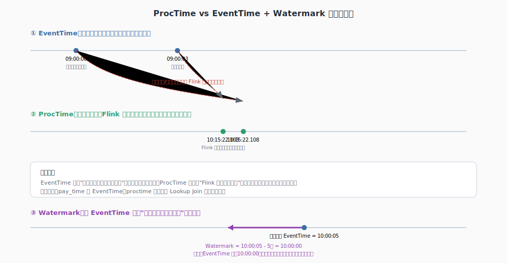
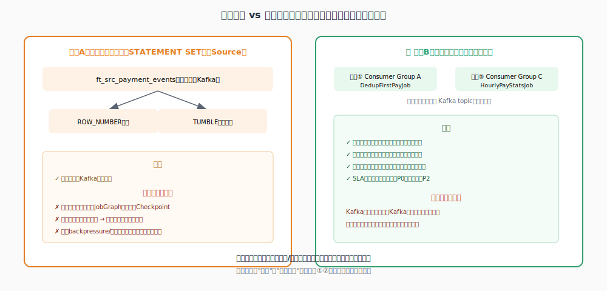
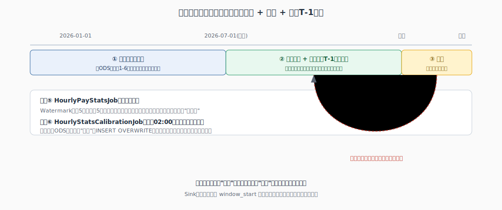

# Flink 实战完整方案 —— 两个案例合集

> 初学者向完整教程，两个独立案例，用大分割线清晰区分：
> - **Case 1**：留学缴费首次支付检测（判断 + 触发发券）
> - **Case 2**：按小时缴费统计大盘（窗口聚合 + 历史回刷 + 每天T-1校准）
>
> 两个案例共用同一批基础知识（命名规范、Watermark/ProcTime、Connector生态、投递语义、容错重启），放在最前面统一讲，避免重复。

---

# 📚 公共基础知识（两个案例都会用到）

## 命名规范总览

| 前缀 | 类型 | 说明 | 举例 |
|---|---|---|---|
| `dm_` | Hive 数据集市层表 | 针对具体业务主题聚合加工后的结果表，权威数据源 | `dm_user_first_payment_d` |
| `hbt_dm_` | HBase 物理表 | `hbt_` 表示"这是一张 HBase 表"，后面完整保留源头 Hive 表名 | `hbt_dm_user_first_payment_d` |
| `ft_` | Flink SQL 里注册的表 | Source / Sink / 维表映射，只是 connector 配置，不存数据 | `ft_src_payment_events` |
| `_d` | 表名后缀 | 日全量快照，每天覆盖式更新 | 对应 `_i` 增量表 |

## 基础知识 A：ProcTime、EventTime、Watermark 到底是什么



**EventTime（事件时间）**：数据自带的业务发生时间，比如 `pay_time`，跟 Flink 什么时候处理它无关。

**ProcTime（处理时间）**：`PROCTIME()` 返回 Flink 处理这条数据那一刻的系统墙上时钟，不可重放。

| | EventTime | ProcTime |
|---|---|---|
| 来源 | 数据自带 | 系统时钟 |
| 确定性 | 可重放 | 不可重放 |
| 典型用途 | 窗口聚合（Case 2） | Lookup Join（Case 1） |

**Watermark**：给 EventTime 划一条"不再等更早数据"的水位线。

```sql
WATERMARK FOR pay_time AS pay_time - INTERVAL '5' SECOND
```

意思：允许数据最多迟到 5 秒，当前最大 EventTime 减去这个容忍值，就是当前 Watermark 位置。

## 基础知识 B：Flink Table/SQL 的 Connector 生态

| Connector | Source | Sink | 当维表(Lookup) | 说明 |
|---|---|---|---|---|
| Kafka | ✅ | ✅ | ❌ | 普通 append 流 |
| Upsert-Kafka | ✅ | ✅ | ❌ | 支持消费/写入 changelog |
| HBase | ✅ | ✅ | ✅ | Case 1 里当维表用 |
| JDBC | ✅ | ✅ | ✅ | MySQL/PostgreSQL 等，也能当维表 |
| Hive | ✅ | ✅ | ✅ | 三种角色都支持 |
| Filesystem | ✅ | ✅ | ❌ | 读写 CSV/Parquet/ORC，含 HDFS/S3 |
| Elasticsearch | ❌ | ✅ | ❌ | 只能当 Sink |
| Print / Blackhole / DataGen | 部分支持 | ✅ | ❌ | 调试/测试专用 |

### 📌 关于 Redis：不算严格意义的"官方支持"

Apache Flink 官方仓库**没有 Redis connector**。Apache Bahir 提供过 Redis Sink，但那是 **DataStream API 级别**，不是 Table/SQL API，且维护不活跃。市面上有第三方 Flink SQL Redis connector，能用但不是官方项目，长期维护性要自己承担。这也是 Case 1 里最终选 HBase 而不是 Redis 当维表的原因之一——HBase 有官方 connector，跟 Hive/Flink 集成无缝。如果确实需要 Redis 特殊结构（Bitmap/HLL），通常在 DataStream API 里用 `RichAsyncFunction` 自己写异步查询逻辑。

## 基础知识 C：消息投递语义 —— At-most-once / At-least-once / Exactly-once


| | 定义 | 代价 |
|---|---|---|
| At-most-once | 出故障不重试，可能丢消息，绝不重复 | 很少用在关键业务 |
| At-least-once | 出故障会重试，不丢但可能重复 | 下游必须自己幂等 |
| Exactly-once | 既不丢也不重 | 实现复杂，跨系统很难真正做到 |

**Flink 靠 Checkpoint + Barrier 对齐做到内部 Exactly-once**：周期性插入 Barrier 标记，所有输入通道收到同一轮 Barrier 时做状态快照；失败重启从最近成功的 Checkpoint 恢复。但这只保证 Flink 自己的计算状态，写外部系统（Kafka/HBase）通常退化成 **"At-least-once 投递 + 下游幂等处理"**（按主键覆盖写、Redis SETNX 判重）。

## 基础知识 D：容错与重启 —— 作业挂了数据丢不丢

必须开启 Checkpoint，否则常驻作业"自动接续消费"不成立：

```sql
SET 'execution.checkpointing.interval' = '60 s';
SET 'execution.checkpointing.mode' = 'EXACTLY_ONCE';
SET 'state.checkpoints.dir' = 'hdfs:///flink-checkpoints/first-pay';
SET 'execution.checkpointing.min-pause' = '30 s';
SET 'execution.checkpointing.timeout' = '10 min';
```

| 场景 | 是否丢数据 | 需要人工操作 |
|---|---|---|
| 自动容错重启（开了Checkpoint） | ❌ 不丢 | 不需要，全自动 |
| 手动重启，用 Savepoint | ❌ 不丢 | 需要，标准操作 |
| 手动重启，裸重启不用Savepoint | ⚠️ 有风险 | 危险操作，不推荐 |

正确的手动重启流程：

```bash
flink stop --savepointPath hdfs:///savepoints/dedup-job job_id
flink run -s hdfs:///savepoints/dedup-job -d job1_new.sql
```

裸重启会退回去看 `scan.startup.mode='group-offsets'`，依赖 Kafka Broker 上最后提交的 offset，如果这个 Consumer Group 从没成功提交过 offset，会触发 `auto.offset.reset`，`latest` 丢数据、`earliest` 重复消费大量历史数据。

---
---

# 🔵 Case 1：留学缴费首次支付检测

> 判断用户是否首次缴纳留学费用，首次支付立刻触发优惠券。核心链路：去重 → 查 HBase 维表判断 → 触发发券。

## Step 1.0：数据源全景


**`study_abroad_payment` 表**（MySQL）

| order_id | user_id | pay_time | pay_amount | pay_type |
|---|---|---|---|---|
| order_88213 | u_7001 | 2026-07-03 09:00:00 | 5000.00 | 订金 |
| order_88214 | u_7001 | 2026-07-03 15:30:00 | 45000.00 | 尾款 |
| order_91002 | u_8002 | 2026-07-03 10:00:00 | 30000.00 | 全款 |

数据经 **CDC（Canal/Debezium）** 读取 MySQL binlog，解析成 JSON 消息发到 Kafka，业务系统代码无需改动。

## Step 1.1：4 个核心作业总览


| 序号 | 作业名 | 涉及表 | 类型 | 运行方式 | 优先级 |
|---|---|---|---|---|---|
| ① | DedupFirstPayJob | `ft_src_payment_events` → `ft_sink_first_pay_dedup` | Flink SQL | 🟢 常驻 | P0 |
| ② | FirstPayCouponTriggerJob | `ft_src_first_pay_dedup` + `ft_dim_hbase_first_pay` → `ft_sink_coupon_trigger` | Flink SQL | 🟢 常驻 | P0 |
| ③ | HiveFirstPayMergeJob | `dm_user_first_payment_d` | Hive/Spark SQL | 🔵 定时 02:00 | P0 |
| ④ | BulkLoadHBaseJob | `dm_user_first_payment_d` → `hbt_dm_user_first_payment_d` | Spark | 🟣 定时 02:30（依赖③） | P0 |

```
Kafka: study_abroad_payment_events
         │
         ▼
   【作业① 常驻】去重
         │
         ▼
Kafka: today_first_pay_dedup
         │
         ▼
   【作业② 常驻】查 HBase 判断首次支付 ←──── 【作业④ 定时02:30】Bulk Load ←──── 【作业③ 定时02:00】Hive T-1合并
         │                                          ↑
         ▼                                    dm_user_first_payment_d（权威数据源）
Kafka: first_pay_coupon_trigger
         │
         ▼
    发券服务（Redis SETNX 幂等兜底）
```

## Step 1.2：Kafka Source Table（作业①）

```sql
CREATE TABLE ft_src_payment_events (
    order_id    STRING,
    user_id     STRING,
    pay_time    TIMESTAMP(3),
    pay_amount  DECIMAL(10,2),
    proctime AS PROCTIME(),
    WATERMARK FOR pay_time AS pay_time - INTERVAL '5' SECOND
) WITH (
    'connector' = 'kafka',
    'topic' = 'study_abroad_payment_events',
    'properties.bootstrap.servers' = 'broker:9092',
    'properties.group.id' = 'dedup-job-group',
    'properties.auto.offset.reset' = 'latest',
    'format' = 'json',
    'scan.startup.mode' = 'group-offsets'
);
```

## Step 1.3：流内去重（作业①核心）


```sql
CREATE TABLE ft_sink_first_pay_dedup (
    user_id              STRING,
    order_id             STRING,
    today_first_pay_time TIMESTAMP(3),
    PRIMARY KEY (user_id) NOT ENFORCED
) WITH (
    'connector' = 'upsert-kafka',
    'topic' = 'today_first_pay_dedup',
    'key.format' = 'json',
    'value.format' = 'json'
);

INSERT INTO ft_sink_first_pay_dedup
SELECT user_id, order_id, pay_time AS today_first_pay_time
FROM (
    SELECT
        user_id, order_id, pay_time,
        ROW_NUMBER() OVER (
            PARTITION BY user_id, DATE_FORMAT(pay_time, 'yyyy-MM-dd')   -- 常驻作业必须按"用户+日期"分组
            ORDER BY pay_time ASC
        ) AS rn
    FROM ft_src_payment_events
)
WHERE rn = 1;
```

> **常驻之后为什么必须加日期分组**：作业不重启会跨天累积数据，只按 `user_id` 分组会算成"历史最早"而不是"今天最早"。配合 `SET 'table.exec.state.ttl' = '25 h'`，昨天的 state 自动清理。
>
> **ROW_NUMBER 底层原理**：按 key 维护 KeyedState 记录当前最优值，新数据更优时撤回旧结果、发出新结果，产生 changelog 流——这决定了 Sink 必须用 upsert-kafka。

## Step 1.4：Hive DM 层 T-1 表（作业③，🔵 定时 02:00）

**`dm_user_first_payment_d`** —— 权威数据源：

| user_id | first_pay_time | first_order_id | dt |
|---|---|---|---|
| u_8002 | 2025-11-03 07:20:00 | order_31005 | 2026-07-02 |

```sql
INSERT OVERWRITE TABLE dm.dm_user_first_payment_d PARTITION (dt='${yesterday}')
SELECT
    COALESCE(old.user_id, new.user_id) AS user_id,
    LEAST(
        COALESCE(old.first_pay_time, new.first_pay_time),
        COALESCE(new.first_pay_time, old.first_pay_time)
    ) AS first_pay_time
FROM dm.dm_user_first_payment_d old
FULL OUTER JOIN today_new_users_snapshot new
    ON old.user_id = new.user_id;
```

## Step 1.5：为什么不直接查 Hive —— 引入 HBase 加速层


| | Hive | HBase |
|---|---|---|
| 定位 | 批量扫描分析 | 高频随机点查 |
| Lookup Join 场景下 | 整表加载进内存，用户量大易 OOM | 按 Key 直接定位 |

## Step 1.6：每天同步进 HBase（作业④，🟣 定时 02:30）


```bash
create 'hbt_dm_user_first_payment_d',
{
    NAME => 'cf', DATA_BLOCK_ENCODING => 'FAST_DIFF', BLOOMFILTER => 'ROW',
    REPLICATION_SCOPE => '0', VERSIONS => '1', MIN_VERSIONS => '0',
    KEEP_DELETED_CELLS => 'false', COMPRESSION => 'SNAPPY'
}
```

RowKey 加盐：`MD5(user_id).substring(0,2) + "_" + user_id`，避免连续递增 ID 造成写入热点。用 **Bulk Load**（生成HFile绕开写路径）而不是逐行 Put，全量刷新大表更快、压力更小。

```scala
val df = spark.sql("SELECT user_id, first_pay_time, first_order_id FROM dm.dm_user_first_payment_d")
val rdd = df.rdd.map(row => {
    val rawKey = row.getAs[String]("user_id")
    (s"${md5Prefix(rawKey)}_${rawKey}", row)
}).sortByKey()
rdd.saveAsNewAPIHadoopFile("/tmp/hbase_bulkload/hbt_dm_user_first_payment_d", ...)
// bash: hbase org.apache.hadoop.hbase.tool.LoadIncrementalHFiles ... hbt_dm_user_first_payment_d
```

## Step 1.7：Flink 查 HBase 判断 + 触发发券（作业②，🟢 常驻）


```sql
CREATE TABLE ft_src_first_pay_dedup (
    user_id STRING, order_id STRING, today_first_pay_time TIMESTAMP(3),
    proctime AS PROCTIME()
) WITH (
    'connector' = 'kafka', 'topic' = 'today_first_pay_dedup',
    'properties.bootstrap.servers' = 'broker:9092',
    'properties.group.id' = 'coupon-trigger-job-group',
    'properties.auto.offset.reset' = 'latest',
    'format' = 'json', 'scan.startup.mode' = 'group-offsets'
);

CREATE TABLE ft_dim_hbase_first_pay (
    rowkey STRING,
    cf ROW<first_pay_time STRING, first_order_id STRING>,
    PRIMARY KEY (rowkey) NOT ENFORCED
) WITH (
    'connector' = 'hbase-2.2',
    'table-name' = 'hbt_dm_user_first_payment_d',
    'zookeeper.quorum' = 'zk1:2181,zk2:2181,zk3:2181',
    'lookup.cache.max-rows' = '500000',
    'lookup.cache.ttl' = '30 min'
);

CREATE TABLE ft_sink_coupon_trigger (
    user_id STRING, order_id STRING, pay_time TIMESTAMP(3),
    PRIMARY KEY (user_id) NOT ENFORCED
) WITH (
    'connector' = 'upsert-kafka', 'topic' = 'first_pay_coupon_trigger',
    'key.format' = 'json', 'value.format' = 'json'
);

INSERT INTO ft_sink_coupon_trigger
SELECT t.user_id, t.order_id, t.today_first_pay_time
FROM ft_src_first_pay_dedup AS t
LEFT JOIN ft_dim_hbase_first_pay
    FOR SYSTEM_TIME AS OF t.proctime AS h
    ON CONCAT(md5_prefix(t.user_id), '_', t.user_id) = h.rowkey
WHERE h.rowkey IS NULL;
```

## Step 1.8：下游发券服务 —— 最后一道幂等兜底

```
SETNX coupon:u_7001:activity_2026Q3   →  key 已存在则跳过，不重复发券
```

Redis `SETNX` + 24小时过期，堵住 Kafka at-least-once 语义下重复消费导致的重复发券。

---
---

# 🟢 Case 2：按小时缴费统计大盘（含历史回刷 + T-1 校准）

> 运营需要实时大盘，按小时看缴费笔数/金额。这是让 Watermark 真正"触发窗口计算"的经典场景，同时要解决两个真实问题：**上线前的历史数据怎么补**、**实时计算被 Watermark 丢弃的迟到数据怎么修正**。

## Step 2.0：Watermark 实战 —— TUMBLE 滚动窗口聚合


### 示例数据

| user_id | pay_time（业务发生时间） | pay_amount | 到达 Flink 的实际时间 |
|---|---|---|---|
| u_7001 | 09:05:00 | 5000 | 09:05:02（正常） |
| u_8002 | 09:30:00 | 30000 | 09:30:01（正常） |
| u_9003 | 09:58:00 | 8000 | 09:58:03（正常） |
| u_9003 | **09:55:00** | 12000 | **10:03:00（延迟8分钟）** |
| u_7001 | 10:02:00 | 45000 | 10:02:01（正常） |

### Flink SQL：滚动窗口

```sql
-- ═══════════════════════════════════════════════════════════
-- 【作业⑤ - 常驻实时作业】HourlyPayStatsJob
-- 按小时统计缴费笔数和金额，供运营大盘使用
-- ═══════════════════════════════════════════════════════════

CREATE TABLE ft_src_payment_events_stats (
    order_id    STRING,
    user_id     STRING,
    pay_time    TIMESTAMP(3),
    pay_amount  DECIMAL(10,2),
    WATERMARK FOR pay_time AS pay_time - INTERVAL '5' SECOND
) WITH (
    'connector' = 'kafka',
    'topic' = 'study_abroad_payment_events',
    'properties.bootstrap.servers' = 'broker:9092',
    'properties.group.id' = 'hourly-stats-job-group',   -- 独立的Consumer Group
    'properties.auto.offset.reset' = 'latest',
    'format' = 'json',
    'scan.startup.mode' = 'group-offsets'
);

CREATE TABLE ft_sink_pay_hourly_stats (
    window_start TIMESTAMP(3),
    window_end   TIMESTAMP(3),
    pay_count    BIGINT,
    pay_amount   DECIMAL(18,2),
    PRIMARY KEY (window_start) NOT ENFORCED   -- 必须能按window_start覆盖，见Step2.2
) WITH (
    'connector' = 'upsert-kafka',   -- 实际生产用upsert-kafka或ClickHouse ReplacingMergeTree
    'topic' = 'pay_hourly_stats',
    'key.format' = 'json',
    'value.format' = 'json'
);

INSERT INTO ft_sink_pay_hourly_stats
SELECT
    window_start,
    window_end,
    COUNT(*)          AS pay_count,
    SUM(pay_amount)    AS pay_amount
FROM TABLE(
    TUMBLE(TABLE ft_src_payment_events_stats, DESCRIPTOR(pay_time), INTERVAL '1' HOUR)
)
GROUP BY window_start, window_end;
```

### 📌 Watermark 怎么触发窗口计算

`[09:00,10:00)` 窗口收到 09:05/09:30/09:58 三条正常数据。当 Watermark **越过 10:00** 这条线时，Flink 判定窗口①数据到齐，触发计算：**3笔，共¥43000**。那条延迟到10:03才到的09:55事件，此时窗口①已经输出结果，**默认直接丢弃**，不会补进去——这正是 Case 2 要解决的问题之一。

> 迟到数据不是必然丢弃，可以用 `allowedLateness`（窗口触发后继续接受一段时间迟到数据，重新触发计算）或**侧输出流**兜底，本例用最简单写法，默认丢弃。

## Step 2.1：窗口统计作业要跟 Case 1 核心链路合并吗？



**结论：不合并，物理拆开成独立作业⑤**，理由：

| 维度 | 合并 | 分开（推荐） |
|---|---|---|
| Kafka 读取开销 | 只读一次 | 多读一次，但 Kafka 天生支持多 Consumer Group，开销可忽略 |
| 故障域 | 耦合，统计逻辑问题会拖累发券判断 | 隔离，互不影响 |
| 变更频率 | 大盘需求经常变，每次都要重启核心链路 | 大盘改动只影响作业⑤ |
| 优先级 | 无法区分，只能按最高标准处理 | 发券是P0，统计是P2，可分级 |

## Step 2.2：历史数据回刷 —— 上线前 1-6月的数据怎么办



作业⑤是 **2026-07-01 才上线**的常驻实时作业，它天生不可能查到 1-6月的历史数据——这跟"今天0点开始消费"没关系，是"作业压根没跑过那段时间"的问题，只能靠**一次性历史回刷**。

```sql
-- ═══════════════════════════════════════════════════════════
-- 【一次性任务】HourlyStatsBackfillJob
-- 只在上线当天跑一次，把1-6月历史数据按小时聚合好
-- 跑完之后不再需要，不用调度、不用每天跑
-- ═══════════════════════════════════════════════════════════

INSERT OVERWRITE TABLE dm.dm_pay_hourly_stats_d PARTITION (dt)
SELECT
    DATE_FORMAT(pay_time, 'yyyy-MM-dd')          AS dt,
    DATE_FORMAT(pay_time, 'yyyy-MM-dd HH:00:00') AS window_start,
    COUNT(*)        AS pay_count,
    SUM(pay_amount) AS pay_amount
FROM ods.ods_payment_detail
WHERE dt >= '2026-01-01' AND dt < '2026-07-01'
GROUP BY DATE_FORMAT(pay_time, 'yyyy-MM-dd'), DATE_FORMAT(pay_time, 'yyyy-MM-dd HH:00:00');
```

**关键点**：历史数据从 **ODS 明细表**（完整、无 Watermark 丢失问题）算出来，天然准确，不需要"实时+校准"这套流程，一次聚合完写进 `dm_pay_hourly_stats_d`。

## Step 2.3：每天 T-1 校准 —— 修正被 Watermark 丢弃的迟到数据（作业⑥，新增）

7.1 当天上线后，作业⑤是实时计算的，前面提到"09:55延迟到10:03才到"这种情况**每天都会真实发生**，需要每天凌晨用完整的离线数据重新算一遍"昨天"，覆盖修正。

```sql
-- ═══════════════════════════════════════════════════════════
-- 【作业⑥ - 定时批处理】HourlyStatsCalibrationJob
-- 调度：每天 02:00 触发（可跟Case1的作业③同批调度）
-- 用完整ODS明细重算"昨天"，覆盖实时算出的近似值
-- ═══════════════════════════════════════════════════════════

INSERT OVERWRITE TABLE dm.dm_pay_hourly_stats_d PARTITION (dt='${yesterday}')
SELECT
    DATE_FORMAT(pay_time, 'yyyy-MM-dd HH:00:00') AS window_start,
    COUNT(*)        AS pay_count,
    SUM(pay_amount) AS pay_amount
FROM ods.ods_payment_detail
WHERE dt = '${yesterday}'
GROUP BY DATE_FORMAT(pay_time, 'yyyy-MM-dd HH:00:00');
```

**关键点**：ODS 明细表是完整的离线数据，昨天发生的所有支付，不管多晚到 Kafka，到今天凌晨早就全部落进 ODS 了，这一步不存在 Watermark 丢弃的问题，专门用来修正实时计算的误差。

### 📌 大盘最终数据是怎么拼起来的

```
1月 ────────────────── 6月 │ 7.1 ────────────────────── 今天
      一次性历史回刷          │      实时(作业⑤) + 每天T-1校准(作业⑥)
      （准确，算一次不再变）    │      昨天及更早：已被作业⑥覆盖成准确值
                              │      今天：还是实时近似值，明天才被校准
```

**越往前的数据越"沉淀"成准确值，只有"今天"是唯一还没定稿的一天**——这跟 Case 1 里 `dm_user_first_payment_d` 每天被批处理合并、越来越准的设计哲学完全一致，Lambda 架构的思路在这两个案例里是统一的。

### ⚠️ 实现细节：Sink 表必须支持覆盖写入，不能纯追加

不管接 upsert-kafka、ClickHouse 还是 Hive，必须保证同一个 `window_start` 能被覆盖，否则作业⑤和作业⑥会各写一份，大盘上出现同一个小时两条重复记录：

- **upsert-kafka**：`PRIMARY KEY (window_start)`，天然覆盖（本文采用）
- **ClickHouse**：用 `ReplacingMergeTree` 引擎按 `window_start` 去重
- **Hive**：`INSERT OVERWRITE ... PARTITION (dt)`，按天分区整体覆盖（作业⑥写法）

---
---

# 📋 全部作业总览 + 部署 Checklist

| 序号 | 作业名 | 所属Case | 类型 | 运行方式 |
|---|---|---|---|---|
| ① | DedupFirstPayJob | Case 1 | Flink SQL | 🟢 常驻，P0 |
| ② | FirstPayCouponTriggerJob | Case 1 | Flink SQL | 🟢 常驻，P0 |
| ③ | HiveFirstPayMergeJob | Case 1 | Hive/Spark SQL | 🔵 定时 02:00 |
| ④ | BulkLoadHBaseJob | Case 1 | Spark | 🟣 定时 02:30（依赖③） |
| ⑤ | HourlyPayStatsJob | Case 2 | Flink SQL | 🟢 常驻，P2 |
| ⑥ | HourlyStatsCalibrationJob | Case 2 | Hive SQL | 🔵 定时 02:00（新增） |
| - | HourlyStatsBackfillJob | Case 2 | Hive SQL | ⚪ 一次性，上线当天跑 |

| 作业类型 | 提交方式 | 每天需要做什么 |
|---|---|---|
| 常驻（①②⑤） | 提交后转入后台常驻运行，配好 Checkpoint | 不需要任何操作；代码变更走 Savepoint 流程重启 |
| 定时（③④⑥） | 注册进 Airflow/DolphinScheduler 的 DAG | 不需要人工干预，调度平台自动触发、自动告警重试 |
| 一次性（历史回刷） | 手动执行一次 | 跑完即完成使命，不需要调度 |

---

# 附录：全篇面试高频 QA 速查

| 问题 | 一句话答案 |
|---|---|
| EventTime 和 ProcTime 区别？ | EventTime 是数据自带的业务时间戳，可重放；ProcTime 是处理时机器的墙上时钟，不可重放 |
| Watermark 是干嘛的？ | 给 EventTime 划一条"不再等更早数据"的水位线，决定窗口什么时候触发计算 |
| 迟到数据默认怎么处理？ | 默认直接丢弃，可用 allowedLateness 或侧输出流兜底 |
| Flink SQL 常见 Connector 有哪些？ | Kafka/Upsert-Kafka/HBase/JDBC/Hive/Filesystem/Elasticsearch(仅Sink)，都是官方支持 |
| Redis 能当 Flink SQL 的 Connector 吗？ | 没有官方 Table API 支持，只有 DataStream 级别的第三方/Bahir 实现，生产常用 RichAsyncFunction 自己写 |
| At-most/at-least/exactly-once 区别？ | 最多一次可能丢不重；至少一次不丢但可能重复；精确一次不丢不重，但跨系统很难真正做到 |
| 作业挂了重启，数据会丢吗？ | 自动容错重启+开了Checkpoint不会丢；手动重启必须走Savepoint流程 |
| 常驻作业为什么要在 PARTITION BY 里加日期？ | 作业不重启会跨天累积数据，不加日期会算成"历史最早"而不是"今天最早" |
| 窗口统计作业要跟核心链路合并吗？ | 不建议，物理拆开隔离故障域，Kafka多读一次的开销远小于耦合风险 |
| 上线前的历史数据怎么补进实时大盘？ | 一次性历史回刷任务，从ODS明细算好写入结果表，只跑一次 |
| 实时窗口计算的误差怎么修正？ | 每天凌晨用完整ODS明细重算"昨天"，INSERT OVERWRITE覆盖实时的近似值 |
| 为什么不直接用 Flink 查 Hive 当维表？ | Hive 为批量扫描设计，高频点查会 OOM、冷启动慢 |
| RowKey 为什么要加盐？ | 避免连续递增 ID 全部落在同一 Region，造成写入热点 |
| 为什么用 Bulk Load 不用逐行 Put？ | Bulk Load 绕开正常写路径，全量刷新大表更快、压力更小 |
| 发券服务为什么还要单独做幂等？ | Kafka at-least-once 语义下消息可能重复消费，需要业务侧兜底 |
