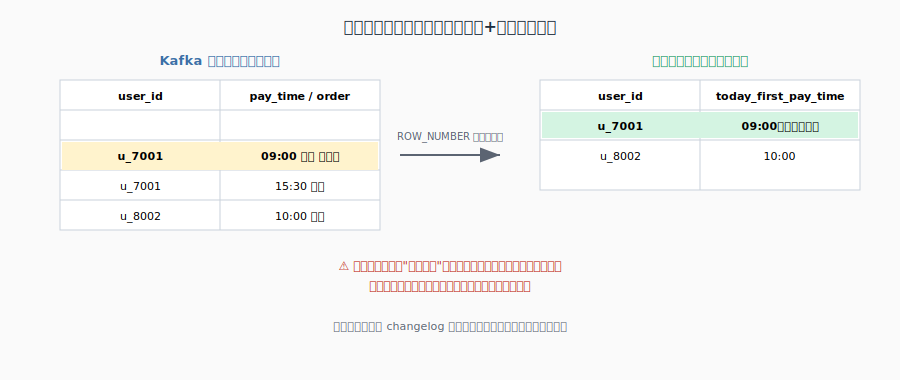
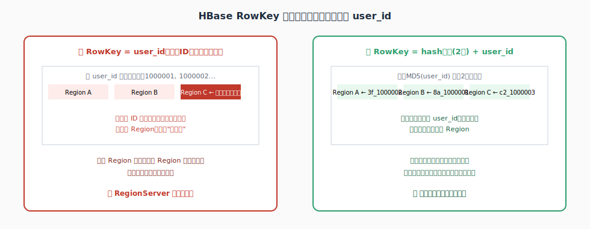
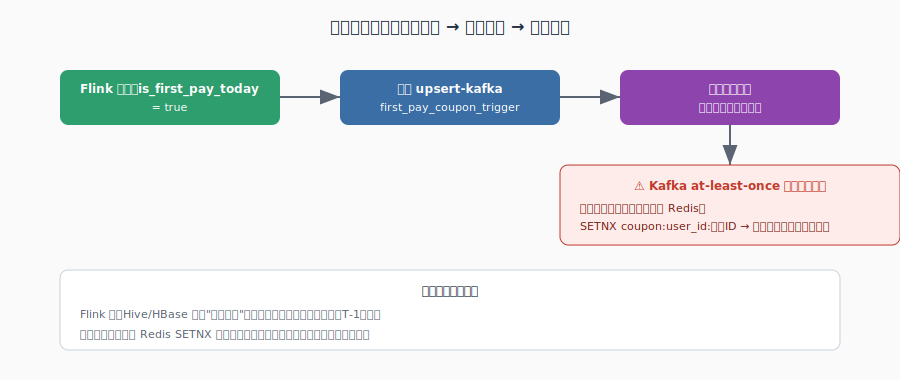

# 留学缴费首次支付检测 —— 完整方案（从数据源开始，一步步讲）

> 场景：判断"留学缴费"用户是否为**首次支付**，首次支付立刻推送优惠券。
> 本文从最源头的 MySQL 数据讲起，一路讲到最终触发发券，覆盖 Flink SQL + Hive T-1 + HBase 加速的完整链路，每一步都配图和示例数据。

---

## Step 0：数据源全景 —— 数据从哪来，怎么流转


### 数据的起点：MySQL 缴费表

一切的源头是 MySQL 里的一张业务表，大概长这样：

**`study_abroad_payment` 表**

| order_id | user_id | pay_time | pay_amount | pay_type |
|---|---|---|---|---|
| order_88213 | u_7001 | 2026-07-03 09:00:00 | 5000.00 | 订金 |
| order_88214 | u_7001 | 2026-07-03 15:30:00 | 45000.00 | 尾款 |
| order_91002 | u_8002 | 2026-07-03 10:00:00 | 30000.00 | 全款 |

用户每完成一次支付，业务系统就往这张表 `INSERT` 一条记录。

### 📌 知识点科普：数据是怎么从 MySQL 变成 Kafka 消息的？

这一步叫 **CDC（Change Data Capture，变更数据捕获）**，常见工具是 **Canal** 或 **Debezium**。原理是：MySQL 本身为了主从复制，会把每一次 `INSERT/UPDATE/DELETE` 都记录进一个叫 **binlog** 的日志文件。CDC 工具伪装成一个"从库"，实时读取这份 binlog，把每条变更解析成一条 JSON 消息，发送到 Kafka。

好处是：**不需要改动业务系统的任何代码**，业务系统该怎么写 MySQL 还是怎么写，CDC 是"旁路监听"，对业务完全无感知、无侵入。

### Kafka 里收到的消息长什么样

```json
{"order_id":"order_88213","user_id":"u_7001","pay_time":"2026-07-03T09:00:00.000Z","pay_amount":5000.00,"pay_type":"订金"}
{"order_id":"order_88214","user_id":"u_7001","pay_time":"2026-07-03T15:30:00.000Z","pay_amount":45000.00,"pay_type":"尾款"}
{"order_id":"order_91002","user_id":"u_8002","pay_time":"2026-07-03T10:00:00.000Z","pay_amount":30000.00,"pay_type":"全款"}
```

### 📌 知识点科普：为什么下游要走 Kafka，不直接读 MySQL？

如果每个下游系统（数仓、实时风控、优惠券系统……）都直接连 MySQL 查数据，MySQL 很快会被查挂，而且业务库和分析型查询混在一起，互相拖慢。**Kafka 起到"数据总线"的作用**：CDC 只写一次 Kafka，后面有多少个下游系统都从 Kafka 读，各自维护自己的消费进度，互不干扰，也不会给业务库增加任何查询压力。

### 两条独立的消费管道

同一个 Kafka topic，被两个 **Consumer Group** 各自完整读一遍：

| | 谁读 | 读的范围 | 目的 |
|---|---|---|---|
| 批处理管道 | Hive/Spark 每天凌晨任务 | 昨天全天 | 落 ODS，聚合出 DWD 层的 `dwd_user_first_payment_t1` |
| 实时管道 | 本文要写的 Flink SQL 作业 | 今天 0 点至今 | 实时判断今天谁是首次支付 |

---

## Step 1：Kafka Source Table —— 把消息变成 Flink 能算的表

```sql
CREATE TABLE kafka_payment_events (
    order_id    STRING,
    user_id     STRING,
    pay_time    TIMESTAMP(3),
    pay_amount  DECIMAL(10,2),
    proctime AS PROCTIME(),
    WATERMARK FOR pay_time AS pay_time - INTERVAL '5' SECOND
) WITH (
    'connector' = 'kafka',
    'topic' = 'study_abroad_payment_events',
    'properties.bootstrap.servers' = 'broker:9092',
    'properties.group.id' = 'first-pay-detector',
    'format' = 'json',
    'scan.startup.mode' = 'timestamp',
    'scan.startup.timestamp-millis' = '${TODAY_0AM_EPOCH_MS}'
);
```

### 📌 知识点科普：这条 DDL 在做什么

Flink 的 `CREATE TABLE` **不会真的创建一张存数据的表**，它只是声明"以后代码里用 `kafka_payment_events` 这个名字，代表这个 Kafka topic，用这种格式（JSON）去读它"。数据本身还在 Kafka 里，这张"表"只是一层读写协议的包装。

- `proctime AS PROCTIME()`：声明一个处理时间列，专门给后面 Lookup Join 用（这是框架的硬性要求，后面会讲为什么）
- `WATERMARK FOR pay_time AS pay_time - INTERVAL '5' SECOND`：告诉 Flink 允许数据最多迟到 5 秒
- `scan.startup.timestamp-millis`：指定从"今天 0 点"开始消费，不指定的话可能会从最早的历史消息开始读，把本该已经处理过的数据重新算一遍

---

## Step 2：流内去重 —— 一个用户可能今天分多笔付款



```sql
CREATE TEMPORARY VIEW today_first_pay AS
SELECT user_id, order_id, pay_time AS today_first_pay_time, proctime
FROM (
    SELECT *,
        ROW_NUMBER() OVER (
            PARTITION BY user_id
            ORDER BY pay_time ASC
        ) AS rn
    FROM kafka_payment_events
)
WHERE rn = 1;
```

### 结合示例数据推演

`u_7001` 今天分两笔付款：09:00 订金、15:30 尾款。去重后只保留最早那笔：

| user_id | today_first_pay_time |
|---|---|
| u_7001 | 09:00（订金） |
| u_8002 | 10:00（全款） |

### 📌 知识点科普：ROW_NUMBER 去重的底层原理

Flink 会按 `PARTITION BY` 的字段（`user_id`）维护一份 **KeyedState**，记录"这个用户目前见过的最早时间"。每来一条新数据就跟 state 比较：更早就更新并**撤回之前发出的结果**，重新发一条新的。所以这一步的输出**不是纯追加流**，而是带有"撤回再更新"的 **changelog 流** —— 这个特性会一路影响到最后 Sink 的 connector 选型。

### ⚠️ 业务口径提醒（这是技术之外，你需要跟业务方确认的点）

"首次支付"算订金那一刻，还是要等**全款到账**才算？这是个业务定义问题，不是技术问题，SQL 层面两种口径都能实现（改一下 `WHERE pay_type = '全款' OR pay_type = '订金'` 的过滤条件即可），但一定要提前跟运营/产品对齐，避免券发早了或发晚了。

---

## Step 3：Hive T-1 表继续照常生成（不变）

批处理管道每天凌晨照常跑，产出滚动累积的历史首次支付表：

**`dwd_user_first_payment_t1`（Hive）**

| user_id | first_pay_time | first_order_id | dt |
|---|---|---|---|
| u_8002 | 2025-11-03 07:20:00 | order_31005 | 2026-07-02 |

`u_7001` 不在这张表里，说明历史上没缴过费，今天是第一次出现。这张表的生成逻辑跟之前登录场景完全一样：

```sql
INSERT OVERWRITE TABLE dwd.dwd_user_first_payment_t1 PARTITION (dt='${yesterday}')
SELECT
    COALESCE(old.user_id, new.user_id) AS user_id,
    LEAST(
        COALESCE(old.first_pay_time, new.first_pay_time),
        COALESCE(new.first_pay_time, old.first_pay_time)
    ) AS first_pay_time
FROM dwd.dwd_user_first_payment_t1 old
FULL OUTER JOIN today_new_users_snapshot new
    ON old.user_id = new.user_id;
```

这张表是**全公司的权威数据源（Source of Truth）**，之后不管加多少层加速手段，最终都要以它为准。

---

## Step 4：为什么 Flink 不直接查 Hive —— 引入 HBase 加速层


### 📌 知识点科普：Hive 和 HBase 的定位不一样

| | Hive | HBase |
|---|---|---|
| 定位 | 批量扫描分析 | 高频随机点查 |
| 单次查询延迟 | 秒级到分钟级 | 毫秒级 |
| Lookup Join 场景下 | 只能整表/整分区加载进 Flink 内存当字典 | 天生支持按 Key 直接定位，不用整表加载 |

Flink 里每条流数据都要查一次维表，属于**高频点查**，跟 Hive 的设计目标（批量扫描）完全不匹配。用户量一大，直接查 Hive 会有 OOM 风险、冷启动慢、Hive 集群压力大等问题。**大厂标准做法：Hive T-1 表继续作为权威数据源，每天额外同步一份进 HBase，专门给 Flink 做高速查询用。**

---

## Step 5：每天把 Hive T-1 表同步进 HBase（Bulk Load）




### HBase 表结构

```bash
create 'dim:user_first_pay', 'info'
```

| RowKey（加盐后） | info:first_pay_time | info:first_order_id |
|---|---|---|
| `8a_u_8002` | 2025-11-03 07:20:00 | order_31005 |

### 📌 知识点科普：为什么 RowKey 要加盐

如果直接用 `user_id` 当 RowKey，且 `user_id` 是数据库自增 ID，新用户的 ID 连续递增，会导致**今天新增的数据全部落在同一个 Region**，其他 Region 空闲，造成写入热点。解决办法是在 RowKey 前面拼一个哈希前缀（比如 `MD5(user_id)` 取前 2 位），把数据打散到不同 Region：

```
RowKey = MD5(user_id).substring(0,2) + "_" + user_id
例如：u_8002 → "8a_u_8002"
```

### 📌 知识点科普：为什么用 Bulk Load，不用逐行 Put

| | 逐行 Put | Bulk Load（推荐） |
|---|---|---|
| 原理 | 逐条调用 API 写入，走正常写路径 | 直接生成 HFile 文件，绕开写路径 |
| 对集群压力 | 大 | 极小 |
| 速度 | 千万级要几十分钟到几小时 | 千万到亿级几分钟到十几分钟 |
| 适用场景 | 小范围增量更新 | **每天全量刷新一份快照**（本场景） |

### 同步任务示意代码（Spark）

```scala
val df = spark.sql("SELECT user_id, first_pay_time, first_order_id FROM dwd.dwd_user_first_payment_t1")

val rdd = df.rdd.map(row => {
    val rawKey = row.getAs[String]("user_id")
    val rowkey = s"${md5Prefix(rawKey)}_${rawKey}"   // 加盐
    (rowkey, row)
}).sortByKey()   // Bulk Load 强制要求按 RowKey 有序

rdd.saveAsNewAPIHadoopFile(
    "/tmp/hbase_bulkload/dim_user_first_pay",
    classOf[org.apache.hadoop.hbase.io.ImmutableBytesWritable],
    classOf[org.apache.hadoop.hbase.KeyValue],
    classOf[org.apache.hadoop.hbase.mapreduce.HFileOutputFormat2]
)
// bash: hbase org.apache.hadoop.hbase.tool.LoadIncrementalHFiles /tmp/hbase_bulkload/dim_user_first_pay dim:user_first_pay
```

### 调度时间线

```
02:00  Hive批任务：合并生成最新 dwd_user_first_payment_t1
02:30  Spark Bulk Load：全量同步进 HBase dim:user_first_pay
全天    Flink 实时作业：查 HBase 判断今天谁是首次支付
```

---

## Step 6：Flink 查 HBase 做判断 + 触发发券 + 幂等兜底



### 建 HBase 维表 + Lookup Join

```sql
CREATE TABLE hbase_first_pay (
    rowkey STRING,
    info ROW<first_pay_time STRING, first_order_id STRING>,
    PRIMARY KEY (rowkey) NOT ENFORCED
) WITH (
    'connector' = 'hbase-2.2',
    'table-name' = 'dim:user_first_pay',
    'zookeeper.quorum' = 'zk1:2181,zk2:2181,zk3:2181',
    'lookup.cache.max-rows' = '500000',
    'lookup.cache.ttl' = '30 min'
);

CREATE TABLE sink_first_pay_coupon_trigger (
    user_id    STRING,
    order_id   STRING,
    pay_time   TIMESTAMP(3),
    PRIMARY KEY (user_id) NOT ENFORCED
) WITH (
    'connector' = 'upsert-kafka',
    'topic' = 'first_pay_coupon_trigger',
    'key.format' = 'json',
    'value.format' = 'json'
);

INSERT INTO sink_first_pay_coupon_trigger
SELECT t.user_id, t.order_id, t.today_first_pay_time
FROM today_first_pay AS t
LEFT JOIN hbase_first_pay
    FOR SYSTEM_TIME AS OF t.proctime AS h
    ON CONCAT(md5_prefix(t.user_id), '_', t.user_id) = h.rowkey
WHERE h.rowkey IS NULL;   -- HBase里查不到，说明今天真的是首次支付
```

### 📌 知识点科普：为什么 Sink 要用 upsert-kafka

回顾 Step 2——去重算子输出的是带"撤回再更新"的 changelog 流。普通 `kafka` connector 只支持纯追加写入，遇到更新/撤回会直接报错。`upsert-kafka` 靠声明的 `PRIMARY KEY (user_id)` 把更新语义翻译成 Kafka 天然支持的"同 key 新消息覆盖旧消息"。

### 下游发券服务：最后一道幂等保护

即使前面逻辑都对，Kafka 的 **at-least-once** 消费语义意味着消息仍有极小概率被重复消费。发券服务收到触发消息后，自己再做一次简单幂等：

```
SETNX coupon:u_7001:activity_2026Q3   →  如果 key 已存在，说明已经发过券了，直接跳过
```

用 Redis `SETNX` 配合合理的过期时间（比如 24 小时），成本很低，但能彻底堵住"重复发券"这个最终风险点。

---

## 全链路时间线总结

```
业务发生    MySQL INSERT 一条缴费记录
  ↓ (毫秒级，CDC 实时捕获)
Kafka       study_abroad_payment_events 收到一条消息
  ↓
  ├─ 批处理：凌晨02:00合并进 Hive T-1 表 → 02:30 Bulk Load 同步进 HBase
  └─ 实时：Flink 全天消费，去重 + 查 HBase 判断首次 → 触发发券 → 发券服务幂等兜底
```

## 附录：全篇面试高频 QA 速查

| 问题 | 一句话答案 |
|---|---|
| CDC 是什么，为什么不侵入业务代码？ | 读 MySQL binlog 解析变更，业务系统无需任何改动 |
| 为什么下游要走 Kafka 不直连 MySQL？ | Kafka 作为数据总线，避免多个下游直接查库拖垮业务库 |
| 为什么要有 proctime？ | Lookup Join 框架层面强制要求，跟事件时间是两套体系 |
| ROW_NUMBER 去重底层怎么实现？ | 按 key 维护 KeyedState，记录当前最优值，产生 changelog 流 |
| 为什么不直接 Flink 查 Hive？ | Hive 为批量扫描设计，高频点查会 OOM、冷启动慢 |
| RowKey 为什么要加盐？ | 避免连续递增 ID 全部落在同一 Region，造成写入热点 |
| 为什么用 Bulk Load 不用逐行 Put？ | Bulk Load 绕开正常写路径，全量刷新大表更快、压力更小 |
| upsert-kafka 和普通 kafka connector 区别？ | upsert-kafka 支持消费 update/delete，普通 connector 只支持追加 |
| 发券服务为什么还要单独做幂等？ | Kafka at-least-once 语义下消息可能重复消费，需要业务侧兜底 |
| 权威数据源是谁？ | 一直是 Hive T-1 表，HBase 只是它给实时链路用的加速副本 |
