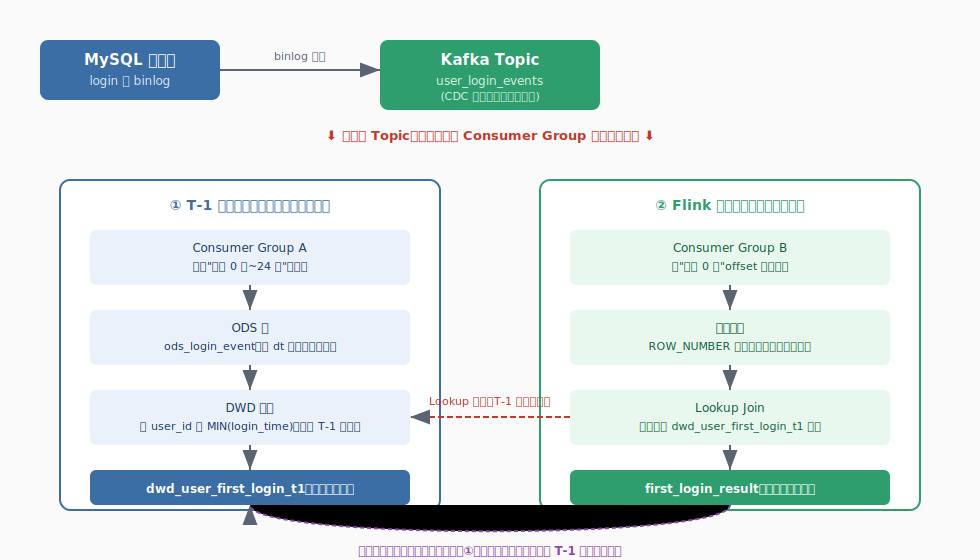
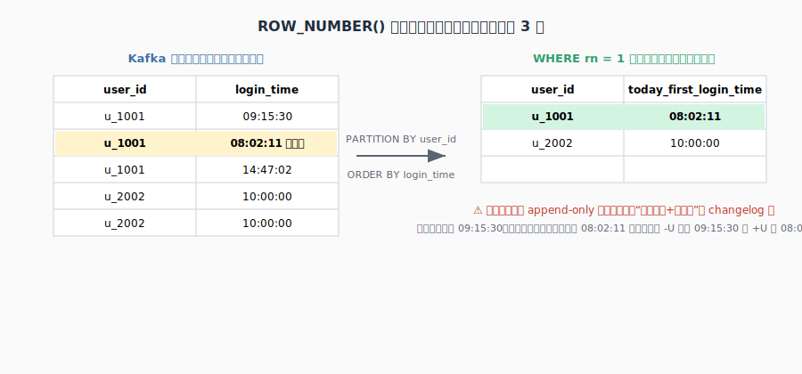
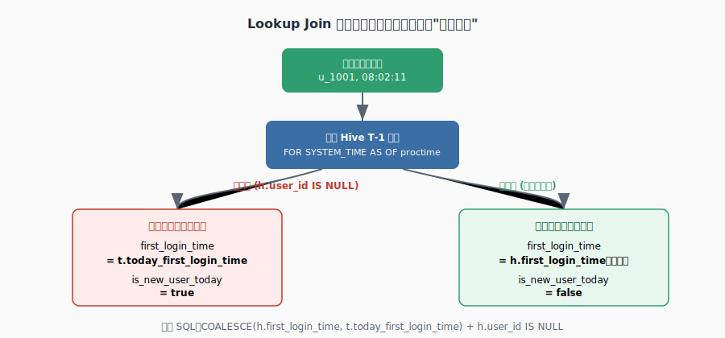

# Flink SQL 实战：用户首次登录时间检测

> 目标读者：Flink 初学者，会基础 SQL，但对 Table API / Dynamic Table / Watermark / Lookup Join 这些概念还比较陌生。
> 本文按 5 个 Step 讲，每个 Step 都有：**知识点科普 + 示例数据 + 实战 SQL 片段**。

---

## Step 1：整体架构 —— 先搞清楚数据从哪来、去哪

在写任何一行 Flink SQL 之前，必须先把"数据从哪来"想清楚，这是新手最容易忽略的一步。



### 场景还原

你的登录数据**源头只有一个**：MySQL 的 `login` 表，通过 **binlog 采集（CDC，Change Data Capture）**，变成一条条事件写进同一个 Kafka topic：`user_login_events`。

这一份数据，被**两个完全独立的 Consumer Group** 各自读一遍：

| | 谁在读 | 读的范围 | 用途 |
|---|---|---|---|
| ① 批处理管道 | 每天凌晨跑的 Hive/Spark 任务 | 昨天 0 点~24 点 | 落 ODS → 聚合进 DWD → 生成/更新 `dwd_user_first_login_t1` |
| ② Flink 实时管道 | 我们今天要写的这个作业 | 今天 0 点到现在 | 实时判断"今天有没有新用户首登" |

### 📌 知识点科普：为什么同一个 Kafka topic 可以被读两次还互不影响？

Kafka 的消费模型是 **Consumer Group 隔离**——每个 Consumer Group 会独立维护自己的 offset（读到哪了）。批处理管道读到哪、跟实时管道读到哪，是两本互不相干的"账"。这也是为什么你可以放心地让批处理和实时任务同时读同一个 topic，不会互相"抢"数据或者丢数据。

### ✅ 回答你的问题："今天的数据也是这个 kafka source，消费一次，明天还能继续 T-1 吗？"

**是的**。整个流程是一个**永续滚动的闭环**：

1. 今天：Flink 实时管道从今天 0 点开始消费，实时判断新用户 → 写到实时结果 topic
2. 今天 24 点后（明天凌晨）：批处理管道读**同一个 topic 里"今天"这部分数据**（此时它已经变成"昨天"），落 ODS，聚合出当天的最早登录时间，跟老的 `dwd_user_first_login_t1` 做 `FULL OUTER JOIN` 合并，取更早的时间，覆盖生成新的 T-1 表
3. 新的一天开始，Flink 实时管道重新从"新的今天 0 点"消费，去查**已经合并过的、更新后的** T-1 表
4. 循环往复

这个模式在数仓里有个专门叫法——**Lambda 架构**：批处理层（Batch Layer）保证最终数据的完整、准确；实时层（Speed Layer）用同一份原始数据源，提供当天低延迟的近似结果；两层各自独立跑，互不阻塞。

---

## Step 2：认识 Kafka Source Table —— 示例数据带你理解每个字段

### 示例数据：MySQL binlog 事件长什么样

假设 MySQL 的 `login` 表被 CDC 采集后，Kafka 里收到的 JSON 消息类似这样：

```json
{"user_id": "u_1001", "login_time": "2026-07-03T08:02:11.000Z"}
{"user_id": "u_1001", "login_time": "2026-07-03T09:15:30.000Z"}
{"user_id": "u_2002", "login_time": "2026-07-03T10:00:00.000Z"}
```

同一个用户一天可能登录很多次，这是后面要去重的原因。

### 对应的 Flink SQL 建表

```sql
CREATE TABLE default_catalog.default_database.kafka_login_events (
    user_id     STRING,
    login_time  TIMESTAMP(3),
    proctime AS PROCTIME(),
    WATERMARK FOR login_time AS login_time - INTERVAL '5' SECOND
) WITH (
    'connector' = 'kafka',
    'topic' = 'user_login_events',
    'properties.bootstrap.servers' = 'broker:9092',
    'format' = 'json',
    'scan.startup.mode' = 'timestamp',
    'scan.startup.timestamp-millis' = '${TODAY_0AM_EPOCH_MS}'
);
```

### 📌 知识点科普 1：Flink 里的"表"不是数据，是一份连接器配置

初学者常见误解：以为 `CREATE TABLE` 会真的创建一张存数据的表。**实际上不会**。这条 DDL 只是告诉 Flink："以后我用 `kafka_login_events` 这个名字，代表这个 Kafka topic，用这个格式读/写它。" 数据本身还是躺在 Kafka 里，Flink 表只是一层"读写协议"的包装。

### 📌 知识点科普 2：`proctime` 和 `WATERMARK` 是两套不同的时间概念

| | proctime（处理时间） | event time + watermark（事件时间） |
|---|---|---|
| 含义 | 这条数据被 Flink 算子处理的那一刻，机器的墙上时钟 | 数据自带的业务时间戳（这里是 `login_time`） |
| 特点 | 不确定、不可重放，每次运行结果可能不同 | 可重放，语义稳定，但需要容忍网络延迟/乱序 |
| 本例用途 | 后面 Lookup Join **强制要求**用它 | 本例里其实没有真正用到 watermark 做窗口计算 |

`WATERMARK FOR login_time AS login_time - INTERVAL '5' SECOND` 的意思是：**允许数据最多迟到 5 秒**，超过 5 秒还没到的，Flink 就认为"不会再等它了"。这里定义了它，但脚本里没有用到窗口聚合，所以更多是"预留"，为将来按事件时间扩展做准备。

### 📌 知识点科普 3：为什么要用 `scan.startup.timestamp-millis` 指定今天 0 点？

如果不指定，Flink 默认可能会从 topic **最早的消息**开始读（`earliest-offset`），那就不只是今天的数据了，还会把 T-1 表里本该已经处理过的历史数据重新算一遍，造成浪费甚至逻辑错误。所以这里显式指定"今天 0 点的 epoch 毫秒"作为起始 offset，确保只消费今天的增量。

---

## Step 3：流内去重 —— ROW_NUMBER() 找"今天最早一条"



### 示例数据回顾

沿用上面例子，`u_1001` 今天登录了 3 次：`08:02:11`、`09:15:30`、`14:47:02`。我们只关心**最早**那条。

### 实战 SQL

```sql
CREATE TEMPORARY VIEW today_first_seen AS
SELECT
    user_id,
    login_time AS today_first_login_time,
    proctime
FROM (
    SELECT
        user_id,
        login_time,
        proctime,
        ROW_NUMBER() OVER (
            PARTITION BY user_id
            ORDER BY login_time ASC
        ) AS rn
    FROM default_catalog.default_database.kafka_login_events
)
WHERE rn = 1;
```

### 去重后的结果

| user_id | today_first_login_time |
|---|---|
| u_1001 | 08:02:11 |
| u_2002 | 10:00:00 |

### 📌 知识点科普：这段 SQL 底层是怎么跑的？（面试高频）

这是 Flink SQL 官方称为 **Deduplication（去重）** 的经典写法。底层原理：

1. Flink 会按 `PARTITION BY` 的字段（这里是 `user_id`）开一个 **KeyedState**，为每个 key 单独维护一份"目前见过的最早时间"
2. 每来一条新事件，跟 state 里存的值比较：
   - 如果比现在存的更早 → **更新 state**，并且**撤回（retract）之前发出的旧结果**，重新发一条新的
   - 如果比现在存的晚 → 直接丢弃，不输出
3. 因此这个去重算子的输出**不是简单的追加流（append-only）**，而是一个**会变化的 changelog 流**（带有 `-U`/`+U` 这种"撤回再更新"的消息）

### ⚠️ 这个特性会一路影响到后面的 Sink 选型

正因为这里的输出可能"改主意"（先以为 09:15:30 最早，后来发现 08:02:11 更早），最终写到 Kafka 的 sink 表，必须能处理"更新"，这就是为什么 Step 5 要用 `upsert-kafka` 而不是普通 `kafka` connector。

---

## Step 4：Lookup Join —— 拿 Hive T-1 表当"字典"去查



### 示例数据：Hive 里的 T-1 表（截至昨天的历史存量）

`dwd_user_first_login_t1`：

| user_id | first_login_time | dt |
|---|---|---|
| u_2002 | 2025-11-03 07:20:00 | 2026-07-02 |
| u_3003 | 2026-01-15 12:00:00 | 2026-07-02 |

注意：`u_1001` 不在这张表里 —— 说明历史上**从没登录过**，今天是它第一次出现。

### 实战 SQL

```sql
CREATE CATALOG hive_catalog WITH (
    'type' = 'hive',
    'hive-conf-dir' = '/opt/hive-conf',
    'default-database' = 'dwd'
);

SELECT
    t.user_id,
    COALESCE(h.first_login_time, t.today_first_login_time) AS first_login_time,
    h.user_id IS NULL AS is_new_user_today
FROM today_first_seen AS t
LEFT JOIN hive_catalog.dwd.dwd_user_first_login_t1
    /*+ OPTIONS(
        'streaming-source.enable' = 'false',
        'lookup.join.cache.ttl' = '12 h'
    ) */
    FOR SYSTEM_TIME AS OF t.proctime AS h
    ON t.user_id = h.user_id;
```

### 结合示例数据推演结果

| user_id | 查 Hive 结果 | first_login_time | is_new_user_today |
|---|---|---|---|
| u_1001 | 查不到 | 08:02:11（今天的值） | **true** |
| u_2002 | 查到 2025-11-03 07:20:00 | 2025-11-03 07:20:00（历史值） | **false** |

### 📌 知识点科普 1：什么是 Lookup Join / 时态表 Join？

`FOR SYSTEM_TIME AS OF t.proctime` 是标准 SQL:2011 引入的**时态表（Temporal Table）**语法，意思是"在流数据到达的那一刻，去维表里查一份**当时的快照**"。这跟你熟悉的普通 `JOIN` 不一样——普通 JOIN 是两边都是"表"，一次性算完；Lookup Join 是一边是流（持续来数据），一边是相对静态的维表，**每来一条流数据就触发一次查询**。

### 📌 知识点科普 2：两个 OPTIONS hint 到底在干嘛

| Option | 类比理解 |
|---|---|
| `streaming-source.enable = false` | 告诉 Flink："这张 Hive 表你就当一份**普通的、有界的**参照数据来加载就行，不用去监听它有没有新分区、新文件"（因为它本来就是一天更新一次） |
| `lookup.join.cache.ttl = 12h` | 相当于给这张维表在 Flink 内存里开了一个**缓存**，12 小时内重复查同一个 `user_id` 不用真的再去 Hive 查一次，直接用内存缓存的结果，减轻 Hive 压力 |

### 📌 知识点科普 3：为什么必须是 `proctime`，不能是 `login_time`（事件时间）？

Lookup Join 本质是一个**同步查找动作**——"现在，马上，去查一下维表现在长什么样"。这跟事件时间体系（允许乱序、允许迟到、靠 watermark 判断"能不能继续等"）完全是两套设计哲学。Flink 目前的实现里，`FOR SYSTEM_TIME AS OF` 后面**只接受 proctime 列**，这是框架层面的硬限制，写错了直接编译报错。

---

## Step 5：Sink 与收尾 —— upsert-kafka 和明天的闭环

### 实战 SQL

```sql
CREATE TABLE default_catalog.default_database.sink_first_login_result (
    user_id           STRING,
    first_login_time  TIMESTAMP(3),
    is_new_user_today BOOLEAN,
    PRIMARY KEY (user_id) NOT ENFORCED
) WITH (
    'connector' = 'upsert-kafka',
    'topic' = 'first_login_result',
    'properties.bootstrap.servers' = 'broker:9092',
    'key.format' = 'json',
    'value.format' = 'json'
);
```

### 最终输出示例

写到 `first_login_result` topic 里的消息（以 `user_id` 为 Kafka message key）：

```json
Key: "u_1001"    Value: {"user_id":"u_1001","first_login_time":"2026-07-03T08:02:11.000Z","is_new_user_today":true}
Key: "u_2002"    Value: {"user_id":"u_2002","first_login_time":"2025-11-03T07:20:00.000Z","is_new_user_today":false}
```

### 📌 知识点科普：为什么这里必须用 `upsert-kafka`，不能用普通 `kafka` connector？

回顾 Step 3 提到的——去重算子的输出是会"改主意"的 changelog 流（带 `-U`/`+U`）。普通 `kafka` connector **只支持 append-only（纯追加）写入**，一旦上游是带更新/撤回的流，直接用普通 kafka sink 会报错："Table sink doesn't support consuming update and delete changes"。

`upsert-kafka` 靠声明的 `PRIMARY KEY (user_id)` 把"更新"翻译成 Kafka 天然支持的语义：**同一个 key 的新消息会覆盖旧消息**（下游用 compacted topic 或者自己按 key 取最新值即可还原出一张"表"）。

### 明天凌晨的闭环批任务（不在这个 Flink 作业里跑）

```sql
-- 这是另一个独立的 Hive/Spark 批任务
INSERT OVERWRITE TABLE dwd.dwd_user_first_login_t1 PARTITION (dt='${yesterday}')
SELECT
    COALESCE(old.user_id, new.user_id) AS user_id,
    LEAST(
        COALESCE(old.first_login_time, new.first_login_time),
        COALESCE(new.first_login_time, old.first_login_time)
    ) AS first_login_time
FROM dwd.dwd_user_first_login_t1 old
FULL OUTER JOIN today_new_users_snapshot new
    ON old.user_id = new.user_id;
```

这一步把"今天"实时发现的新用户，正式合并进 T-1 表，第二天 Flink 作业重新启动时查到的维表就是**已经更新过的**，循环继续。

---

## 附录：面试高频 QA 速查

| 问题 | 一句话答案 |
|---|---|
| Flink SQL 里的表和真实数据库的表一样吗？ | 不一样，Flink 表只是 connector 配置的抽象，不存数据 |
| 为什么要先 CREATE TABLE 再 INSERT？ | SQL 编译阶段就要做 schema 校验、生成执行计划，必须先注册表结构和 connector 信息 |
| proctime 和 event time 区别？ | proctime 是处理时机器的墙上时钟，不可重放；event time 是数据自带业务时间戳，可重放、可回溯 |
| 为什么 Lookup Join 只能用 proctime？ | 它是"当下同步查询"语义，跟事件时间的乱序容忍机制不是一套体系，Flink 框架层面强制要求 |
| ROW_NUMBER 去重的底层实现？ | 按 key 维护 KeyedState 记录当前最优值，新数据更优时撤回旧结果、发出新结果，产生 changelog 流 |
| 为什么 sink 要用 upsert-kafka？ | 上游是带更新/撤回的 changelog 流，普通 kafka connector 不支持消费 update/delete，只有 upsert-kafka 支持按主键覆盖写 |
| `PRIMARY KEY ... NOT ENFORCED` 是什么意思？ | 声明主键但不做唯一性强校验，只是告诉优化器和 connector 用于生成 upsert 语义 |
| Kafka 同一个 topic 能被两个任务同时读吗？ | 能，不同 Consumer Group 各自独立维护 offset，互不影响 |
| 这套架构叫什么？ | Lambda 架构：批处理层保精确、实时层保时效，共享同一份数据源 |
| `lookup.join.cache.ttl` 设太长有什么风险？ | 缓存过期前如果 Hive 维表数据变了，Flink 读到的可能是旧快照，这里因为 T-1 表本来就一天更新一次，属于合理权衡 |
