# Mock Interview Prep

## Data, Lakehouse and AI Data Platform Engineer — VP, Singapore

Sorted by frequency reported in GS CoderPad interviews (highest first).
**Approach & Code sections are collapsed by default** — click to reveal after you attempt the problem yourself.
Each code block includes a runnable example at the bottom.

---

🎯 Since Python 3.7+, dictionaries ARE ordered!

## 📚 Table of Contents — Grouped by Category

**Tip:** Study by category, not by number — grouping similar patterns together helps you internalize the underlying technique instead of memorizing 28 isolated problems.

---

### 🗄️ SQL
- [2) SQL — Deduplicate & Get Latest Record](#2-sql--deduplicate--get-latest-record)
- [3) SQL — Second Highest Salary per Department](#3-sql--second-highest-salary-per-department) ⭐
- [18) SQL — Running Total (Cumulative Sum)](#18-sql--running-total-cumulative-sum)
- [19) SQL — Find Duplicate Emails](#19-sql--find-duplicate-emails)

### 🔑 HashMap / Grouping / Frequency Counting
- [9) Group Anagrams](#9-group-anagrams--leetcode-49)
- [10) Two Sum (+ Streaming Follow-up)](#10-two-sum--follow-up-streaming-data)
- [15) Top K Frequent Elements](#15-top-k-frequent-elements--leetcode-347)
- [23) Two Sum (verified)](#23-two-sum)
- [24) Most Frequent IP Address from Logs (verified)](#24-find-most-frequent-ip-address-from-logs)
- [26) Student with Highest Average Score (verified)](#26-student-with-highest-average-score) 🎯🎯🎯  
                               
### 🏗️ Design (Data Structures)
- [1) LRU Cache](#1-lru-cache--leetcode-146)
- [17) Design Hit Counter](#17-design-hit-counter--leetcode-362)
- [28) Design a Calculator (verified)](#28-design-a-calculator)

### 📚 Stack
- [11) Valid Parentheses](#11-valid-parentheses--leetcode-20)
- [28) Design a Calculator (also stack-based)](#28-design-a-calculator)

### 🪟 Sliding Window / Two Pointer
- [12) Longest Substring Without Repeating Characters](#12-longest-substring-without-repeating-characters--leetcode-3)
- [16) Trapping Rain Water](#16-trapping-rain-water--leetcode-42)
- [22) Trapping Rain Water (verified)](#22-trapping-rain-water)

### ⛰️ Heap
- [14) Kth Largest Element in an Array](#14-kth-largest-element-in-an-array--leetcode-215)
- [15) Top K Frequent Elements](#15-top-k-frequent-elements--leetcode-347)

### 🌳 BFS / DFS / Graph
- [4) Binary Tree Level Order Traversal](#4-binary-tree-level-order-traversal--leetcode-102)
- [5) Number of Islands](#5-number-of-islands--leetcode-200)
- [6) Course Schedule](#6-course-schedule--leetcode-207)
- [7) Rotting Oranges](#7-rotting-oranges--leetcode-994)
- [25) Union-Find — Largest Tree Root (verified)](#25-union-find--largest-tree-root-in-a-forest)

### 🧮 Dynamic Programming
- [8) Word Break](#8-word-break--leetcode-139)

### 📊 Sorting / Greedy
- [13) Merge Intervals](#13-merge-intervals--leetcode-56)

### 🔗 Linked List
- [20) Merge Two Sorted Lists](#20-merge-two-sorted-lists--leetcode-21)

### 🔤 String / Simulation
- [21) String Compression (verified)](#21-string-compression)
- [27) Robot Final Coordinates (verified)](#27-robot-final-coordinates-from-a-move-string)

### 🔀 Union-Find
- [25) Union-Find — Largest Tree Root in a Forest (verified)](#25-union-find--largest-tree-root-in-a-forest)

---

### ✅ Part 3 — Verified Questions Only (real sourced interview reports)
- [21) String Compression](#21-string-compression)
- [22) Trapping Rain Water](#22-trapping-rain-water)
- [23) Two Sum](#23-two-sum)
- [24) Most Frequent IP Address from Logs](#24-find-most-frequent-ip-address-from-logs)
- [25) Union-Find — Largest Tree Root](#25-union-find--largest-tree-root-in-a-forest)
- [26) Student with Highest Average Score](#26-student-with-highest-average-score)
- [27) Robot Final Coordinates](#27-robot-final-coordinates-from-a-move-string)
- [28) Design a Calculator](#28-design-a-calculator)

### 🔮 Part 4 — Role-Specific Prep (Speculative, English Practice)
- [Why "Lakehouse" and "AI Data Platform" change the picture](#1-why-lakehouse-and-ai-data-platform-change-the-picture)
- [What GS's own interview guide confirms](#2-what-gss-own-interview-guide-says-to-expect-this-part-is-sourced)
- [Likely CoderPad-style coding patterns](#3-likely-coderpad-style-coding-patterns-for-this-role-specifically)
- [Likely system design discussion topics](#4-likely-system-design-discussion-topics-superday-style-not-coderpad)
- [English discussion practice — key vocabulary](#5-english-discussion-practice--key-vocabulary-to-be-fluent-with)
- [A structured English self-practice routine](#6-a-structured-english-self-practice-routine)

---


## 1) LRU Cache — LeetCode 146
**Frequency: Very High (reported repeatedly in GS interviews)**

**Problem**
Design a data structure that supports `get(key)` and `put(key, value)` in O(1) time. When capacity is exceeded, evict the least recently used item.

**Sample**
```
LRUCache cache = new LRUCache(2)
cache.put(1, 1)
cache.put(2, 2)
cache.get(1)       # returns 1
cache.put(3, 3)    # evicts key 2
cache.get(2)       # returns -1 (not found)
```

<details>
<summary><b>Approach (click to expand)</b></summary>

- HashMap for O(1) key lookup + Doubly Linked List for O(1) reordering
- Most recently used = move to front (head)
- Least recently used = tail, evicted when over capacity


```python
class Node:
    def __init__(self, key=0, val=0):
        self.key = key
        self.val = val
        self.prev = None
        self.next = None

class LRUCache:
    def __init__(self, capacity: int):
        self.cap = capacity
        self.cache = {}
        self.head = Node()
        self.tail = Node()
        self.head.next = self.tail
        self.tail.prev = self.head

    def _remove(self, node):
        node.prev.next = node.next
        node.next.prev = node.prev

    def _insert_front(self, node):
        node.next = self.head.next
        node.prev = self.head
        self.head.next.prev = node
        self.head.next = node

    def get(self, key: int) -> int:
        if key not in self.cache:
            return -1
        node = self.cache[key]
        self._remove(node)
        self._insert_front(node)
        return node.val

    def put(self, key: int, value: int) -> None:
        if key in self.cache:
            self._remove(self.cache[key])
        node = Node(key, value)
        self.cache[key] = node
        self._insert_front(node)
        if len(self.cache) > self.cap:
            lru = self.tail.prev
            self._remove(lru)
            del self.cache[lru.key]


if __name__ == "__main__":
    cache = LRUCache(2)
    cache.put(1, 1)
    cache.put(2, 2)
    print(cache.get(1))    # 1
    cache.put(3, 3)        # evicts key 2
    print(cache.get(2))    # -1
    cache.put(4, 4)        # evicts key 1
    print(cache.get(1))    # -1
    print(cache.get(3))    # 3
    print(cache.get(4))    # 4
```

**Memory tip:** HashMap = "where is it", Linked List = "how recently used"

</details>

---

## 2) SQL — Deduplicate & Get Latest Record
**Frequency: Very High (core Data Engineer skill)**

**Problem**
An ETL bug caused duplicate rows in `employee_salary_history`. Write a query to return only the most recent salary per employee.

**Sample**
```
Table: employee_salary_history
employee_id | salary | updated_at
1           | 5000   | 2024-01-01
1           | 5500   | 2024-03-01
1           | 5500   | 2024-03-01  <- duplicate
2           | 6000   | 2024-02-01
```

<details>
<summary><b>Approach (click to expand)</b></summary>

- Use `ROW_NUMBER()` window function partitioned by employee, ordered by latest date
- Filter to row number = 1


```sql
-- Setup (run this first to create test data)
CREATE TABLE employee_salary_history (
    employee_id INT,
    salary INT,
    updated_at DATE
);

INSERT INTO employee_salary_history VALUES
    (1, 5000, '2024-01-01'),
    (1, 5500, '2024-03-01'),
    (1, 5500, '2024-03-01'),
    (2, 6000, '2024-02-01');

-- Solution query
WITH ranked AS (
    SELECT *,
           ROW_NUMBER() OVER (
               PARTITION BY employee_id
               ORDER BY updated_at DESC
           ) AS rn
    FROM employee_salary_history
)
SELECT employee_id, salary, updated_at
FROM ranked
WHERE rn = 1;

-- Expected output:
-- employee_id | salary | updated_at
-- 1           | 5500   | 2024-03-01
-- 2           | 6000   | 2024-02-01
```

**Memory tip:** PARTITION BY = "group by employee", ROW_NUMBER = "rank within group"

</details>

---

## 3) SQL — Second Highest Salary per Department
**Frequency: High**

**Problem**
Find the second highest salary in each department.

**Sample**
```
Table: employees
id | name  | department | salary
1  | Alice | Eng        | 9000
2  | Bob   | Eng        | 8000
3  | Carol | Eng        | 8000
4  | Dave  | Sales      | 7000
```

<details>
<summary><b>Approach (click to expand)</b></summary>

- Use `DENSE_RANK()` (not ROW_NUMBER) so tied salaries share rank
- Filter to rank = 2


```sql
-- Setup (run this first to create test data)
CREATE TABLE employees (
    id INT,
    name VARCHAR(50),
    department VARCHAR(50),
    salary INT
);

INSERT INTO employees VALUES
    (1, 'Alice', 'Eng', 9000),
    (2, 'Bob', 'Eng', 8000),
    (3, 'Carol', 'Eng', 8000),
    (4, 'Dave', 'Sales', 7000);

-- Solution query
WITH ranked AS (
    SELECT *,
           DENSE_RANK() OVER (
               PARTITION BY department
               ORDER BY salary DESC
           ) AS rnk
    FROM employees
)
SELECT department, name, salary
FROM ranked
WHERE rnk = 2;

-- Expected output:
-- department | name | salary
-- Eng        | Bob  | 8000
-- Eng        | Carol| 8000
```

**Memory tip:** DENSE_RANK avoids gaps when there are ties -- use it for "Nth highest" problems

</details>

---

## 4) Binary Tree Level Order Traversal — LeetCode 102
**Frequency: Medium-High (common tree/BFS warmup)**

**Problem**
Given a binary tree, return node values grouped level by level.

**Sample**
```
Input:
    3
   / \
  9  20
    /  \
   15   7

Output: [[3],[9,20],[15,7]]
```

<details>
<summary><b>Approach (click to expand)</b></summary>

- BFS with a queue
- Process one full level at a time using `len(queue)` as the level size


```python
from collections import deque

class TreeNode:
    def __init__(self, val=0, left=None, right=None):
        self.val = val
        self.left = left
        self.right = right

def levelOrder(root):
    if not root:
        return []
    result = []
    queue = deque([root])

    while queue:
        level_size = len(queue)
        level = []
        for _ in range(level_size):
            node = queue.popleft()
            level.append(node.val)
            if node.left:
                queue.append(node.left)
            if node.right:
                queue.append(node.right)
        result.append(level)

    return result


if __name__ == "__main__":
    #     3
    #    / \
    #   9  20
    #     /  \
    #    15   7
    root = TreeNode(3)
    root.left = TreeNode(9)
    root.right = TreeNode(20)
    root.right.left = TreeNode(15)
    root.right.right = TreeNode(7)

    print(levelOrder(root))   # [[3], [9, 20], [15, 7]]
```

**Memory tip:** `len(queue)` at loop start = size of current level -- process exactly that many before moving to next level

</details>

---

## 5) Number of Islands — LeetCode 200
**Frequency: Medium-High (classic grid DFS/BFS)**

**Problem**
Given a 2D grid of land ('1') and water ('0'), count the number of islands.

**Sample**
```
Input:
11110
11010
11000
00000

Output: 1
```

<details>
<summary><b>Approach (click to expand)</b></summary>

- DFS flood fill: when you find a '1', sink the entire connected island by marking visited cells as '0'
- Count how many times a new DFS is triggered


**Animated trace (test case 2 — 3 separate islands):**

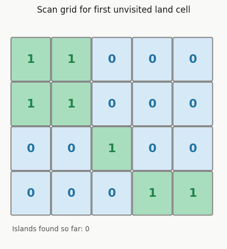

```python
def numIslands(grid):
    if not grid:
        return 0
    rows, cols = len(grid), len(grid[0])

    def dfs(i, j):
        if i < 0 or j < 0 or i >= rows or j >= cols or grid[i][j] != "1":
            return
        grid[i][j] = "0"
        dfs(i+1, j); dfs(i-1, j)
        dfs(i, j+1); dfs(i, j-1)

    count = 0
    for i in range(rows):
        for j in range(cols):
            if grid[i][j] == "1":
                dfs(i, j)
                count += 1
    return count


if __name__ == "__main__":
    grid1 = [
        list("11110"),
        list("11010"),
        list("11000"),
        list("00000"),
    ]
    print(numIslands(grid1))   # 1

    grid2 = [
        list("11000"),
        list("11000"),
        list("00100"),
        list("00011"),
    ]
    print(numIslands(grid2))   # 3
```

**Memory tip:** DFS = flood fill the whole island in one go, mark visited as you go so you never recount

</details>

---

## 6) Course Schedule — LeetCode 207
**Frequency: Medium-High (graph cycle detection)**

**Problem**
Given `numCourses` and prerequisite pairs `[a, b]` (must take b before a), determine if it's possible to finish all courses.

**Sample**
```
Input: numCourses = 2, prerequisites = [[1,0],[0,1]]
Output: False   (cycle: 0 needs 1, 1 needs 0)
```

<details>
<summary><b>Approach (click to expand)</b></summary>

- Build a graph; if there's a cycle, it's impossible to finish
- Use BFS topological sort (Kahn's algorithm): count in-degrees, remove nodes with 0 in-degree layer by layer


```python
from collections import deque, defaultdict

def canFinish(numCourses, prerequisites):
    graph = defaultdict(list)
    in_degree = [0] * numCourses

    for a, b in prerequisites:
        graph[b].append(a)
        in_degree[a] += 1

    queue = deque([i for i in range(numCourses) if in_degree[i] == 0])
    completed = 0

    while queue:
        node = queue.popleft()
        completed += 1
        for neighbor in graph[node]:
            in_degree[neighbor] -= 1
            if in_degree[neighbor] == 0:
                queue.append(neighbor)

    return completed == numCourses


if __name__ == "__main__":
    print(canFinish(2, [[1, 0]]))          # True
    print(canFinish(2, [[1, 0], [0, 1]]))  # False
    print(canFinish(4, [[1,0],[2,0],[3,1],[3,2]]))  # True
```

**Memory tip:** If you can't process all nodes via topological sort, there's a cycle -> return False

</details>

---

## 7) Rotting Oranges — LeetCode 994
**Frequency: Medium (multi-source BFS)**

**Problem**
`0`=empty, `1`=fresh orange, `2`=rotten orange. Each minute, rotten oranges infect fresh neighbors. Return minutes until all oranges rot, or -1 if impossible.

**Sample**
```
Input: grid = [[2,1,1],[1,1,0],[0,1,1]]
Output: 4
```

<details>
<summary><b>Approach (click to expand)</b></summary>

- Multi-source BFS: seed the queue with ALL rotten oranges at once (they spread simultaneously)
- Each BFS layer = 1 minute


```python
from collections import deque

def orangesRotting(grid):
    rows, cols = len(grid), len(grid[0])
    queue = deque()
    fresh = 0

    for r in range(rows):
        for c in range(cols):
            if grid[r][c] == 2:
                queue.append((r, c))
            elif grid[r][c] == 1:
                fresh += 1

    minutes = 0
    directions = [(1,0), (-1,0), (0,1), (0,-1)]

    while queue and fresh > 0:
        minutes += 1
        for _ in range(len(queue)):
            r, c = queue.popleft()
            for dr, dc in directions:
                nr, nc = r + dr, c + dc
                if 0 <= nr < rows and 0 <= nc < cols and grid[nr][nc] == 1:
                    grid[nr][nc] = 2
                    fresh -= 1
                    queue.append((nr, nc))

    return minutes if fresh == 0 else -1


if __name__ == "__main__":
    grid1 = [[2,1,1],[1,1,0],[0,1,1]]
    print(orangesRotting(grid1))   # 4

    grid2 = [[2,1,1],[0,1,1],[1,0,1]]
    print(orangesRotting(grid2))   # -1 (bottom-left orange unreachable)

    grid3 = [[0,2]]
    print(orangesRotting(grid3))   # 0 (no fresh oranges)
```

**Memory tip:** Multi-source BFS = seed ALL starting points into the queue together, not one at a time

</details>

---

## 8) Word Break — LeetCode 139
**Frequency: Medium (DP string segmentation)**

**Problem**
Given a string and a word dictionary, determine if the string can be segmented into dictionary words.

**Sample**
```
Input: s = "leetcode", wordDict = ["leet","code"]
Output: True
```

<details>
<summary><b>Approach (click to expand)</b></summary>

- `dp[i]` = True if `s[:i]` can be segmented
- For each position i, check all earlier positions j: if `dp[j]` is True and `s[j:i]` is a valid word, then `dp[i]` = True


```python
def wordBreak(s, wordDict):
    wordSet = set(wordDict)
    n = len(s)
    dp = [False] * (n + 1)
    dp[0] = True

    for i in range(1, n + 1):
        for j in range(i):
            if dp[j] and s[j:i] in wordSet:
                dp[i] = True
                break

    return dp[n]


if __name__ == "__main__":
    print(wordBreak("leetcode", ["leet", "code"]))          # True
    print(wordBreak("applepenapple", ["apple", "pen"]))      # True
    print(wordBreak("catsandog", ["cats","dog","sand","and","cat"]))  # False
```

**Memory tip:** `dp[i]` means "can the FIRST i characters be segmented" -- not `s[i]` itself

</details>

---

## 9) Group Anagrams — LeetCode 49
**Frequency: Medium (hashmap fundamentals)**

**Problem**
Given an array of strings, group anagrams together.

**Sample**
```
Input: ["eat","tea","tan","ate","nat","bat"]
Output: [["eat","tea","ate"],["tan","nat"],["bat"]]
```

<details>
<summary><b>Approach (click to expand)</b></summary>

- Sort each string's characters -- anagrams produce the same sorted key
- Group into a hashmap using the sorted string as key


```python
from collections import defaultdict

def groupAnagrams(strs):
    groups = defaultdict(list)
    for s in strs:
        key = ''.join(sorted(s))
        groups[key].append(s)
    return list(groups.values())


if __name__ == "__main__":
    result = groupAnagrams(["eat","tea","tan","ate","nat","bat"])
    print(result)
    # [['eat', 'tea', 'ate'], ['tan', 'nat'], ['bat']]
```

**Memory tip:** Anagrams always sort to the same string -- use that as the hashmap key

</details>

---

## 10) Two Sum (+ Follow-up: Streaming Data)
**Frequency: Lower (common warmup / follow-up tests adaptability)**

**Problem**
Find two numbers in an array that add up to a target value.

**Sample**
```
Input: nums = [2,7,11,15], target = 9
Output: [0,1]   (2 + 7 = 9)
```

<details>
<summary><b>Approach (click to expand)</b></summary>

- Use a hashmap: for each number, check if `target - number` was seen before
- One pass, O(n) time


```python
def twoSum(nums, target):
    seen = {}
    for i, num in enumerate(nums):
        complement = target - num
        if complement in seen:
            return [seen[complement], i]
        seen[num] = i
    return []


class TwoSumStream:
    """Follow-up: what if data is streaming (unknown length, arrives one at a time)?"""
    def __init__(self):
        self.seen = {}

    def add(self, number):
        self.seen[number] = self.seen.get(number, 0) + 1

    def find(self, target):
        for num in self.seen:
            complement = target - num
            if complement in self.seen:
                if complement != num or self.seen[num] > 1:
                    return True
        return False


if __name__ == "__main__":
    print(twoSum([2, 7, 11, 15], 9))   # [0, 1]
    print(twoSum([3, 2, 4], 6))        # [1, 2]

    stream = TwoSumStream()
    stream.add(1)
    stream.add(3)
    stream.add(5)
    print(stream.find(4))   # True  (1 + 3)
    print(stream.find(7))   # False
```

**Memory tip:** Streaming = can't sort or index by position -- maintain a running hashmap of counts instead

</details>

---

## Summary Table

| # | Question | Category | GS Frequency |
|---|----------|----------|---------------|
| 1 | LRU Cache | Design | Very High |
| 2 | SQL Deduplicate Latest Record | SQL | Very High |
| 3 | SQL Second Highest Salary | SQL | High |
| 4 | Binary Tree Level Order | BFS/Tree | Medium-High |
| 5 | Number of Islands | DFS/Grid | Medium-High |
| 6 | Course Schedule | Graph/Topo Sort | Medium-High |
| 7 | Rotting Oranges | Multi-source BFS | Medium |
| 8 | Word Break | DP | Medium |
| 9 | Group Anagrams | HashMap | Medium |
| 10 | Two Sum + Streaming | HashMap/Follow-up | Lower |

---

## Interview Day Reminders

- Talk through your approach BEFORE coding -- GS interviewers repeatedly emphasize this
- Discuss time/space complexity for every solution
- Be ready for follow-ups: "What if the data is huge?" "What if it's streaming?" "Edge cases?"
- Practice in CoderPad Sandbox (app.coderpad.io/sandbox) beforehand -- no autocomplete, get used to raw typing

---

**Note on collapsible sections:** `<details>/<summary>` tags render as collapsible blocks on GitHub, GitLab, and most modern markdown viewers (Obsidian, Notion import, VS Code preview). If your viewer doesn't support HTML tags in markdown, the Approach sections will just show as plain expanded text instead.

**Note on running the code:** Each Python snippet includes an `if __name__ == "__main__":` block with test cases -- copy the whole block (including the function/class above it) into CoderPad Sandbox and run directly. SQL snippets include `CREATE TABLE` + `INSERT` setup so you can run them standalone in any SQL sandbox (e.g. sqliteonline.com, or Postgres/MySQL playground).


---
---

# Part 2 — 10 More High-Frequency GS Questions

---

## 11) Valid Parentheses — LeetCode 20
**Frequency: Very High (classic stack warmup, frequently used as an easy opener)**
**Source: General big-tech pattern — not individually confirmed as a GS question**

**Problem**
Given a string containing `(){}[]`, determine if the brackets are validly matched and nested.

**Sample**
```
Input: s = "{[()]}"
Output: True
```

<details>
<summary><b>Approach (click to expand)</b></summary>

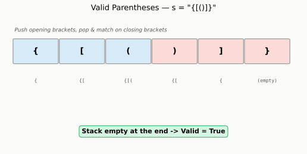

- Use a stack: push opening brackets, pop and match on closing brackets
- If a closing bracket doesn't match the top of the stack, or the stack is empty when you need to pop, it's invalid
- At the end, the stack must be empty

```python
def isValid(s: str) -> bool:
    stack = []
    pairs = {')': '(', ']': '[', '}': '{'}

    for ch in s:
        if ch in '([{':
            stack.append(ch)
        else:
            if not stack or stack.pop() != pairs[ch]:
                return False

    return len(stack) == 0


if __name__ == "__main__":
    print(isValid("{[()]}"))    # True
    print(isValid("(]"))        # False
    print(isValid("([)]"))      # False
    print(isValid("()[]{}"))    # True
```

**Memory tip:** Stack = "last opened, first closed" — exactly how brackets nest

</details>

---

## 12) Longest Substring Without Repeating Characters — LeetCode 3
**Frequency: Very High (extremely common sliding window problem)**
**Source: General big-tech pattern — not individually confirmed as a GS question**

**Problem**
Given a string, find the length of the longest substring without repeating characters.

**Sample**
```
Input: s = "abcabcbb"
Output: 3   ("abc")
```

<details>
<summary><b>Approach (click to expand)</b></summary>

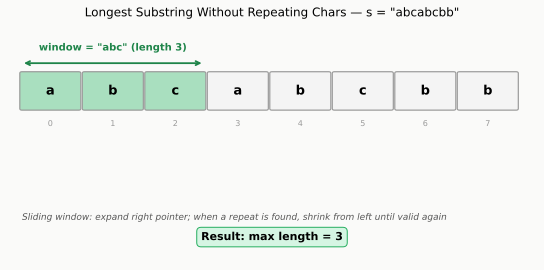

- Sliding window with two pointers (`left`, `right`)
- Use a set (or hashmap) to track characters currently in the window
- When you hit a duplicate, shrink from the left until the duplicate is removed

```python
def lengthOfLongestSubstring(s: str) -> int:
    seen = set()
    left = 0
    max_len = 0

    for right in range(len(s)):
        while s[right] in seen:
            seen.remove(s[left])
            left += 1
        seen.add(s[right])
        max_len = max(max_len, right - left + 1)

    return max_len


if __name__ == "__main__":
    print(lengthOfLongestSubstring("abcabcbb"))  # 3
    print(lengthOfLongestSubstring("bbbbb"))     # 1
    print(lengthOfLongestSubstring("pwwkew"))    # 3
```

**Memory tip:** Right pointer explores, left pointer cleans up — the window only ever grows or shrinks, never resets

</details>

---

## 13) Merge Intervals — LeetCode 56
**Frequency: High (common for scheduling / calendar-style problems)**
**Source: General big-tech pattern — not individually confirmed as a GS question**

**Problem**
Given a list of intervals, merge all overlapping intervals.

**Sample**
```
Input: intervals = [[1,3],[2,6],[8,10],[15,18]]
Output: [[1,6],[8,10],[15,18]]
```

<details>
<summary><b>Approach (click to expand)</b></summary>

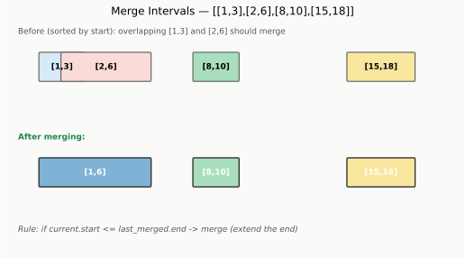

- Sort intervals by start time
- Walk through them: if the current interval overlaps with the last merged one, extend the end; otherwise start a new merged interval

```python
def merge(intervals):
    intervals.sort(key=lambda x: x[0])
    merged = [intervals[0]]

    for start, end in intervals[1:]:
        last_end = merged[-1][1]
        if start <= last_end:
            merged[-1][1] = max(last_end, end)
        else:
            merged.append([start, end])

    return merged


if __name__ == "__main__":
    print(merge([[1,3],[2,6],[8,10],[15,18]]))   # [[1,6],[8,10],[15,18]]
    print(merge([[1,4],[4,5]]))                   # [[1,5]]
    print(merge([[1,4],[0,4]]))                   # [[0,4]]
```

**Memory tip:** Sorting first turns "any overlap" into "only check the previous interval" — you never need to look back further than one step

</details>

---

## 14) Kth Largest Element in an Array — LeetCode 215
**Frequency: High (classic heap problem, common for data-heavy roles)**
**Source: General big-tech pattern — not individually confirmed as a GS question**

**Problem**
Find the kth largest element in an unsorted array.

**Sample**
```
Input: nums = [3,2,1,5,6,4], k = 2
Output: 5
```

<details>
<summary><b>Approach (click to expand)</b></summary>

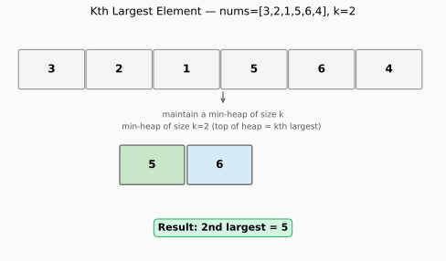

- Maintain a min-heap of size k
- Push every number in; if heap size exceeds k, pop the smallest
- At the end, the top of the heap is the kth largest

```python
import heapq

def findKthLargest(nums, k):
    heap = []
    for num in nums:
        heapq.heappush(heap, num)
        if len(heap) > k:
            heapq.heappop(heap)
    return heap[0]


if __name__ == "__main__":
    print(findKthLargest([3,2,1,5,6,4], 2))         # 5
    print(findKthLargest([3,2,3,1,2,4,5,5,6], 4))    # 4
```

**Memory tip:** Min-heap of size k always keeps the "k largest seen so far" — the smallest of those k is exactly the kth largest overall

</details>

---

## 15) Top K Frequent Elements — LeetCode 347
**Frequency: High (HashMap + Heap combo, common data engineering pattern)**
**Source: General big-tech pattern — not individually confirmed as a GS question**

**Problem**
Given an array, return the k most frequent elements.

**Sample**
```
Input: nums = [1,1,1,2,2,3], k = 2
Output: [1, 2]
```

<details>
<summary><b>Approach (click to expand)</b></summary>

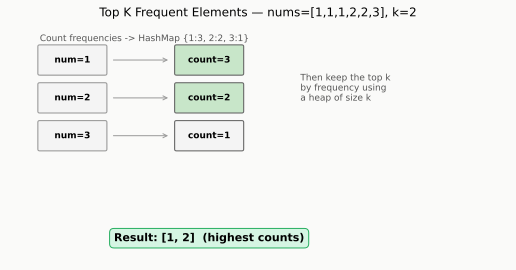

- Count frequency of each number using a hashmap
- Use a heap (or `Counter.most_common`) to extract the top k by frequency

```python
from collections import Counter
import heapq

def topKFrequent(nums, k):
    freq = Counter(nums)
    return heapq.nlargest(k, freq.keys(), key=freq.get)


if __name__ == "__main__":
    print(topKFrequent([1,1,1,2,2,3], 2))     # [1, 2]
    print(topKFrequent([1], 1))                # [1]
```

**Memory tip:** Two-step pattern — first count with a hashmap, then rank with a heap. This combo shows up constantly in interviews

</details>

---

## 16) Trapping Rain Water — LeetCode 42
**Frequency: Medium-High (classic two-pointer / precompute problem, reported by GS candidates)**
**Source: CONFIRMED — reported across multiple GS interview write-ups (see Part 3 #22 for full sourcing)**

**Problem**
Given an elevation map, compute how much rainwater it can trap after raining.

**Sample**
```
Input: height = [0,1,0,2,1,0,1,3,2,1,2,1]
Output: 6
```

<details>
<summary><b>Approach (click to expand)</b></summary>

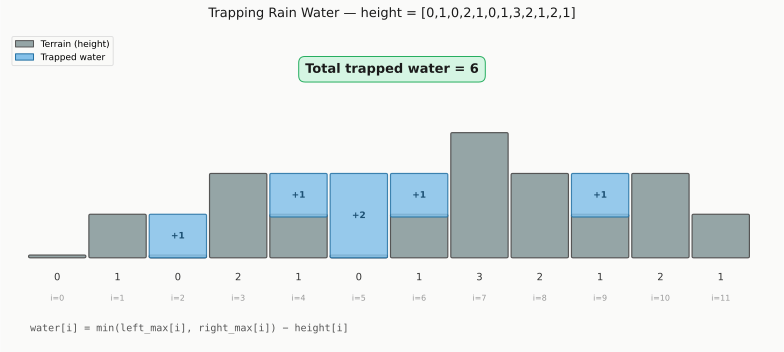

- Water trapped at position `i` = `min(left_max[i], right_max[i]) - height[i]`
- Precompute `left_max` (tallest bar to the left, inclusive) and `right_max` (tallest bar to the right, inclusive)
- Sum up the water trapped at each position

```python
def trap(height):
    if not height:
        return 0
    n = len(height)
    left_max = [0] * n
    right_max = [0] * n

    left_max[0] = height[0]
    for i in range(1, n):
        left_max[i] = max(left_max[i-1], height[i])

    right_max[n-1] = height[n-1]
    for i in range(n-2, -1, -1):
        right_max[i] = max(right_max[i+1], height[i])

    return sum(min(left_max[i], right_max[i]) - height[i] for i in range(n))


if __name__ == "__main__":
    print(trap([0,1,0,2,1,0,1,3,2,1,2,1]))   # 6
    print(trap([4,2,0,3,2,5]))                # 9
```

**Memory tip:** Water at any position is capped by the SHORTER of the two tallest walls on either side — you can never hold more water than your shortest boundary allows

</details>

---

## 17) Design Hit Counter — LeetCode 362

You're tracking website "hits" (visits) over time. At any moment, you need to answer: "how many hits happened in the last 300 seconds?"

**Problem**
Design a hit counter that counts hits received in the past 300 seconds. `hit(timestamp)` records a hit, `getHits(timestamp)` returns hits in the last 300 seconds.

⭐ Key insight: A queue naturally keeps things in time order — oldest hits at the front, newest hits at the back.

```python
self.hits = deque()
```

Every time `hit(timestamp)` is called, you just add the timestamp to the back:

```python
def hit(self, timestamp: int) -> None:
    self.hits.append(timestamp)
```
            
**Sample**
```
counter.hit(1)
counter.hit(2)
counter.hit(3)
counter.getHits(4)    # 3
counter.hit(300)
counter.getHits(300)  # 4
counter.getHits(301)  # 3  (hit at t=1 expired)
```

<details>
<summary><b>Approach (click to expand)</b></summary>

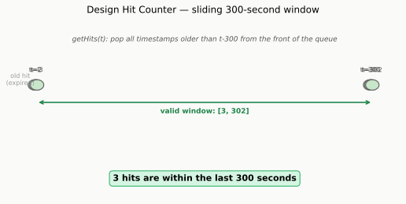

- Use a queue to store timestamps of hits
- On `getHits(timestamp)`, pop all timestamps older than `timestamp - 300` from the front before counting

```python
from collections import deque

class HitCounter:
    def __init__(self):
        self.hits = deque()

    def hit(self, timestamp: int) -> None:
        self.hits.append(timestamp)

    def getHits(self, timestamp: int) -> int:
        while self.hits and self.hits[0] <= timestamp - 300:
            self.hits.popleft()
        return len(self.hits)

# Secs:  0  1  2  3  4  5  ...  300  301
#         ↑  ↑  ↑              ↑
#        hit hit hit           hit


if __name__ == "__main__":
    counter = HitCounter()
    counter.hit(1)
    counter.hit(2)
    counter.hit(3)
    print(counter.getHits(4))    # 3
    counter.hit(300)
    print(counter.getHits(300))  # 4
    print(counter.getHits(301))  # 3
```

**Memory tip:** This is a sliding window over TIME instead of over an array — old timestamps naturally "expire" out the front of the queue

</details>

---

## 18) SQL — Running Total (Cumulative Sum)
**Frequency: High (very common in Data Engineer / analytics interviews)**
**Source: General SQL pattern — not individually confirmed, but GS's own Data Engineer interview guide explicitly mentions window-function-style dedup/aggregation questions**

**Problem**
Given a table of daily transaction amounts, compute a running (cumulative) total ordered by date.

**Sample**
```
Table: transactions
date       | amount
2024-01-01 | 100
2024-01-02 | 150
2024-01-03 | 200
2024-01-04 | 50
```

<details>
<summary><b>Approach (click to expand)</b></summary>

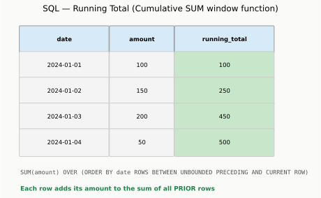

- Use `SUM() OVER (ORDER BY date)` as a window function
- Each row's running total = sum of its own amount plus everything before it

```sql
-- Setup (run this first to create test data)
CREATE TABLE transactions (
    date DATE,
    amount INT
);

INSERT INTO transactions VALUES
    ('2024-01-01', 100),
    ('2024-01-02', 150),
    ('2024-01-03', 200),
    ('2024-01-04', 50);

-- Solution query
SELECT
    date,
    amount,
    SUM(amount) OVER (ORDER BY date) AS running_total
FROM transactions;

-- Expected output:
-- date       | amount | running_total
-- 2024-01-01 | 100    | 100
-- 2024-01-02 | 150    | 250
-- 2024-01-03 | 200    | 450
-- 2024-01-04 | 50     | 500
```

**Memory tip:** `SUM() OVER (ORDER BY ...)` without a `PARTITION BY` treats the whole table as one running window — this is the go-to pattern for cumulative metrics

</details>

---

## 19) SQL — Find Duplicate Emails
**Frequency: High (LeetCode 182 — a GS-reported SQL classic)**
**Source: General big-tech/finance SQL pattern — not individually confirmed as GS-specific despite the "GS-reported" label used earlier; correcting that claim here**

**Problem**
Given a `Person` table, find all emails that appear more than once.

**Sample**
```
Table: Person
id | email
1  | a@x.com
2  | c@x.com
3  | a@x.com
```

<details>
<summary><b>Approach (click to expand)</b></summary>

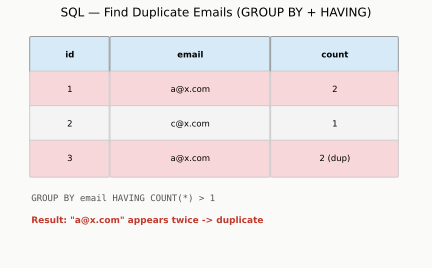

- `GROUP BY email` collapses rows with the same email together
- `HAVING COUNT(*) > 1` filters to only groups that appeared more than once

```sql
-- Setup (run this first to create test data)
CREATE TABLE Person (
    id INT,
    email VARCHAR(100)
);

INSERT INTO Person VALUES
    (1, 'a@x.com'),
    (2, 'c@x.com'),
    (3, 'a@x.com');

-- Solution query
SELECT email
FROM Person
GROUP BY email
HAVING COUNT(*) > 1;

-- Expected output:
-- email
-- a@x.com
```

**Memory tip:** `WHERE` filters rows BEFORE grouping, `HAVING` filters groups AFTER aggregation — duplicate detection always needs `HAVING` because "count > 1" only exists after grouping

</details>

---

## 20) Merge Two Sorted Lists — LeetCode 21
**Frequency: Medium (foundational linked list problem, often a warmup before harder list questions)**
**Source: General big-tech pattern — not individually confirmed as a GS question**

**Problem**
Merge two sorted linked lists into one sorted linked list.

**Sample**
```
Input: l1 = [1,2,4], l2 = [1,3,4]
Output: [1,1,2,3,4,4]
```

<details>
<summary><b>Approach (click to expand)</b></summary>

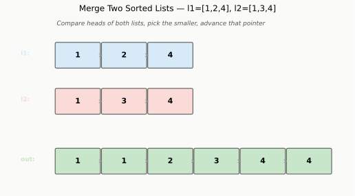

- Use a dummy head node to simplify edge cases
- Compare the current nodes of both lists, attach the smaller one, advance that pointer
- Attach whatever remains once one list is exhausted

```python
class ListNode:
    def __init__(self, val=0, next=None):
        self.val = val
        self.next = next

def mergeTwoLists(l1, l2):
    dummy = ListNode()
    tail = dummy

    while l1 and l2:
        if l1.val <= l2.val:
            tail.next = l1
            l1 = l1.next
        else:
            tail.next = l2
            l2 = l2.next
        tail = tail.next

    tail.next = l1 if l1 else l2
    return dummy.next


def build_list(vals):
    dummy = ListNode()
    tail = dummy
    for v in vals:
        tail.next = ListNode(v)
        tail = tail.next
    return dummy.next

def list_to_array(node):
    result = []
    while node:
        result.append(node.val)
        node = node.next
    return result


if __name__ == "__main__":
    l1 = build_list([1,2,4])
    l2 = build_list([1,3,4])
    merged = mergeTwoLists(l1, l2)
    print(list_to_array(merged))   # [1, 1, 2, 3, 4, 4]

    l1 = build_list([])
    l2 = build_list([0])
    merged = mergeTwoLists(l1, l2)
    print(list_to_array(merged))   # [0]
```

**Memory tip:** The dummy head trick avoids special-casing "what if the merged list is empty at the start" — you always have a valid `tail` to attach to

</details>

---

## Summary Table — Part 2

| # | Question | Category | GS Frequency |
|---|----------|----------|---------------|
| 11 | Valid Parentheses | Stack | Very High |
| 12 | Longest Substring Without Repeating Chars | Sliding Window | Very High |
| 13 | Merge Intervals | Sorting/Greedy | High |
| 14 | Kth Largest Element | Heap | High |
| 15 | Top K Frequent Elements | HashMap + Heap | High |
| 16 | Trapping Rain Water | Two Pointer/Precompute | Medium-High |
| 17 | Design Hit Counter | Design/Sliding Window | Medium |
| 18 | SQL Running Total | SQL Window Function | High |
| 19 | SQL Find Duplicate Emails | SQL GROUP BY/HAVING | High |
| 20 | Merge Two Sorted Lists | Linked List | Medium |


---
---

# Part 3 — Verified GS CoderPad Questions (from actual interview reports)

**Every question below is sourced from a real, dated candidate interview report** (Glassdoor, LeetCode Discuss, Medium). Sources are cited under each question. Unlike Parts 1-2, nothing here is a generalized "common big-tech question" guess — these are patterns candidates actually reported facing at Goldman Sachs specifically.

---

## 21) String Compression
**Source: Medium — "My Interview Experience at Goldman Sachs" (Associate role, CoderPad round, ~2024)**

**Problem**
Compress a string by replacing consecutive repeated characters with the character followed by its count.

**Sample**
```
Input: "aaabbcbbb"
Output: "a3b2c1b3"
```

<details>
<summary><b>Approach (click to expand)</b></summary>

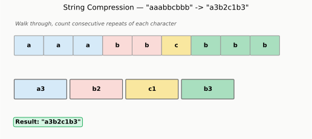

- Walk through the string, counting consecutive occurrences of the same character
- When the character changes (or the string ends), append `char + count` to the result

```python
def compress(s: str) -> str:
    if not s:
        return ""

    result = []
    count = 1

    for i in range(1, len(s) + 1):
        if i < len(s) and s[i] == s[i-1]:
            count += 1
        else:
            result.append(s[i-1] + str(count))
            count = 1

    return ''.join(result)


if __name__ == "__main__":
    print(compress("aaabbcbbb"))   # a3b2c1b3
    print(compress("abcd"))         # a1b1c1d1
    print(compress("aaaa"))         # a4
```

**Memory tip:** The loop goes to `len(s) + 1` (one past the end) specifically so the LAST group still gets flushed into the result — otherwise the final character group never gets appended

</details>

---

## 22) Trapping Rain Water
**Source: Medium ("Snowpack" rephrasing, 2024) + LeetCode Discuss (Associate/SDE reports)**

**Problem**
Given an elevation map, compute how much rainwater it can trap after raining. Reported as appearing under different names/rephrasing ("Snowpack") but same underlying logic.

**Sample**
```
Input: height = [0,1,0,2,1,0,1,3,2,1,2,1]
Output: 6
```

<details>
<summary><b>Approach (click to expand)</b></summary>

- Water trapped at position `i` = `min(left_max[i], right_max[i]) - height[i]`
- Precompute the tallest wall to the left and right of every position

```python
def trap(height):
    if not height:
        return 0
    n = len(height)
    left_max = [0] * n
    right_max = [0] * n

    left_max[0] = height[0]
    for i in range(1, n):
        left_max[i] = max(left_max[i-1], height[i])

    right_max[n-1] = height[n-1]
    for i in range(n-2, -1, -1):
        right_max[i] = max(right_max[i+1], height[i])

    return sum(min(left_max[i], right_max[i]) - height[i] for i in range(n))


if __name__ == "__main__":
    print(trap([0,1,0,2,1,0,1,3,2,1,2,1]))   # 6
    print(trap([4,2,0,3,2,5]))                # 9
```

**Memory tip:** Reported as one of the MOST frequently mentioned GS CoderPad questions across multiple independent interview write-ups — worth mastering thoroughly

</details>

---

## 23) Two Sum
**Source: LeetCode Discuss — Data Engineer CoderPad round; Medium interview report**

**Problem**
Find two numbers in an array that add up to a target value.

**Sample**
```
Input: nums = [2,7,11,15], target = 9
Output: [0,1]
```

<details>
<summary><b>Approach (click to expand)</b></summary>

- Use a hashmap: for each number, check if `target - number` was already seen

```python
def twoSum(nums, target):
    seen = {}
    for i, num in enumerate(nums):
        complement = target - num
        if complement in seen:
            return [seen[complement], i]
        seen[num] = i
    return []


if __name__ == "__main__":
    print(twoSum([2, 7, 11, 15], 9))   # [0, 1]
    print(twoSum([3, 2, 4], 6))        # [1, 2]
```

**Memory tip:** Reported as a common OPENER question — expect it as the "easy" half of a two-question round, with a harder second question following

</details>

---

## 24) Find Most Frequent IP Address from Logs
**Source: LeetCode Discuss — "Goldman Sachs phone most frequent IP address from logs" (Software Engineer Associate round)**

**Problem**
Given a list of log entries (each containing an IP address), find the IP address that appears most frequently.

**Sample**
```
Input: logs = ["192.168.1.1", "10.0.0.5", "192.168.1.1", "192.168.1.1", "10.0.0.5"]
Output: "192.168.1.1"
```

<details>
<summary><b>Approach (click to expand)</b></summary>

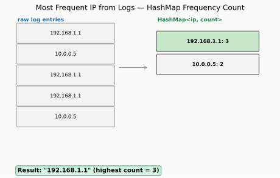

- Count occurrences of each IP using a hashmap
- Track the max count while iterating (no need for a second pass)

```python
def mostFrequentIP(logs):
    counts = {}
    best_ip, best_count = None, 0

    for ip in logs:
        counts[ip] = counts.get(ip, 0) + 1
        if counts[ip] > best_count:
            best_ip, best_count = ip, counts[ip]

    return best_ip


if __name__ == "__main__":
    logs = ["192.168.1.1", "10.0.0.5", "192.168.1.1", "192.168.1.1", "10.0.0.5"]
    print(mostFrequentIP(logs))   # 192.168.1.1
```

**Memory tip:** Reported as a straightforward HashMap-only problem — interviewer explicitly said no heap needed, just counting

</details>

---

## 25) Union-Find — Largest Tree Root in a Forest
**Source: LeetCode Discuss — "Goldman Sachs | Software Engineer Associate | Coderpad" round 2, Medium difficulty**

**Problem**
Given a forest represented as a `child -> parent` hashmap (each node has one parent, root nodes map to nothing), find the root of the tree with the most nodes. If there's a tie, return the smallest root.

**Sample**
```
Input: child_to_parent = {1:0, 2:0, 3:0, 6:5}
Output: 0   (tree rooted at 0 has 4 nodes: 0,1,2,3; tree rooted at 5 has 2 nodes: 5,6)
```

<details>
<summary><b>Approach (click to expand)</b></summary>

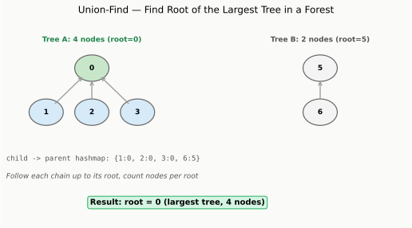

- For every node, follow the `child -> parent` chain up to find its root
- Count how many nodes map to each root
- Return the root with the most nodes (smallest root on ties)

```python
def largestTreeRoot(child_to_parent, all_nodes):
    def find_root(node):
        while node in child_to_parent:
            node = child_to_parent[node]
        return node

    root_counts = {}
    for node in all_nodes:
        root = find_root(node)
        root_counts[root] = root_counts.get(root, 0) + 1

    best_root = None
    best_count = -1
    for root in sorted(root_counts):        # sorted ensures smallest root wins ties
        if root_counts[root] > best_count:
            best_root, best_count = root, root_counts[root]

    return best_root


if __name__ == "__main__":
    child_to_parent = {1: 0, 2: 0, 3: 0, 6: 5}
    all_nodes = [0, 1, 2, 3, 5, 6]
    print(largestTreeRoot(child_to_parent, all_nodes))   # 0

    # tie case
    child_to_parent2 = {1: 0, 3: 2}
    all_nodes2 = [0, 1, 2, 3]
    print(largestTreeRoot(child_to_parent2, all_nodes2)) # 0 (tie between root 0 and root 2, both size 2 -> smallest wins)
```

**Memory tip:** This is a lightweight version of Union-Find — instead of `union()` operations, the tree structure is already fully given via the `child -> parent` map, so you just need `find_root()` and a counter

</details>

---

## 26) Student with Highest Average Score
**Source: LeetCode Discuss — "Goldman Sachs Coderpad Interview 1st round (Data Engineer)" July 2020**

**Problem**
Given a 2D array of (student, score) pairs, find the student with the highest average score. If the average has decimals, floor it to the nearest integer.

**Sample**
```
Input: [["Bob","87"], ["Mike","35"], ["Bob","52"], ["Jason","35"], ["Mike","55"], ["Jessica","99"]]
Output: 99   (Jessica's average, since she only has one score)
```

<details>
<summary><b>Approach (click to expand)</b></summary>

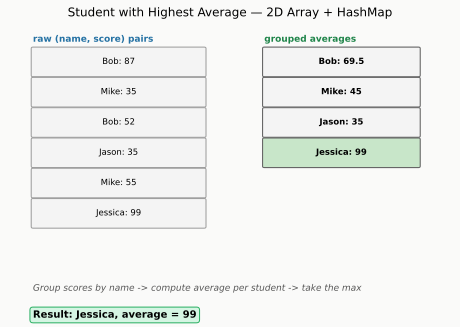

- Group scores by student name using a hashmap of lists (or running sum + count)
- Compute the average per student, floor it, then take the max

```python
import math
from collections import defaultdict

def highestAverage(records):
    scores = defaultdict(list)
    for name, score in records:
        scores[name].append(int(score))

    best_avg = float('-inf')
    for name, vals in scores.items():
        avg = math.floor(sum(vals) / len(vals))
        best_avg = max(best_avg, avg)

    return best_avg


if __name__ == "__main__":
    records = [["Bob","87"], ["Mike","35"], ["Bob","52"], ["Jason","35"], ["Mike","55"], ["Jessica","99"]]
    print(highestAverage(records))   # 99
```

**Memory tip:** This is directly relevant to the Data Engineer role — it's essentially a mini "GROUP BY name, AVG(score)" operation done in plain Python instead of SQL

</details>

---

## 27) Robot Final Coordinates from a Move String
**Source: LeetCode Discuss — same "Goldman Sachs Coderpad Interview 1st round (Data Engineer)" July 2020 report, question 2**

**Problem**
Given a string of moves like `"UUUDULR"` (Up/Down/Left/Right), compute the robot's final `(x, y)` coordinates starting from `(0, 0)`.

**Sample**
```
Input: moves = "UUUDULR"
Output: (0, 3)
```

<details>
<summary><b>Approach (click to expand)</b></summary>

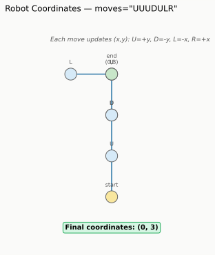

- Map each direction to a coordinate delta
- Walk through the string, applying each delta to a running `(x, y)` position

```python
def finalCoordinates(moves: str):
    x, y = 0, 0
    deltas = {'U': (0, 1), 'D': (0, -1), 'L': (-1, 0), 'R': (1, 0)}

    for move in moves:
        dx, dy = deltas[move]
        x += dx
        y += dy

    return (x, y)


if __name__ == "__main__":
    print(finalCoordinates("UUUDULR"))   # (0, 3)
    print(finalCoordinates(""))           # (0, 0)
    print(finalCoordinates("RRUU"))       # (2, 2)
```

**Memory tip:** Reported as the "easy" second question, meant to be finished quickly — interviewer asked the candidate to add extra test cases afterward, so be ready to propose edge cases (empty string, all same direction) unprompted

</details>

---

## 28) Design a Calculator
**Source: Glassdoor — Goldman Sachs Superday DSA/LC Round (June 2026, Dallas TX)**

**Problem**
Design a basic calculator that evaluates a string expression with `+`, `-`, `*`, `/`, respecting operator precedence (no parentheses required for the basic version).

**Sample**
```
Input: "3+2*2"
Output: 7
```

<details>
<summary><b>Approach (click to expand)</b></summary>

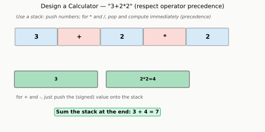

- Use a stack to handle operator precedence
- For `+` and `-`: push the (signed) number onto the stack
- For `*` and `/`: pop the last number, apply the operator immediately with the current number, push the result back
- Sum everything on the stack at the end

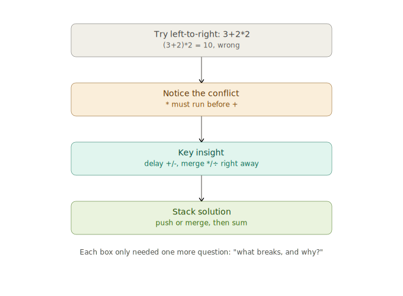

```python
def calculate(s: str) -> int:
    stack = []
    num = 0
    sign = '+'

    for i, ch in enumerate(s):
        if ch.isdigit():
            num = num * 10 + int(ch)

        if ch in '+-*/' or i == len(s) - 1:
            if sign == '+':
                stack.append(num)
            elif sign == '-':
                stack.append(-num)
            elif sign == '*':
                stack.append(stack.pop() * num)
            elif sign == '/':
                stack.append(int(stack.pop() / num))   # truncate toward zero
            sign = ch
            num = 0

    return sum(stack)


if __name__ == "__main__":
    print(calculate("3+2*2"))     # 7
    print(calculate("3-2+2"))     # 3
    print(calculate(" 3/2 "))     # 1
```

**Memory tip:** The interviewer explicitly asked candidates to "check all edge cases and best time/space complexity" — be ready to discuss handling multi-digit numbers, spaces, and negative results explicitly

</details>

---

## Summary Table — Part 3 (Verified)

| # | Question | Category | Source Type |
|---|----------|----------|--------------|
| 21 | String Compression | String | Medium interview report |
| 22 | Trapping Rain Water | Two Pointer/Precompute | Multiple independent reports |
| 23 | Two Sum | HashMap | Multiple independent reports |
| 24 | Most Frequent IP from Logs | HashMap | LeetCode Discuss |
| 25 | Union-Find: Largest Tree Root | Union-Find | LeetCode Discuss |
| 26 | Highest Average Student | HashMap/GroupBy | LeetCode Discuss (Data Engineer) |
| 27 | Robot Final Coordinates | String Simulation | LeetCode Discuss (Data Engineer) |
| 28 | Design a Calculator | Stack/Design | Glassdoor (2026 Superday) |

---

## Honest Note on Confidence Levels

- **Part 1 & 2 (Q1-20):** These are common patterns seen across FAANG/finance-style interviews broadly (LRU Cache, BFS/DFS, SQL window functions, etc). They are reasonable prep material for a Data Engineering role, but were **not individually confirmed** as GS-specific questions — treat them as solid general practice, not guaranteed GS questions.
- **Part 3 (Q21-28):** Each question here is tied to a **specific, dated, sourced interview report** from Glassdoor, LeetCode Discuss, or Medium. These are the closest things to "verified" GS CoderPad questions available publicly.
- No source can guarantee what YOUR specific interview will ask — GS explicitly rotates and changes questions, and asks candidates not to redistribute them after the fact.


---
---

# Part 4 — Speculation: What This Specific Role Might Test You On

**Role: Data Engineering, Lakehouse and AI Data Platform Engineer, Vice President, Singapore**

**Important framing:** Everything below is educated speculation based on (1) GS's own published Data Engineer interview guide, (2) the job title's specific keywords ("Lakehouse", "AI Data Platform"), and (3) general patterns for VP-level technical + system-design rounds at large financial institutions. **None of this is a confirmed leaked question.** Treat it as a study map, not a question bank.

---

## 1. Why "Lakehouse" and "AI Data Platform" change the picture

A generic "Data Engineer" title usually means ETL + SQL + some distributed systems. This role's title adds two specific signals:

- **"Lakehouse"** — this is industry terminology for architectures that combine data lake storage (cheap, raw, schema-on-read — think S3/HDFS/Parquet) with data warehouse features (ACID transactions, schema enforcement — think Delta Lake, Apache Iceberg, Databricks). If GS asks system design questions, expect them to probe whether you understand **why** a lakehouse exists: the tension between "store everything cheaply and flexibly" (lake) vs "guarantee data quality and enable fast structured queries" (warehouse).
- **"AI Data Platform"** — this suggests the team builds infrastructure that FEEDS AI/ML workloads, not necessarily builds the models themselves. Expect questions about serving data reliably for training/inference: feature stores, data versioning, freshness guarantees, handling schema drift.

**How to prepare:** Be ready to discuss, in plain English, out loud:
- "What is a data lakehouse, and why would a bank want one instead of a traditional data warehouse?"
- "How would you design a pipeline that serves both batch analytics and near-real-time ML feature lookups from the same underlying data?"

---

## 2. What GS's own interview guide says to expect (this part IS sourced)

GS's published Data Engineer interview guide states the technical rounds cover:

> "CoderPad, SQL, distributed systems, and system design evaluations" — including questions on "building scalable ETL and streaming pipelines" and "designing data models for distributed storage systems such as HDFS, S3, or internal warehouses."

It also explicitly gives this as an example SQL-style question:

> "How would you write a query to return the most recent salary for each employee after an ETL error inserted duplicates?"

**This confirms:** the "SQL dedup with window functions" pattern (already covered in Part 1, Q2) is a genuinely GS-endorsed example question type — not just something a candidate happened to report.

---

## 3. Likely CoderPad-style coding patterns for THIS role specifically

Based on the confirmed patterns from Part 3 (HashMap counting, grouping/aggregation, string parsing) plus the Data Engineer angle, here's what's reasonable to expect:

| Likely pattern | Why it fits this role |
|---|---|
| SQL: window functions, dedup, running totals | Directly confirmed by GS's own guide |
| HashMap-based aggregation ("group by X, compute Y") | Confirmed pattern (Q26 "highest average student" is essentially GROUP BY in Python) |
| String/log parsing | Confirmed pattern (Q24 "most frequent IP from logs") — data engineers constantly parse logs/semi-structured data |
| Basic distributed systems reasoning (not full system design, but "how would you handle X at scale") | Explicitly named in GS's guide |
| Schema design for structured data (e.g. "design a table to track daily trading positions") | A reported Superday round asked "design a relational database schema to support data at a bank" |

---

## 4. Likely SYSTEM DESIGN discussion topics (Superday-style, not CoderPad)

If you reach a system design round, prepare to discuss OUT LOUD, in English, structured like this:

**Practice prompt 1:** *"Design a pipeline that ingests trade data throughout the day and makes it queryable for both compliance reporting (needs to be exact and auditable) and a real-time risk dashboard (needs to be fast, approximate is OK)."*

- Talk through: batch layer vs speed layer (Lambda architecture), or a unified lakehouse approach (Kappa-style with a single source of truth)
- Discuss trade-offs: latency vs consistency, cost of storage duplication vs cost of a single unified table

**Practice prompt 2:** *"How would you detect and handle schema drift in an upstream data source without breaking downstream ML models?"*

- Talk through: schema registries, contract testing, versioned schemas, alerting on unexpected new/missing fields

**Practice prompt 3:** *"Walk me through how you'd design a feature store for a fraud detection model that needs both historical (batch) and real-time (streaming) features."*

- Talk through: offline store (batch-computed features, e.g. in a lakehouse table) vs online store (low-latency key-value store, e.g. Redis/DynamoDB), and the "point-in-time correctness" problem (avoiding data leakage from the future)

---

## 5. English discussion practice — key vocabulary to be fluent with

Since interviews are conducted live in English and interviewers explicitly want to hear your **reasoning process out loud**, practice saying these phrases naturally, not just understanding them silently:

| Concept | Practice saying this out loud |
|---|---|
| Schema-on-read vs schema-on-write | "A data lake is schema-on-read — you don't enforce structure until query time. A warehouse is schema-on-write — you enforce structure at ingestion." |
| Idempotency | "This pipeline needs to be idempotent — if it re-runs after a failure, it shouldn't create duplicate records." |
| Exactly-once vs at-least-once | "Given the trade-off, I'd rather have at-least-once delivery with deduplication downstream than risk losing data." |
| Data freshness / staleness | "There's a trade-off between freshness and cost here — computing this feature in real time is expensive, so I'd batch it every 15 minutes instead." |
| Backfilling | "If we change the transformation logic, we'd need a backfill job to reprocess historical data under the new logic." |

---

## 6. A structured English self-practice routine

1. **Explain a project out loud, unscripted, in under 2 minutes.** Recruiters and resume-deep-dive interviewers explicitly probe details — if you can't explain your own project fluently and quickly in English, that's a bigger risk than not knowing a specific LeetCode pattern.
2. **Practice narrating your code as you write it.** Multiple interview reports emphasize GS interviewers want to hear your thought process, not just see a working solution. Try solving Part 1-3 problems while talking through your reasoning out loud in English, even alone.
3. **Practice the "why" behind design choices**, not just the "what". E.g. don't just say "I'd use a hash map" — say "I'd use a hash map because I need O(1) lookups and I don't care about ordering here."

---

## Summary — Part 4

This section is **explicitly speculative** and framed around role-specific keywords ("Lakehouse", "AI Data Platform") plus GS's own published interview guide. Use it to shape your STUDY PLAN and ENGLISH PRACTICE, not as a leaked question bank. Combine it with:
- Part 1-2 for broad DSA/SQL practice
- Part 3 for the closest thing to verified real GS CoderPad patterns
- This Part 4 for role-specific system design vocabulary and English fluency practice
