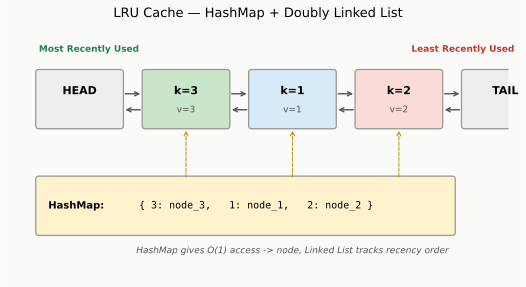
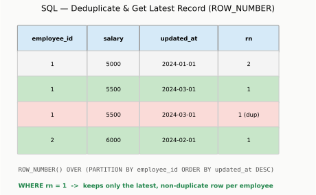
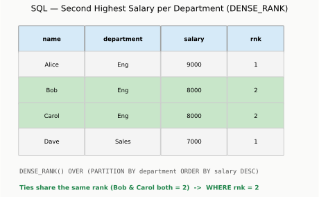
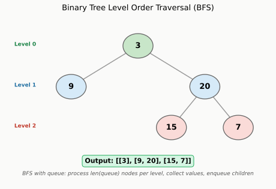
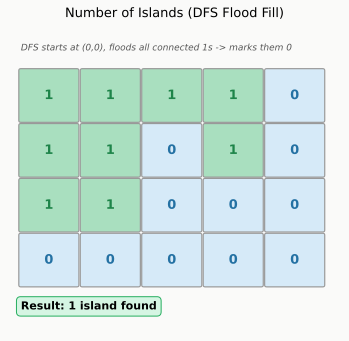
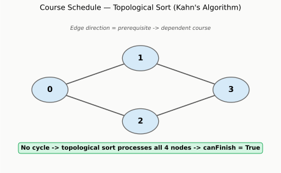
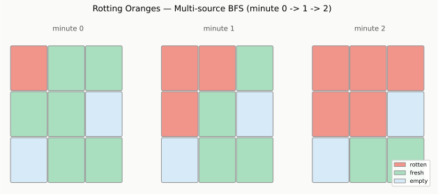
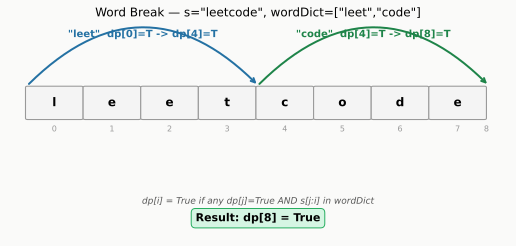
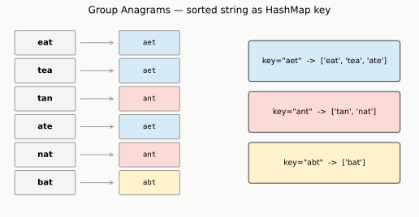
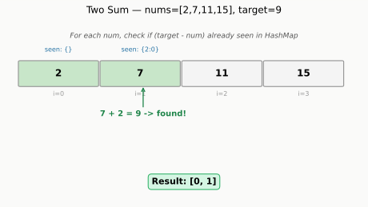

# Goldman Sachs Mock Interview Prep
## Data, Lakehouse and AI Data Platform Engineer — VP, Singapore

Sorted by frequency reported in GS CoderPad interviews (highest first).
**Approach & Code sections are collapsed by default** — click to reveal after you attempt the problem yourself.
Each code block includes a runnable example at the bottom.

---

## 1) LRU Cache — LeetCode 146
**Frequency: Very High (reported repeatedly in GS interviews)**

**Problem**
Design a data structure that supports `get(key)` and `put(key, value)` in O(1) time. When capacity is exceeded, evict the least recently used item.

**Sample**
```
LRUCache cache = new LRUCache(2)
cache.put(1, 1)
cache.put(2, 2)
cache.get(1)       # returns 1
cache.put(3, 3)    # evicts key 2
cache.get(2)       # returns -1 (not found)
```

<details>
<summary><b>Approach (click to expand)</b></summary>

- HashMap for O(1) key lookup + Doubly Linked List for O(1) reordering
- Most recently used = move to front (head)
- Least recently used = tail, evicted when over capacity



```python
class Node:
    def __init__(self, key=0, val=0):
        self.key = key
        self.val = val
        self.prev = None
        self.next = None

class LRUCache:
    def __init__(self, capacity: int):
        self.cap = capacity
        self.cache = {}
        self.head = Node()
        self.tail = Node()
        self.head.next = self.tail
        self.tail.prev = self.head

    def _remove(self, node):
        node.prev.next = node.next
        node.next.prev = node.prev

    def _insert_front(self, node):
        node.next = self.head.next
        node.prev = self.head
        self.head.next.prev = node
        self.head.next = node

    def get(self, key: int) -> int:
        if key not in self.cache:
            return -1
        node = self.cache[key]
        self._remove(node)
        self._insert_front(node)
        return node.val

    def put(self, key: int, value: int) -> None:
        if key in self.cache:
            self._remove(self.cache[key])
        node = Node(key, value)
        self.cache[key] = node
        self._insert_front(node)
        if len(self.cache) > self.cap:
            lru = self.tail.prev
            self._remove(lru)
            del self.cache[lru.key]


if __name__ == "__main__":
    cache = LRUCache(2)
    cache.put(1, 1)
    cache.put(2, 2)
    print(cache.get(1))    # 1
    cache.put(3, 3)        # evicts key 2
    print(cache.get(2))    # -1
    cache.put(4, 4)        # evicts key 1
    print(cache.get(1))    # -1
    print(cache.get(3))    # 3
    print(cache.get(4))    # 4
```

**Memory tip:** HashMap = "where is it", Linked List = "how recently used"

</details>

---

## 2) SQL — Deduplicate & Get Latest Record
**Frequency: Very High (core Data Engineer skill)**

**Problem**
An ETL bug caused duplicate rows in `employee_salary_history`. Write a query to return only the most recent salary per employee.

**Sample**
```
Table: employee_salary_history
employee_id | salary | updated_at
1           | 5000   | 2024-01-01
1           | 5500   | 2024-03-01
1           | 5500   | 2024-03-01  <- duplicate
2           | 6000   | 2024-02-01
```

<details>
<summary><b>Approach (click to expand)</b></summary>

- Use `ROW_NUMBER()` window function partitioned by employee, ordered by latest date
- Filter to row number = 1



```sql
-- Setup (run this first to create test data)
CREATE TABLE employee_salary_history (
    employee_id INT,
    salary INT,
    updated_at DATE
);

INSERT INTO employee_salary_history VALUES
    (1, 5000, '2024-01-01'),
    (1, 5500, '2024-03-01'),
    (1, 5500, '2024-03-01'),
    (2, 6000, '2024-02-01');

-- Solution query
WITH ranked AS (
    SELECT *,
           ROW_NUMBER() OVER (
               PARTITION BY employee_id
               ORDER BY updated_at DESC
           ) AS rn
    FROM employee_salary_history
)
SELECT employee_id, salary, updated_at
FROM ranked
WHERE rn = 1;

-- Expected output:
-- employee_id | salary | updated_at
-- 1           | 5500   | 2024-03-01
-- 2           | 6000   | 2024-02-01
```

**Memory tip:** PARTITION BY = "group by employee", ROW_NUMBER = "rank within group"

</details>

---

## 3) SQL — Second Highest Salary per Department
**Frequency: High**

**Problem**
Find the second highest salary in each department.

**Sample**
```
Table: employees
id | name  | department | salary
1  | Alice | Eng        | 9000
2  | Bob   | Eng        | 8000
3  | Carol | Eng        | 8000
4  | Dave  | Sales      | 7000
```

<details>
<summary><b>Approach (click to expand)</b></summary>

- Use `DENSE_RANK()` (not ROW_NUMBER) so tied salaries share rank
- Filter to rank = 2



```sql
-- Setup (run this first to create test data)
CREATE TABLE employees (
    id INT,
    name VARCHAR(50),
    department VARCHAR(50),
    salary INT
);

INSERT INTO employees VALUES
    (1, 'Alice', 'Eng', 9000),
    (2, 'Bob', 'Eng', 8000),
    (3, 'Carol', 'Eng', 8000),
    (4, 'Dave', 'Sales', 7000);

-- Solution query
WITH ranked AS (
    SELECT *,
           DENSE_RANK() OVER (
               PARTITION BY department
               ORDER BY salary DESC
           ) AS rnk
    FROM employees
)
SELECT department, name, salary
FROM ranked
WHERE rnk = 2;

-- Expected output:
-- department | name | salary
-- Eng        | Bob  | 8000
-- Eng        | Carol| 8000
```

**Memory tip:** DENSE_RANK avoids gaps when there are ties -- use it for "Nth highest" problems

</details>

---

## 4) Binary Tree Level Order Traversal — LeetCode 102
**Frequency: Medium-High (common tree/BFS warmup)**

**Problem**
Given a binary tree, return node values grouped level by level.

**Sample**
```
Input:
    3
   / \
  9  20
    /  \
   15   7

Output: [[3],[9,20],[15,7]]
```

<details>
<summary><b>Approach (click to expand)</b></summary>

- BFS with a queue
- Process one full level at a time using `len(queue)` as the level size



```python
from collections import deque

class TreeNode:
    def __init__(self, val=0, left=None, right=None):
        self.val = val
        self.left = left
        self.right = right

def levelOrder(root):
    if not root:
        return []
    result = []
    queue = deque([root])

    while queue:
        level_size = len(queue)
        level = []
        for _ in range(level_size):
            node = queue.popleft()
            level.append(node.val)
            if node.left:
                queue.append(node.left)
            if node.right:
                queue.append(node.right)
        result.append(level)

    return result


if __name__ == "__main__":
    #     3
    #    / \
    #   9  20
    #     /  \
    #    15   7
    root = TreeNode(3)
    root.left = TreeNode(9)
    root.right = TreeNode(20)
    root.right.left = TreeNode(15)
    root.right.right = TreeNode(7)

    print(levelOrder(root))   # [[3], [9, 20], [15, 7]]
```

**Memory tip:** `len(queue)` at loop start = size of current level -- process exactly that many before moving to next level

</details>

---

## 5) Number of Islands — LeetCode 200
**Frequency: Medium-High (classic grid DFS/BFS)**

**Problem**
Given a 2D grid of land ('1') and water ('0'), count the number of islands.

**Sample**
```
Input:
11110
11010
11000
00000

Output: 1
```

<details>
<summary><b>Approach (click to expand)</b></summary>

- DFS flood fill: when you find a '1', sink the entire connected island by marking visited cells as '0'
- Count how many times a new DFS is triggered



```python
def numIslands(grid):
    if not grid:
        return 0
    rows, cols = len(grid), len(grid[0])

    def dfs(i, j):
        if i < 0 or j < 0 or i >= rows or j >= cols or grid[i][j] != "1":
            return
        grid[i][j] = "0"
        dfs(i+1, j); dfs(i-1, j)
        dfs(i, j+1); dfs(i, j-1)

    count = 0
    for i in range(rows):
        for j in range(cols):
            if grid[i][j] == "1":
                dfs(i, j)
                count += 1
    return count


if __name__ == "__main__":
    grid1 = [
        list("11110"),
        list("11010"),
        list("11000"),
        list("00000"),
    ]
    print(numIslands(grid1))   # 1

    grid2 = [
        list("11000"),
        list("11000"),
        list("00100"),
        list("00011"),
    ]
    print(numIslands(grid2))   # 3
```

**Memory tip:** DFS = flood fill the whole island in one go, mark visited as you go so you never recount

</details>

---

## 6) Course Schedule — LeetCode 207
**Frequency: Medium-High (graph cycle detection)**

**Problem**
Given `numCourses` and prerequisite pairs `[a, b]` (must take b before a), determine if it's possible to finish all courses.

**Sample**
```
Input: numCourses = 2, prerequisites = [[1,0],[0,1]]
Output: False   (cycle: 0 needs 1, 1 needs 0)
```

<details>
<summary><b>Approach (click to expand)</b></summary>

- Build a graph; if there's a cycle, it's impossible to finish
- Use BFS topological sort (Kahn's algorithm): count in-degrees, remove nodes with 0 in-degree layer by layer



```python
from collections import deque, defaultdict

def canFinish(numCourses, prerequisites):
    graph = defaultdict(list)
    in_degree = [0] * numCourses

    for a, b in prerequisites:
        graph[b].append(a)
        in_degree[a] += 1

    queue = deque([i for i in range(numCourses) if in_degree[i] == 0])
    completed = 0

    while queue:
        node = queue.popleft()
        completed += 1
        for neighbor in graph[node]:
            in_degree[neighbor] -= 1
            if in_degree[neighbor] == 0:
                queue.append(neighbor)

    return completed == numCourses


if __name__ == "__main__":
    print(canFinish(2, [[1, 0]]))          # True
    print(canFinish(2, [[1, 0], [0, 1]]))  # False
    print(canFinish(4, [[1,0],[2,0],[3,1],[3,2]]))  # True
```

**Memory tip:** If you can't process all nodes via topological sort, there's a cycle -> return False

</details>

---

## 7) Rotting Oranges — LeetCode 994
**Frequency: Medium (multi-source BFS)**

**Problem**
`0`=empty, `1`=fresh orange, `2`=rotten orange. Each minute, rotten oranges infect fresh neighbors. Return minutes until all oranges rot, or -1 if impossible.

**Sample**
```
Input: grid = [[2,1,1],[1,1,0],[0,1,1]]
Output: 4
```

<details>
<summary><b>Approach (click to expand)</b></summary>

- Multi-source BFS: seed the queue with ALL rotten oranges at once (they spread simultaneously)
- Each BFS layer = 1 minute



```python
from collections import deque

def orangesRotting(grid):
    rows, cols = len(grid), len(grid[0])
    queue = deque()
    fresh = 0

    for r in range(rows):
        for c in range(cols):
            if grid[r][c] == 2:
                queue.append((r, c))
            elif grid[r][c] == 1:
                fresh += 1

    minutes = 0
    directions = [(1,0), (-1,0), (0,1), (0,-1)]

    while queue and fresh > 0:
        minutes += 1
        for _ in range(len(queue)):
            r, c = queue.popleft()
            for dr, dc in directions:
                nr, nc = r + dr, c + dc
                if 0 <= nr < rows and 0 <= nc < cols and grid[nr][nc] == 1:
                    grid[nr][nc] = 2
                    fresh -= 1
                    queue.append((nr, nc))

    return minutes if fresh == 0 else -1


if __name__ == "__main__":
    grid1 = [[2,1,1],[1,1,0],[0,1,1]]
    print(orangesRotting(grid1))   # 4

    grid2 = [[2,1,1],[0,1,1],[1,0,1]]
    print(orangesRotting(grid2))   # -1 (bottom-left orange unreachable)

    grid3 = [[0,2]]
    print(orangesRotting(grid3))   # 0 (no fresh oranges)
```

**Memory tip:** Multi-source BFS = seed ALL starting points into the queue together, not one at a time

</details>

---

## 8) Word Break — LeetCode 139
**Frequency: Medium (DP string segmentation)**

**Problem**
Given a string and a word dictionary, determine if the string can be segmented into dictionary words.

**Sample**
```
Input: s = "leetcode", wordDict = ["leet","code"]
Output: True
```

<details>
<summary><b>Approach (click to expand)</b></summary>

- `dp[i]` = True if `s[:i]` can be segmented
- For each position i, check all earlier positions j: if `dp[j]` is True and `s[j:i]` is a valid word, then `dp[i]` = True



```python
def wordBreak(s, wordDict):
    wordSet = set(wordDict)
    n = len(s)
    dp = [False] * (n + 1)
    dp[0] = True

    for i in range(1, n + 1):
        for j in range(i):
            if dp[j] and s[j:i] in wordSet:
                dp[i] = True
                break

    return dp[n]


if __name__ == "__main__":
    print(wordBreak("leetcode", ["leet", "code"]))          # True
    print(wordBreak("applepenapple", ["apple", "pen"]))      # True
    print(wordBreak("catsandog", ["cats","dog","sand","and","cat"]))  # False
```

**Memory tip:** `dp[i]` means "can the FIRST i characters be segmented" -- not `s[i]` itself

</details>

---

## 9) Group Anagrams — LeetCode 49
**Frequency: Medium (hashmap fundamentals)**

**Problem**
Given an array of strings, group anagrams together.

**Sample**
```
Input: ["eat","tea","tan","ate","nat","bat"]
Output: [["eat","tea","ate"],["tan","nat"],["bat"]]
```

<details>
<summary><b>Approach (click to expand)</b></summary>

- Sort each string's characters -- anagrams produce the same sorted key
- Group into a hashmap using the sorted string as key



```python
from collections import defaultdict

def groupAnagrams(strs):
    groups = defaultdict(list)
    for s in strs:
        key = ''.join(sorted(s))
        groups[key].append(s)
    return list(groups.values())


if __name__ == "__main__":
    result = groupAnagrams(["eat","tea","tan","ate","nat","bat"])
    print(result)
    # [['eat', 'tea', 'ate'], ['tan', 'nat'], ['bat']]
```

**Memory tip:** Anagrams always sort to the same string -- use that as the hashmap key

</details>

---

## 10) Two Sum (+ Follow-up: Streaming Data)
**Frequency: Lower (common warmup / follow-up tests adaptability)**

**Problem**
Find two numbers in an array that add up to a target value.

**Sample**
```
Input: nums = [2,7,11,15], target = 9
Output: [0,1]   (2 + 7 = 9)
```

<details>
<summary><b>Approach (click to expand)</b></summary>

- Use a hashmap: for each number, check if `target - number` was seen before
- One pass, O(n) time



```python
def twoSum(nums, target):
    seen = {}
    for i, num in enumerate(nums):
        complement = target - num
        if complement in seen:
            return [seen[complement], i]
        seen[num] = i
    return []


class TwoSumStream:
    """Follow-up: what if data is streaming (unknown length, arrives one at a time)?"""
    def __init__(self):
        self.seen = {}

    def add(self, number):
        self.seen[number] = self.seen.get(number, 0) + 1

    def find(self, target):
        for num in self.seen:
            complement = target - num
            if complement in self.seen:
                if complement != num or self.seen[num] > 1:
                    return True
        return False


if __name__ == "__main__":
    print(twoSum([2, 7, 11, 15], 9))   # [0, 1]
    print(twoSum([3, 2, 4], 6))        # [1, 2]

    stream = TwoSumStream()
    stream.add(1)
    stream.add(3)
    stream.add(5)
    print(stream.find(4))   # True  (1 + 3)
    print(stream.find(7))   # False
```

**Memory tip:** Streaming = can't sort or index by position -- maintain a running hashmap of counts instead

</details>

---

## Summary Table

| # | Question | Category | GS Frequency |
|---|----------|----------|---------------|
| 1 | LRU Cache | Design | Very High |
| 2 | SQL Deduplicate Latest Record | SQL | Very High |
| 3 | SQL Second Highest Salary | SQL | High |
| 4 | Binary Tree Level Order | BFS/Tree | Medium-High |
| 5 | Number of Islands | DFS/Grid | Medium-High |
| 6 | Course Schedule | Graph/Topo Sort | Medium-High |
| 7 | Rotting Oranges | Multi-source BFS | Medium |
| 8 | Word Break | DP | Medium |
| 9 | Group Anagrams | HashMap | Medium |
| 10 | Two Sum + Streaming | HashMap/Follow-up | Lower |

---

## Interview Day Reminders

- Talk through your approach BEFORE coding -- GS interviewers repeatedly emphasize this
- Discuss time/space complexity for every solution
- Be ready for follow-ups: "What if the data is huge?" "What if it's streaming?" "Edge cases?"
- Practice in CoderPad Sandbox (app.coderpad.io/sandbox) beforehand -- no autocomplete, get used to raw typing

---

**Note on collapsible sections:** `<details>/<summary>` tags render as collapsible blocks on GitHub, GitLab, and most modern markdown viewers (Obsidian, Notion import, VS Code preview). If your viewer doesn't support HTML tags in markdown, the Approach sections will just show as plain expanded text instead.

**Note on running the code:** Each Python snippet includes an `if __name__ == "__main__":` block with test cases -- copy the whole block (including the function/class above it) into CoderPad Sandbox and run directly. SQL snippets include `CREATE TABLE` + `INSERT` setup so you can run them standalone in any SQL sandbox (e.g. sqliteonline.com, or Postgres/MySQL playground).
