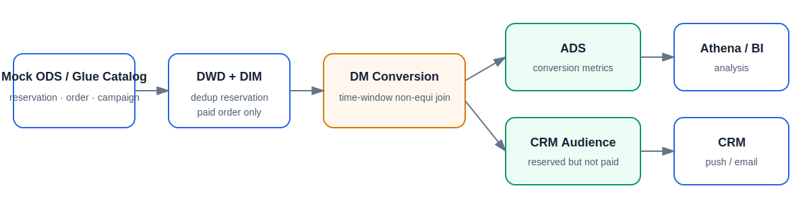

# Reservation Analytics Platform

A small SQL-first data engineering project that is easy to understand, runnable locally, and deployable to AWS Glue.



## Architecture

```text
ODS → DWD + DIM → DM → ADS
```

There is no separate FACT layer.

| Layer | Tables |
|---|---|
| ODS | `ods_reservation_event`, `ods_order` |
| DWD | `dwd_reservation_event`, `dwd_paid_order` |
| DIM | `dim_campaign` |
| DM | `dm_reservation_conversion` |
| ADS | `ads_campaign_conversion`, `ads_crm_reserved_not_paid` |

## Business logic

The DM table has this grain:

```text
User × Campaign × Product × Site
```

It:

1. deduplicates repeated reservation events;
2. keeps valid paid orders;
3. matches orders inside the campaign window;
4. creates conversion and CRM tags.

## Run locally

```bash
python3 -m venv .venv
source .venv/bin/activate
pip install -r requirements-dev.txt
python -m src.run_local
pytest -q
```

## Deploy to an AWS sandbox

```bash
aws sts get-caller-identity
python scripts/generate_mock_ods.py
python scripts/aws_setup.py --region ap-southeast-1
python scripts/aws_run.py
python scripts/aws_validate.py
```

Optional schedule:

```bash
python scripts/aws_schedule.py
```

Cleanup:

```bash
python scripts/aws_cleanup.py --delete-bucket
```

## Development model

SQL is developed in an IDE such as PyCharm, stored in Git, tested locally, and deployed to AWS Glue. The direct Boto3 commands in this repository are for a personal sandbox. A production team normally uses pull requests, CI/CD and infrastructure as code for deployment.

Read:

- [One-hour guide](ONE_HOUR_GUIDE.md)
- [Development and deployment model](docs/DEVELOPMENT_AND_DEPLOYMENT.md)
- [Data layers](docs/knowledge/01_data_layers.md)
- [SQL patterns](docs/knowledge/02_sql_patterns.md)
- [AWS services](docs/knowledge/03_aws_services.md)
- [Extending the project](docs/EXTENDING_THE_PROJECT.md)
- [Interview Q&A](docs/interview_qa.md)

## Repository structure

```text
config/pipeline.json
sql/local/                 local mock ODS
sql/dwd/                   atomic detail SQL
sql/dm/                    subject-level business SQL
sql/ads/                   application outputs
src/run_local.py
glue_jobs/run_glue_sql_job.py
scripts/                    sandbox deployment commands
tests/
docs/
```

## Public repository safety

All names and sample data are generic and synthetic. The repository contains no employer code, internal identifiers or company-specific names.
