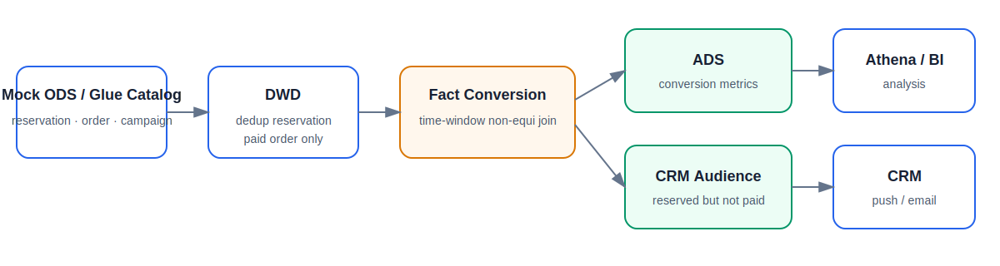

# Reservation Analytics Platform

A compact SQL-first data-engineering project that runs locally and deploys to AWS Glue.

- no real company names or proprietary code;
- synthetic ODS data only;
- shared SQL business logic;
- local DuckDB execution;
- AWS S3 + Glue Catalog + Glue Spark + Athena deployment;
- interview Q&A and extension guide.



## Business problem

Users reserve products before launch. The platform identifies:

- users who purchased inside the campaign launch window;
- users who reserved but did not purchase;
- conversion by campaign, site and channel.

Fact grain:

```text
User × Campaign × Product × Site
```

## Start in one hour

Open [ONE_HOUR_GUIDE.md](ONE_HOUR_GUIDE.md).

Main commands:

```bash
python3 -m venv .venv
source .venv/bin/activate
pip install -r requirements-dev.txt

python -m src.run_local
pytest -q
python scripts/generate_mock_ods.py
python scripts/aws_setup.py --region ap-southeast-1
python scripts/aws_run.py
python scripts/aws_validate.py
```

## Data model

```text
Mock ODS / Glue Catalog
  ├── ods_reservation_event
  ├── ods_order
  └── dim_campaign
          ↓
DWD
  ├── dwd_reservation
  └── dwd_paid_order
          ↓
FACT
  └── fact_reservation_conversion
          ↓
DM / ADS
  ├── dm_user_campaign_profile
  ├── ads_campaign_conversion
  └── crm_reserved_not_paid
```

## Core SQL

### Deduplication

```sql
ROW_NUMBER() OVER (
    PARTITION BY mid, campaign_id, product_id, site
    ORDER BY reserve_time
)
```

### Time-window join

```sql
AND o.order_time BETWEEN c.launch_start AND c.launch_end
```

### CRM tag

```sql
CASE WHEN order_id IS NULL THEN 1 ELSE 0 END
    AS tag_reserved_not_paid
```

## Where to focus

1. Business grain and metric definition.
2. Deduplication key.
3. Why the join is non-equi.
4. Why late or cancelled orders do not convert.
5. Difference between FACT, DM and ADS.
6. How the same SQL is tested locally and run in Glue.
7. How scheduling, monitoring and Athena validation work.
8. How to add a new DM without rewriting the framework.

## Documentation

| Document | Purpose |
|---|---|
| [One-hour guide](ONE_HOUR_GUIDE.md) | local and AWS step-by-step run |
| [AWS Console guide](docs/AWS_CONSOLE_GUIDE.md) | where to click and what to inspect |
| [Interview Q&A](docs/interview_qa.md) | common questions and answers |
| [Extension guide](docs/EXTENDING_THE_PROJECT.md) | add new DM/ADS tables |
| [Deployment checklist](docs/DEPLOYMENT_CHECKLIST.md) | success and cleanup checks |
| [Data layers](docs/knowledge/01_data_layers.md) | ODS/DWD/FACT/DM/ADS |
| [SQL patterns](docs/knowledge/02_sql_patterns.md) | key SQL techniques |
| [AWS services](docs/knowledge/03_aws_services.md) | S3/Glue/Athena roles |
| [Reliability and cost](docs/knowledge/04_reliability_cost.md) | production concerns |

## Daily engineering workflow

```text
Scheduled Glue job
→ check Glue and CloudWatch
→ validate Athena metrics
→ clarify requirement
→ edit SQL in PyCharm
→ local test
→ Git pull request
→ CI/CD upload
→ Glue test/daily run
→ downstream acceptance
```

## Repository structure

```text
config/pipeline.json              execution and output manifest
sql/local/00_mock_ods.sql         local synthetic ODS
sql/shared/                       DWD and FACT SQL
sql/dm/                           reusable subject models
sql/ads/                          reporting and operational outputs
src/run_local.py                  local runner
glue_jobs/run_glue_sql_job.py     AWS runner
scripts/                          AWS setup, run, validate, schedule, cleanup
docs/                             guides and knowledge notes
tests/                            business-result tests
```

## Honest interview description

> I rebuilt a simplified reservation analytics pattern as an independent AWS data-engineering project. The business logic reflects a common e-commerce use case, while all code and synthetic data in this repository were created independently for learning and demonstration.
